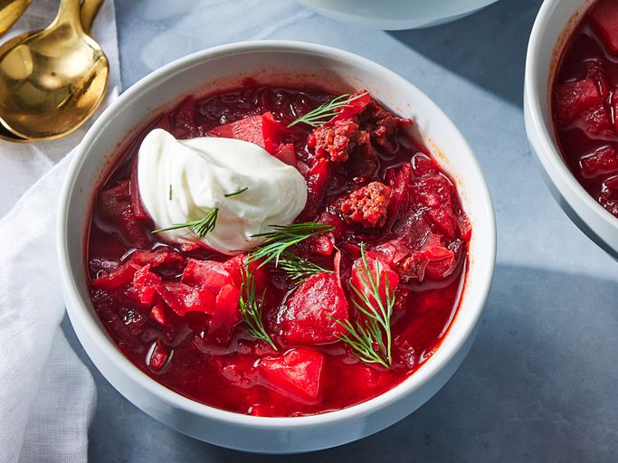

# Borscht

*Eastern European beetroot soup: deep ruby-red broth with beef, beetroot, cabbage and root vegetables, finished with a dollop of soured cream and dill. Russian and Ukrainian both claim it (with passion); the version below is the rich, beef-laden one most cooks recognise.*

**Serves:** 6-8

**Prep Time:** 25 minutes

**Cook Time:** 2 hours

## Overview
Borscht is the great beetroot soup of Eastern Europe, claimed with passion by both Russians and Ukrainians: a deep ruby-red broth thick with beef, beetroot, cabbage and root vegetables, eaten under a generous dollop of soured cream and a heavy shower of fresh dill. A proper stock comes first; bone-in beef shin or short rib simmered with halved onion, carrot, celery, bay and peppercorns for an hour and a half. Coarsely grated raw beetroot (not roasted) is essential, since the deep earthiness depends on it. The critical move is the vinegar at the finish: beetroot loses its red without acid, so two tablespoons of red wine vinegar and a teaspoon of sugar keep the soup ruby instead of dull and balance the sweetness with sourness. Ladle into deep bowls, top each with a heavy spoonful of soured cream and a generous scatter of dill, eat with dark rye. Make it a day ahead if you can; borscht improves overnight in a way few soups do.

## Ingredients

- 1 kg beef shin (bone-in) or short rib
- 2 onions (one halved for the stock, one chopped for the soup)
- 1 carrot (whole, plus 2 more grated for the soup)
- 1 celery stick
- 2 bay leaves
- 1 tablespoon black peppercorns
- 2 litres water
- 4 beetroots (medium, peeled and coarsely grated)
- 4 garlic cloves (crushed)
- ¼ small white cabbage (shredded)
- 3 potatoes (medium, peeled, cubed)
- 400 g tinned chopped tomatoes
- 2 tablespoons tomato purée
- 2 tablespoons vegetable oil
- 2 tablespoons red wine vinegar
- 1 teaspoon caster sugar
- salt
- pepper

### To serve
- 200 g soured cream
- A small bunch of dill (chopped)
- Rye bread

## Method

### Stage 1 - Beef stock
1. Place the beef, halved onion, whole carrot, celery, bay and peppercorns in a large pot.
1. Cover with the water; bring to a gentle simmer; skim.
1. Cook 1 ½ hours until the beef is tender.
1. Lift out the beef, shred from the bones; reserve.
1. Strain the broth; discard the vegetables.

### Stage 2 - Beetroot and aromatics
1. Heat the oil in a heavy soup pot.
1. Cook the chopped onion 8 minutes.
1. Add the grated beetroot, grated carrot, garlic and tomato purée; cook 10 minutes, stirring, until softened and concentrated.
1. Stir in the chopped tomatoes; cook 5 minutes.

### Stage 3 - Combine
1. Pour in the strained beef broth.
1. Add the cubed potatoes; simmer 15 minutes.
1. Add the shredded cabbage; simmer another 10 minutes until tender.
1. Return the shredded beef.

### Stage 4 - Finish
1. Stir in the vinegar and sugar (the vinegar locks in the red colour; sugar balances the acidity).
1. Season generously with salt and pepper.

### Stage 5 - Serve
1. Ladle into deep bowls.
1. Top each with a generous spoonful of soured cream and a heavy scatter of dill.
1. Serve with rye bread.

## Notes
- **Vinegar is structural for colour:** Beetroot loses red without acid. The vinegar at the end is what keeps borscht ruby instead of dull.
- **Don't pre-cook the beetroot:** Roasted beetroot gives a milder, sweeter soup. Raw grated beet builds the deep, slightly earthy flavour that defines borscht.
- **Rest overnight:** Improves dramatically. Day-two borscht is the dish; day-one is just dinner.

## Storage
- Improves overnight. Keeps 5 days refrigerated.
- Freezes 3 months.
