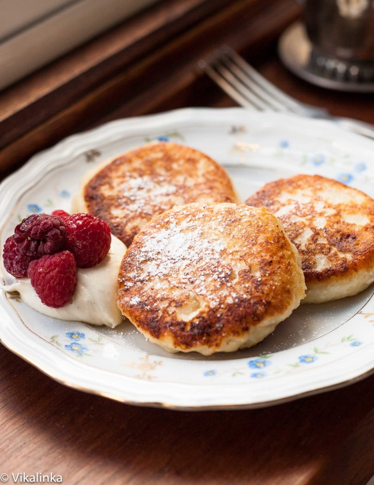

# Syrniki

*Russia's breakfast cheese pancakes: small thick pancakes of farmer's cheese (tvorog) sweetened with sugar and vanilla, bound with egg and flour, pan-fried in butter till deep golden. The Russian weekend breakfast served with sour cream, fruit jam, fresh berries or honey.*

**Serves:** 4 (makes 12 syrniki)

**Prep Time:** 20 minutes

**Cook Time:** 20 minutes

## Overview
Syrniki (сырники, from "sir" meaning cheese) are Russia's most beloved breakfast pancake: small thick round pancakes of farmer's cheese (tvorog, the slightly tangy, slightly grainy Russian fresh cheese), sweetened with sugar and vanilla, bound with egg and a small amount of flour or semolina, pan-fried in butter till deeply golden outside and tender inside. The result sits between cheesecake, pancake and fritter; served warm with sour cream (canonical), fruit jam, fresh berries, honey or condensed milk. A staple of Russian breakfast tables, especially on weekends; children adore them, adults enjoy them with strong sweet tea. Tvorog (or Polish twaróg, German Quark, ricotta drained heavily, or full-fat cottage cheese well drained) is non-negotiable; cream cheese is too smooth and rich for this. Drain the tvorog properly before mixing; under-drained cheese forces too much flour into the batter and the syrniki go dense. Fry on medium heat in butter or butter-and-oil; high burns the surface before the centre cooks, low gives a pale flat exterior.

## Ingredients

- 500 g tvorog (or full-fat cottage cheese drained well; or quark; or ricotta drained heavily; or 50/50 ricotta and cream cheese)
- 1 large egg
- 2 tablespoons caster sugar (more if you like sweeter)
- 1 teaspoon vanilla extract (or the seeds of half a vanilla pod)
- Pinch of fine sea salt
- 4 tablespoons plain flour (or 3 tablespoons flour + 1 tablespoon semolina)
- Zest of ½ lemon (optional)
- 50 g raisins (optional, soaked in warm water 10 minutes then drained)
- 2 tablespoons plain flour (for dredging)

### Frying
- 3 tablespoons unsalted butter
- 2 tablespoons vegetable oil

### To serve
- 200 g sour cream (smetana; or full-fat sour cream)
- Fruit jam (raspberry, cherry, strawberry)
- Fresh berries
- Honey
- Sweetened condensed milk
- Icing sugar (for dusting)

## Method

### Stage 1 - Drain the tvorog
1. If your tvorog (or cottage cheese, or ricotta) seems wet: press it gently in a clean tea towel or muslin cloth to remove excess liquid.
2. The cheese should feel firm and slightly crumbly when you press a finger into it; not wet or runny.

### Stage 2 - Mix the syrniki batter
1. In a wide bowl, combine the drained tvorog, egg, sugar, vanilla, salt and lemon zest (if using).
2. Mash with a fork till the mixture is mostly smooth (some texture is fine).
3. Sift in the 4 tablespoons of flour; fold in gently.
4. Stir in the soaked drained raisins (if using).
5. The batter should be soft but holdable; you should be able to scoop it with a spoon and have it hold its shape briefly. If too wet, add 1 tablespoon more flour; if too dry, add 1 tablespoon of milk.

### Stage 3 - Shape the syrniki
1. Place the 2 tablespoons of plain flour for dredging on a plate.
2. Using slightly damp hands or two spoons, scoop generous tablespoons of the batter.
3. Shape each into a small thick patty (about 6 cm across and 1.5 cm thick).
4. Dredge each patty lightly in the flour; the coating should be a thin even layer.
5. Place on a tray; repeat with the remaining batter. You should have 12 syrniki.

### Stage 4 - Pan-fry
1. Heat 1.5 tablespoons of butter and 1 tablespoon of oil in a wide heavy frying pan over medium heat till the butter is melted and foamy.
2. Place 6 syrniki in the pan (don't crowd; work in 2 batches).
3. Cook 3-4 minutes per side till deeply golden and cooked through (the centre should be soft but not raw).
4. Press the centre gently with a finger; it should feel firm and spring back.
5. Lift out; place on a warm plate.
6. Add the remaining butter and oil to the pan; cook the second batch.

### Stage 5 - Serve immediately
1. Place 3 warm syrniki on each plate.
2. Spoon generous sour cream over (or alongside).
3. Add a spoonful of jam, a drizzle of honey, fresh berries, or condensed milk; or all of these.
4. Dust with icing sugar.
5. Serve immediately with strong tea or coffee.

## Notes
- **Drain the cheese properly:** wet tvorog (or cottage cheese) needs more flour to hold together, which gives dense doughy syrniki. Press out the excess moisture first; the cheese should feel firm.
- **Don't over-mix:** the syrniki should still have some texture from the cheese. Mash till mostly combined but not till uniform smooth.
- **Just enough flour:** the right amount of flour gives tender syrniki that hold their shape; too much gives dense doughy ones. 4 tablespoons (or sometimes 3-5) is the right range for 500 g of cheese.
- **Medium heat, not high:** high heat burns the outside before the inside cooks; low heat gives pale uninteresting syrniki. Medium with the butter foamy is right.
- **Eat warm:** syrniki are at their best fresh out of the pan; they go off-texture as they cool (denser and less tender).

## Variations
**Banana syrniki:** mash 1 ripe banana into the cheese mixture (omit the raisins); gives a sweeter fruitier syrniki. Common modern Russian variation.
**Apple-cinnamon syrniki:** grate 1 small apple and add to the mixture; double the vanilla; add ¼ teaspoon of cinnamon. Lovely autumn variation.
**Chocolate chip syrniki:** add 50 g of mini chocolate chips to the mixture; gives a dessert-leaning version that kids love.
**Savoury syrniki:** skip the sugar and vanilla; add 2 tablespoons of chopped fresh dill, ¼ teaspoon of ground black pepper and 50 g of grated hard cheese. Serve with sour cream and smoked salmon. Brunch-friendly Russian style.

## Serving
On warm plates with the canonical accompaniments: sour cream is essential; jam, honey, condensed milk and fresh berries are all welcome. With strong sweet tea (the Russian way: dark, slightly bitter, with a small amount of sugar) or milky coffee. At weekend breakfast; or as dessert with afternoon tea.

## Storage
- Best eaten fresh and warm.
- Keeps refrigerated 3 days; reheat in a hot dry pan for 1-2 minutes per side, or briefly in the oven at 160°C for 5-7 minutes. Don't microwave (they go rubbery).
- Freeze cooked syrniki 2 months in a sealed bag; reheat from frozen in a hot oven (180°C / 350°F) for 8-10 minutes.
- The uncooked batter doesn't keep well; use within a few hours of mixing.
- Day-old syrniki are still good for lunchboxes; eat cold or briefly reheat.
