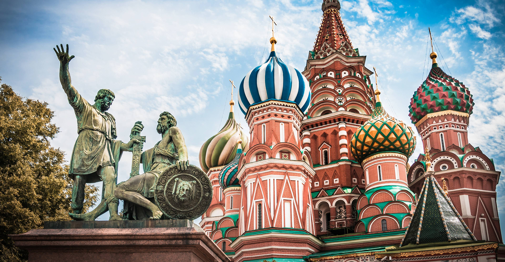

# Russian Cuisine

Cold-climate cooking that prizes preservation, grains, root vegetables and dairy. Sour cream and dill finish nearly every bowl; pickles, salted fish and fermented kvass sit at the table. Long-braised stews and beetroot-based soups (borscht), buckwheat kasha, blini and yeasted breads, plus the table-bound zakuski tradition of small starters, anchor the cuisine.
