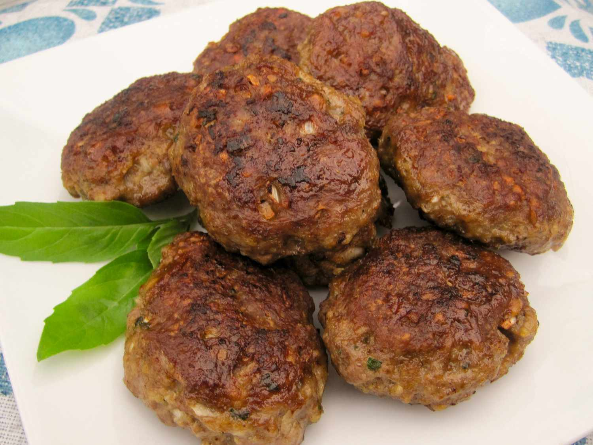

# Kotlety

*Russia's everyday cutlet: oval patties of seasoned minced beef (or pork, or chicken) bound with bread soaked in milk, dredged in breadcrumbs and pan-fried in butter till deeply golden outside and tender-juicy inside. The Russian family meal alongside mashed potato or buckwheat kasha, the school-canteen and home-kitchen standard from Murmansk to Vladivostok.*

**Serves:** 4 (8 kotlety total)

**Prep Time:** 25 minutes (plus 30 minutes chilling)

**Cook Time:** 25 minutes

## Overview
Kotlety (кoтлеты; literally "cutlets") are Russia's most beloved everyday meat dish and the canonical Russian home-cook standard: oval patties of minced beef (or pork, or chicken, or a mix), bound with soft white bread that's been soaked in milk and squeezed out (the "panada" technique that gives the kotlety their characteristic tender juicy interior), seasoned with onion, garlic, salt, pepper and a generous bunch of dill or parsley, sometimes enriched with a beaten egg, then formed into oval patties, dredged in breadcrumbs (or just flour) and pan-fried in butter or vegetable oil till deeply golden outside and tender-juicy inside. The dish has been the Russian family meal for at least a century; it's what every Russian grandmother makes, what school canteens serve, what office cafeterias dish out, and what families eat together on weeknight evenings. The dish is closely related to the German Frikadellen, the Polish kotlet, the Romanian chiftea and various other Eastern European meatcake traditions; the Russian version distinguishes itself with the bread-soaked-in-milk binder, the dill or parsley herb finish, and the typical accompaniments (mashed potato, buckwheat kasha, or a fresh salad of cucumber and tomato). Three details define proper kotlety. First, the bread-and-milk panada is essential. White bread (sliced sandwich bread, no crusts) soaked in milk till saturated, then squeezed gently to remove excess milk, gives the kotlety their characteristic tender juicy interior. Skipping this and using just dry breadcrumbs in the mix gives drier denser patties. Second, oval shape, not round. Russian kotlety are properly oval (more elongated than burgers, slightly flatter than meatballs); the shape gives more surface area for the golden crust. Third, fry in butter (or butter + oil) for the proper Russian flavour; pure vegetable oil works but loses the rich buttery character.

## Ingredients

### Meat filling
- 800 g minced beef (or 50/50 beef and pork; or chicken thigh; whatever you prefer)
- 100 g day-old white bread (no crusts; about 3 slices of supermarket white sandwich bread)
- 150 ml whole milk (for soaking the bread)
- 1 large onion (very finely chopped or grated)
- 4 garlic cloves (finely crushed)
- 1 large egg
- 2 tablespoons fresh dill (finely chopped; or substitute with parsley)
- 2 tablespoons fresh parsley (finely chopped)
- 1 ½ teaspoons fine sea salt
- 1 teaspoon ground black pepper
- ½ teaspoon ground sweet paprika
- ¼ teaspoon ground nutmeg

### Dredge
- 150 g fine dried breadcrumbs (or 100 g breadcrumbs + 50 g flour mixed)

### Frying
- 60 g unsalted butter
- 4 tablespoons vegetable oil

### To finish
- 30 g butter (for finishing the kotlety in the pan)
- Lemon wedges
- A small bowl of sour cream (smetana)
- Extra fresh dill

### To serve (choose one or more)
- Mashed potato (the Russian classic)
- Buckwheat kasha
- A simple salad of sliced cucumber, tomato and red onion with a vinegar dressing

## Method

### Stage 1 - Soak the bread
1. Tear the white bread into small pieces; place in a wide bowl.
2. Pour the milk over; let stand 5 minutes till the bread is fully saturated.
3. Squeeze the bread between your hands to remove excess milk (you want the bread moist but not dripping); discard the squeezed-out milk.
4. The squeezed bread becomes the panada.

### Stage 2 - Mix the kotlet filling
1. In a wide bowl, combine the minced meat, soaked bread, finely chopped/grated onion, crushed garlic, egg, dill, parsley, salt, pepper, paprika and nutmeg.
2. Mix thoroughly with a wooden spoon or your hands for 2-3 minutes; the mixture should become slightly sticky and cohesive.
3. Cover and refrigerate 30 minutes; this firms up the filling and makes it easier to shape.

### Stage 3 - Test the seasoning
1. Cook a small spoonful of the mix in a hot pan for 1 minute to test the seasoning.
2. Taste; adjust salt and pepper before shaping.

### Stage 4 - Shape the kotlety
1. Divide the meat mixture into 8 equal portions.
2. Shape each portion into an oval patty about 8 cm long, 5 cm wide and 2 cm thick.
3. Dredge each kotlety in the breadcrumbs, pressing gently to coat all sides.

### Stage 5 - Pan-fry
1. Heat 30 g of butter and 2 tablespoons of oil in a wide heavy frying pan over medium heat till the butter is foamy.
2. Place 4 kotlety in the pan (work in 2 batches; don't crowd).
3. Cook 4-5 minutes per side till deeply golden and the kotlety are cooked through (internal temperature 70°C / 158°F for beef and pork).
4. Press the centre gently with a finger; it should feel firm and spring back.
5. Lift out; place on a warm plate.
6. Wipe the pan; add the remaining 30 g butter and 2 tablespoons oil; cook the second batch.

### Stage 6 - Finish (optional)
1. After all kotlety are cooked, add 30 g of butter to the hot pan.
2. Lay the kotlety back into the foamy butter for 30 seconds, basting briefly.
3. Lift out; transfer to a serving plate.

### Stage 7 - Serve
1. Place 2 kotlety on each warm plate.
2. Serve with mashed potato, buckwheat kasha, or a fresh salad.
3. Add a dollop of sour cream and a lemon wedge.
4. Scatter with extra fresh dill.

## Notes
- **Bread-in-milk panada:** the proper Russian kotlety use bread soaked in milk (not dry breadcrumbs) as the binder. The soaked bread holds moisture and gives the kotlety their characteristic tender juicy interior. Don't skip.
- **Onion finely grated or processed:** large pieces of onion in the kotlety give an unpleasant texture. Grate finely or pulse in a food processor till nearly a paste.
- **Mix till sticky:** the 2-3 minutes of vigorous mixing develops the proteins and gives the kotlety proper cohesion. Lazy mixing gives crumbly kotlety that fall apart in the pan.
- **Oval shape, not round:** Russian kotlety are oval (8 cm × 5 cm × 2 cm); rounds are wrong. The shape gives more surface area for the golden crust.
- **Butter is the proper fat:** the butter (combined with oil to prevent burning) gives the proper Russian flavour. Pure oil works but lacks character; pure butter burns. The 60/40 butter-to-oil mix is right.

## Variations
**Chicken Kiev-style kotlety (with cheese):** insert a 2 cm cube of cold butter or a small piece of garlic-herb butter into the centre of each kotlety before sealing and dredging; gives a juicier centre.
**Pozharsky kotlety:** use chicken instead of beef; add 50 g of butter cut into pieces into the filling for richness; fry the same way. The 19th-century imperial Russian classic.
**Fish kotlety:** swap the meat for 800 g of minced white fish (pike, cod, salmon); add 1 tablespoon of grated onion and 1 tablespoon of dill; bind with 1 extra egg.
**Liver kotlety (pechenochnye kotlety):** swap 400 g of the meat for 400 g of chicken liver (chopped); add 1 extra slice of bread to absorb the extra moisture.

## Serving
On warm plates with mashed potato (the classic; Russian-style with plenty of butter and milk) or buckwheat kasha. A small dollop of sour cream on the kotlety; a sprinkle of dill. Lemon wedges on the side. Drink: a small cold glass of vodka; kompot (Russian fruit drink); or strong sweet tea after the meal.

## Storage
- Keeps refrigerated 4 days; the flavour deepens overnight.
- Reheat gently in a frying pan with a little butter, or in a covered oven dish at 160°C / 320°F for 12-15 minutes till hot through.
- Freezes 3 months cooked or uncooked. For uncooked: shape, freeze flat on a tray, transfer to a bag; pan-fry from frozen (cook 6-7 minutes per side instead of 4-5).
- Day-old kotlety make excellent sandwich filling: split a fresh roll, layer kotlety with sliced tomato and mustard.
- Don't microwave; the breadcrumb crust goes soggy.
