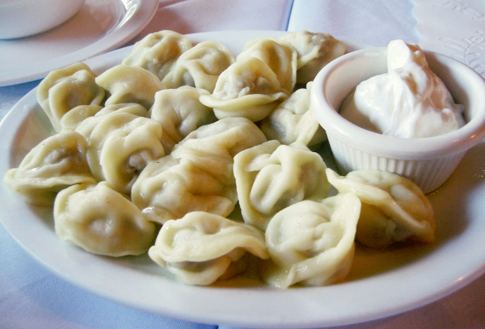

# Pelmeni

*Russia's Siberian dumplings: small round dumplings of thin pasta-style dough wrapped around a seasoned mince of beef, pork and onion, boiled briefly and served with melted butter, sour cream, dill and black pepper. The Siberian-Russian classic eaten across the country, frozen for winter and boiled in 5 minutes from the freezer.*

**Serves:** 6 (makes about 60 pelmeni)

**Prep Time:** 1 hour 30 minutes

**Cook Time:** 8 minutes (boiling)

## Overview
Pelmeni are Russia's most iconic dumplings and the canonical Siberian winter food: thin pasta-style dough rolled paper-thin, cut into small circles, filled with a seasoned minced meat (the traditional Siberian filling is a mix of beef, pork and a small amount of lamb; sometimes pure beef or pork; sometimes including a small amount of veal), folded into half-moons and then twisted into the iconic ear-shaped pelmeni (the rounded edge is folded inward to give the rounded little pouches). They're boiled briefly in salted water (5-7 minutes), drained and served immediately with melted butter, sour cream, finely chopped dill and freshly ground black pepper. Across Russia, pelmeni are made in large batches and frozen on trays; you can take a handful from the freezer at any time and drop them straight into boiling water for a 7-minute dinner. The dish has Mongolian-Chinese origins (the buuz of Mongolia and the jiaozi of China are close cousins), brought to Siberia centuries ago and now thoroughly Russian. Three details define proper pelmeni. First, the filling must be properly seasoned. Salt, pepper, finely grated onion (the moisture from grated onion keeps the filling juicy), a small amount of cold water to help the meat hold together, and traditionally a small amount of milk or cream. Underseasoned filling gives bland pelmeni. Second, the dough must be properly thin. The Russian pelmeni dough is rolled paper-thin (1-2 mm); thicker dough gives heavy doughy pelmeni. Third, the boiling water must be heavily salted; pelmeni boiled in unsalted water taste flat. The traditional accompaniments (butter, sour cream, dill, black pepper) are not optional; they're part of the dish.

## Ingredients

### Dough
- 500 g plain flour
- 2 large eggs
- 200 ml cold water
- 1 teaspoon fine sea salt
- 1 tablespoon vegetable oil (optional; helps the dough roll)

### Filling
- 300 g minced beef (about 20% fat)
- 300 g minced pork (about 20% fat)
- 100 g minced veal (or use more beef; or skip)
- 1 large onion (finely grated, or pulsed in a food processor)
- 4 garlic cloves (crushed)
- 4 tablespoons cold water (or beef stock)
- 1 ½ teaspoons fine sea salt
- 1 ½ teaspoons ground black pepper
- ¼ teaspoon ground allspice (optional but very Russian)

### To cook
- 2 tablespoons fine sea salt (for the boiling water; the water should taste like seawater)
- 1 bay leaf (added to the boiling water for fragrance)

### To serve
- 60 g unsalted butter (melted)
- 300 ml sour cream (the proper smetana if available, or full-fat sour cream)
- 1 large bunch fresh dill (finely chopped)
- Freshly ground black pepper
- 2 tablespoons white wine vinegar or apple cider vinegar (for diners who want a sharp note)

## Method

### Stage 1 - Make the dough
1. In a wide bowl, whisk together the flour and salt.
2. In a smaller bowl, whisk the eggs with the cold water and the optional oil.
3. Make a well in the centre of the flour; pour in the egg-water mix.
4. Use a fork to gradually incorporate the flour from the edges into the liquid; once mostly combined, switch to hands.
5. Knead for 8-10 minutes on a lightly floured surface till smooth and elastic. The dough should feel slightly stiff (not soft pasta dough; firmer for pelmeni).
6. Wrap in cling film; rest 30 minutes at room temperature.

### Stage 2 - Make the filling
1. In a wide bowl, combine the minced beef, pork, veal (if using), grated onion, crushed garlic, water (or stock), salt, pepper and allspice.
2. Mix thoroughly with a wooden spoon or hands; mix vigorously for 2-3 minutes till the mixture becomes slightly sticky. The texture should be cohesive but moist.
3. Cover and refrigerate till needed.

### Stage 3 - Roll out the dough
1. Divide the rested dough into 4 portions.
2. Working one at a time (keep the rest covered), roll each portion on a lightly floured surface to about 1-2 mm thick (paper-thin).
3. Use a small round cutter (about 6 cm diameter; a glass works) to cut circles from the dough.
4. Re-roll the scraps once to make more circles.

### Stage 4 - Fill and shape
1. Place 1 teaspoon of meat filling in the centre of each dough circle.
2. Fold the circle in half over the filling to make a half-moon shape.
3. Pinch the edges together to seal; press out any air bubbles.
4. Hold the half-moon by its straight edge; bring the two pointed corners together at the bottom (under the curved edge) and pinch them together. This creates the iconic rounded pelmeni shape.
5. Place each shaped pelmeni on a lightly floured tray.
6. Repeat with the remaining dough and filling. You should have about 60 pelmeni.

### Stage 5 - Cook (or freeze)
1. **To freeze for later:** lay the pelmeni in a single layer on a floured tray; freeze solid for 1-2 hours; transfer to a freezer bag. Keep frozen 3 months.
2. **To cook now:** bring a large pot of heavily salted water to a rolling boil with the bay leaf.
3. Add the pelmeni in batches (don't crowd; 20-25 at a time in a large pot).
4. Stir gently with a wooden spoon to prevent sticking.
5. Cook 5-7 minutes (or 7-9 minutes from frozen) till the pelmeni float to the surface and are cooked through.
6. Lift out with a slotted spoon; drain briefly.

### Stage 6 - Serve
1. Place 8-10 pelmeni in each warm bowl.
2. Pour 1-2 tablespoons of melted butter over.
3. Add 2 generous tablespoons of sour cream on top.
4. Scatter generously with chopped dill.
5. Add a heavy grind of black pepper.
6. Offer the vinegar on the side for those who want sharpness.
7. Eat immediately while hot.

## Notes
- **Grated onion gives the proper juicy filling:** finely grated onion (rather than chopped) releases its juice into the meat and keeps the filling moist. Chopped onion gives chunkier filling that's less juicy.
- **Mix the filling till sticky:** the 2-3 minutes of vigorous mixing develops the proteins and gives the filling proper cohesion. Lazy mixing gives crumbly filling.
- **Paper-thin dough:** pelmeni dough should be rolled to 1-2 mm; thicker gives heavy dumplings. If you have a pasta machine, the lowest setting works.
- **Heavily salted water:** the boiling water should taste like seawater. Add 2 tablespoons of salt per 4 litres of water. Underseasoned water gives flat-tasting pelmeni.
- **Don't crowd the pot:** boil in batches. Overcrowding drops the water temperature, gives uneven cooking and sticking.

## Variations
**Pelmeni with broth:** instead of butter-and-sour-cream, serve the pelmeni in their cooking broth (well-salted, with a bay leaf and a few peppercorns), garnished with dill and pepper. Common Siberian style.
**Lamb pelmeni:** use 600 g of minced lamb instead of the beef-pork mix; add 1 teaspoon of ground cumin to the filling. Common in the Caucasus and central Asia.
**Cabbage and meat pelmeni:** mix 100 g of finely chopped sauerkraut into the filling; common Ural Russian variation.
**Fish pelmeni:** swap the meat for 600 g of minced white fish (pike, cod) with a small amount of butter and dill in the filling; Siberian river-fish variation.

## Serving
In warm bowls with the butter, sour cream and dill. As a main course, 8-10 per person. As a starter, 5-6 per person. A small glass of cold vodka alongside is the canonical Russian winter pairing; for non-vodka diners, kvass (the fermented rye drink) or cold beer.

## Storage
- Cooked pelmeni keep refrigerated 2 days; reheat gently in butter in a frying pan, or briefly in the microwave.
- Uncooked frozen pelmeni keep 3 months in the freezer; cook from frozen by dropping straight into boiling water (add 2-3 minutes to the cook time).
- Don't refreeze cooked pelmeni; the dough goes soggy.
- The dough freezes 2 months wrapped tightly; defrost in the fridge before rolling.
- The filling alone keeps refrigerated 2 days; use within or freeze for 3 months.
