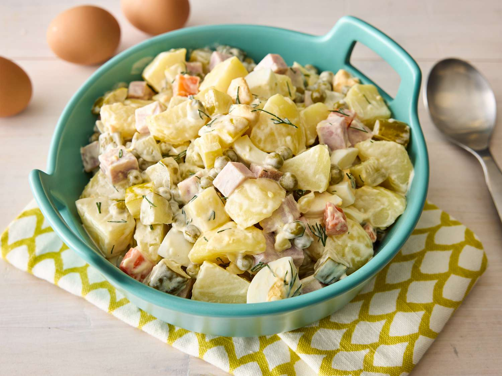

# Olivier Salad

*Russia's New Year's Eve salad: cubed cooked potato, carrot, peas, hard-boiled egg, dill pickles and cooked chicken (or beef, or bologna) folded together with a generous amount of mayonnaise and finished with dill. The Soviet-era and now Russian-classic salad on every Russian and Eastern European New Year's table.*

**Serves:** 8 as a generous side

**Prep Time:** 30 minutes (plus 1 hour chilling)

**Cook Time:** 25 minutes

## Overview
Olivier salad (Olivye in Russian, salat Olivye) is Russia's most iconic salad and a New Year's Eve institution across Russia and the former Soviet states: cubed cooked potato, carrot, peas, hard-boiled egg, dill pickles and cooked chicken (the modern home-cook standard; the original 19th-century recipe used game birds, the Soviet version used bologna), all bound generously with mayonnaise, seasoned with mustard, finished with chopped dill. The salad was supposedly invented in the 1860s by a Belgian-French chef, Lucien Olivier, at the Hermitage restaurant in Moscow; over time it was simplified and democratised, especially during the Soviet era when game birds were unavailable. A cultural touchstone: no Russian, Ukrainian, Belarusian or Kazakh New Year's table is complete without it. Cut all ingredients to a uniform 5 to 7 mm dice; chunky is wrong here. Mayonnaise only (not yogurt or sour cream). Rest one to two hours in the fridge before serving so the flavours marry.

## Ingredients

- 400 g potatoes (small floury potatoes; left whole with skin, boiled, then peeled and diced)
- 250 g carrots (peeled, then either left whole and boiled or diced and boiled; the goal is fully cooked)
- 200 g cooked chicken breast (or substitute with cooked ham, salami, or doktorskaya kolbasa)
- 4 large eggs (hard-boiled; about 8 minutes from cold water)
- 200 g good-quality dill pickles (finely diced; reserve some brine for the dressing)
- 200 g frozen peas (thawed and drained; or fresh peas blanched 2 minutes)
- 1 small onion (very finely chopped, optional; some recipes include, some don't)
- 200-250 g good-quality mayonnaise (start with 200; add more if needed; or homemade for the proper version)
- 2 teaspoons Dijon mustard
- 2 tablespoons pickle brine (from the dill pickles; gives the proper Russian profile)
- 1 large bunch fresh dill (finely chopped)
- 1 small bunch fresh parsley (finely chopped, optional)
- 1 teaspoon fine sea salt
- 1 teaspoon ground black pepper

## Method

### Stage 1 - Cook the vegetables and eggs
1. Place the potatoes (whole, skin-on; choose small uniform potatoes) and carrots (whole, peeled) in a large pot of cold salted water.
2. Bring to a boil; cook 15-18 minutes till both are fork-tender but not falling apart.
3. Drain; let cool to room temperature.
4. In a separate pan, hard-boil the eggs: place in cold water, bring to a boil, then cook 8 minutes; transfer to ice water immediately; peel once cool.

### Stage 2 - Cook or prepare the chicken
1. If using raw chicken: poach 200 g of chicken breast in salted water for 12-15 minutes till cooked through; cool.
2. If using leftover cooked chicken or cured meats: skip this step.

### Stage 3 - Dice the ingredients
1. Peel the cooled potatoes; cut into 5-7 mm dice.
2. Cut the cooked carrots into 5-7 mm dice.
3. Cut the cooled chicken (or cured meat) into 5-7 mm dice.
4. Cut the peeled hard-boiled eggs into 5-7 mm dice.
5. Cut the dill pickles into 5-7 mm dice (keep the brine).
6. The frozen peas are already the right size; just thaw and drain.

### Stage 4 - Make the dressing
1. In a small bowl, whisk together the mayonnaise, Dijon mustard, pickle brine, salt and pepper.
2. Taste; adjust with more pickle brine for tang, more mayonnaise for richness, more mustard for kick.

### Stage 5 - Combine
1. In a wide bowl, gently combine the diced potato, carrot, chicken, eggs, pickles, peas and onion (if using).
2. Pour the dressing over.
3. Add half the chopped dill and all the parsley (if using).
4. Fold gently with a wooden spoon; don't crush the ingredients.
5. Taste; adjust salt and pepper.

### Stage 6 - Rest
1. Cover the bowl with cling film; refrigerate at least 1 hour (preferably 2-3 hours) before serving.
2. The flavours marry, the mayonnaise distributes through, and the salad reaches the proper Russian texture.

### Stage 7 - Serve
1. Transfer to a serving bowl.
2. Scatter the remaining chopped dill over the top.
3. Serve cold as a side or starter.

## Notes
- **Boil the potatoes whole, then dice:** boiling whole potatoes (with skin on) and dicing after cooling gives firmer cleaner dice than boiling pre-cut potato. The cooked dice will hold their shape in the salad.
- **Uniform small dice:** all ingredients should be cut to similar small size (5-7 mm); this gives the proper Russian Olivier texture. Larger dice gives a chunky salad which is not the proper style.
- **Use good-quality mayonnaise:** the salad's flavour depends on the mayonnaise. Homemade is best; or use a good store brand. Don't use low-fat mayo; the texture and flavour suffer.
- **Pickle brine in the dressing:** a tablespoon or two of pickle brine in the dressing gives the proper Russian tang. Skipping it gives a bland salad.
- **Rest before serving:** 1-2 hours of refrigeration is essential. Right-after-mixing the salad tastes scattered; properly rested it tastes harmonious.

## Variations
**Original Hermitage Olivier (luxe version):** use grouse, ptarmigan or other game birds instead of chicken; add 100 g of small capers and 2 tablespoons of caviar (or salmon roe). The 19th-century original.
**Vegetarian Olivier:** skip the chicken; double the peas; add 200 g of finely diced cooked beetroot (which turns the whole salad pink; the proper "vinaigrette-Olivier hybrid").
**Crab Olivier:** swap the chicken for 200 g of cooked picked crab meat; a luxurious modern variation. Common at fancier Russian restaurants.
**With apple (Soviet variation):** add 1 small finely diced eating apple (Granny Smith or similar) for sweetness; reduces the mayonnaise feel. Common in some regional Soviet variations.

## Serving
In a big bowl as the centerpiece of a Russian New Year's table, alongside herring under fur coat (selyodka pod shuboy), various pickled vegetables, smoked fish, blini with caviar, and copious shots of cold vodka. Or as a side at any meal; or as lunch with a slice of black bread. Drink: chilled vodka (the traditional pairing); kvass; or cold beer.

## Storage
- Keeps refrigerated 3-4 days in a sealed container; the flavour deepens after 24 hours.
- Don't freeze; the texture suffers completely (the mayonnaise splits and the vegetables go off-texture).
- Make ahead: the components can be prepped the day before; combine and dress 2-3 hours before serving.
- Best within 48 hours of making; after day 3, the salad starts to weep liquid as the vegetables release moisture.
- Day-old Olivier is excellent for breakfast on a slice of buttered black bread.
