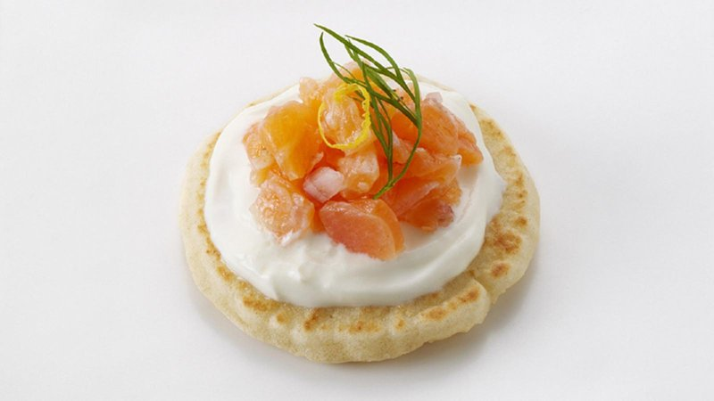

# Smoked Salmon Blini

*Bite-sized buckwheat pancakes topped with crème fraîche, smoked salmon and dill. Russian in origin, now a fixture of Christmas drinks parties. Make the blini ahead; assemble in the last ten minutes.*

**Serves:** 6 (makes 30 blini)

**Prep Time:** 30 minutes (plus 1 hour rise)

**Cook Time:** 20 minutes

## Overview
Blini are the small yeasted buckwheat pancakes of Russian drinks tables, topped with crème fraîche, a curl of smoked salmon and a sprig of dill, eaten in two bites with a glass of cold champagne in the other hand. The buckwheat is what gives blini their earthy character, all-plain-flour blini are fluffier but blander, so use half plain and half buckwheat. Whisk both flours with dried yeast, sugar and salt, pour in warm milk and beat to a smooth batter, then cover and rise an hour in a warm place till the surface is bubbly. Whisk in two egg yolks and melted butter, then whip the whites to soft peaks and fold them gently through. Heat a wide non-stick pan over medium-low, brush with a tiny knob of butter, drop teaspoonfuls of batter spaced apart (each blini about 4 cm across), and cook a minute or two till bubbles cover the surface and the edges set, flip for another thirty seconds. Lift onto a wire rack and repeat, brushing more butter as needed. Make the blini ahead and assemble only in the last ten minutes before guests arrive: a small dollop of crème fraîche on each, a curl of smoked salmon laid over, a small sprig of dill tucked on top, a grate of lemon zest and a twist of black pepper. Arrange on a platter with lemon wedges, pass with chilled champagne or a thimble of vodka straight from the freezer.

## Ingredients

### Blini batter
- 100 g plain flour
- 100 g buckwheat flour
- 1 teaspoon dried yeast
- 1 teaspoon caster sugar
- 1 teaspoon salt
- 250 ml whole milk (warm)
- 2 eggs (large, separated)
- 30 g unsalted butter (melted)

### To cook
- 2 tablespoons unsalted butter (for the pan)

### Topping
- 200 g crème fraîche
- 200 g smoked salmon (sliced into 4 cm strips)
- A small bunch of fresh dill (sprigs picked)
- 1 lemon (zest and a few wedges)
- Freshly ground black pepper

## Method

### Stage 1 - Make the batter
1. Whisk both flours, yeast, sugar and salt in a bowl.
1. Pour in the warm milk; whisk to a smooth batter.
1. Cover; rise in a warm place for 1 hour (the surface should be bubbly).
1. Whisk in the egg yolks and melted butter.
1. Whip the egg whites to soft peaks; fold gently into the batter.

### Stage 2 - Cook the blini
1. Heat a wide non-stick pan over medium-low heat.
1. Brush with a tiny knob of butter.
1. Drop teaspoonfuls of batter into the pan, spaced apart (each blini is about 4 cm across).
1. Cook for 1-2 minutes until bubbles cover the surface and edges set.
1. Flip; cook another 30 seconds.
1. Transfer to a wire rack; repeat with the rest of the batter, brushing more butter as needed.

### Stage 3 - Assemble (last 10 minutes only)
1. Top each blini with a small dollop of crème fraîche.
1. Lay a curl of smoked salmon over.
1. Tuck a small sprig of dill on top.
1. Grate a tiny bit of lemon zest over.
1. Add a twist of black pepper.

### Stage 4 - Serve
1. Arrange on a platter; lemon wedges alongside.
1. Pass with chilled champagne or vodka.

## Notes
- **Buckwheat for character:** All plain flour gives a fluffier but blander blini. Buckwheat brings the proper Russian earthiness.
- **Make blini ahead:** Cool completely, store in an airtight container; warm briefly in a low oven before topping.
- **Don't dollop crème fraîche too early:** Goes runny and soaks the blini if assembled more than 15 minutes before serving.

## Storage
- Plain blini keep 2 days refrigerated, freeze 2 months. Re-warm at 150°C for 5 minutes.
- Topped blini don't keep; assemble at the moment of serving.
