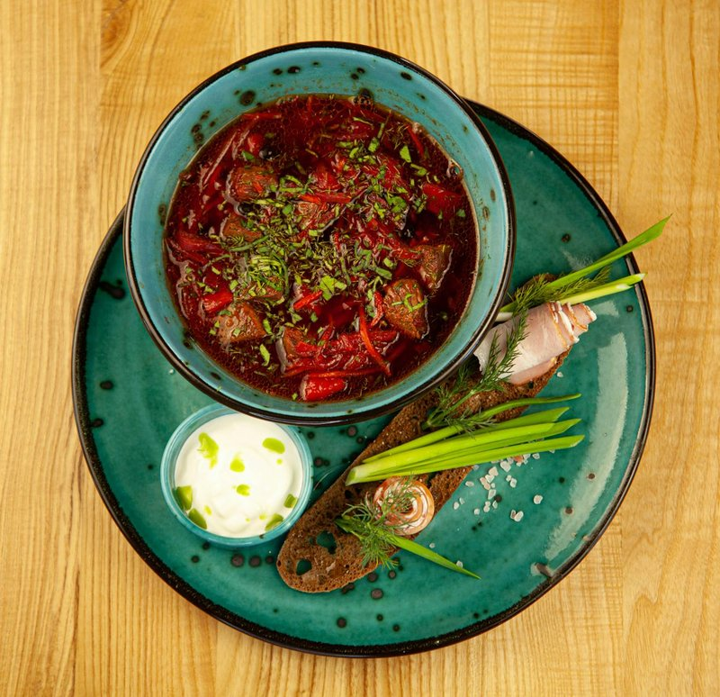

# Vegetarian Borscht

*Russian beetroot soup with cabbage, carrots and potatoes, deep ruby-red and faintly sweet from the long-cooked beetroot. The sour finish - vinegar in the soup, sour cream and fresh dill on top - is what makes it borscht and not just a beetroot stew.*

**Serves:** 6

**Prep Time:** 20 minutes

**Cook Time:** 1 hour

## Overview
The vegetarian sister to the great beef-stocked borscht: a deep ruby-red soup of grated beetroot, cabbage, carrots and potatoes that gives nothing away on colour or depth, finished with the same sour-cream-and-dill swirl that defines the dish. The whole thing hinges on the finish: cider vinegar and a teaspoon of sugar (without acid the soup tastes flat and sweet, with it the colour stays brilliant and the flavour balances sour, sweet and earthy). Taste and adjust till all three notes show with the beetroot earthiness behind. Ladled into bowls, each topped with a generous spoonful of soured cream and a heavy shower of fresh dill, the cream stirred into the dark broth at the table for the pink-and-white swirl that's part of the dish. Eaten with dark rye and a glass of something cold; the soup deepens overnight and keeps five days in the fridge.

## Ingredients

- 4 tablespoons sunflower oil
- 1 onion (large, chopped)
- 2 carrots (medium, grated)
- 3 beetroots (medium, around 400 g; peeled and grated)
- 4 garlic cloves (crushed)
- 2 tablespoons tomato paste
- 1 ½ litres vegetable stock
- 3 potatoes (medium, peeled and cubed)
- ½ small white cabbage (around 400 g; shredded)
- 2 bay leaves
- 5 black peppercorns
- 2 tablespoons cider vinegar (or white wine vinegar)
- 1 teaspoon sugar
- 1 ½ teaspoons salt (or to taste)
- Black pepper

### To serve
- 4 tablespoons soured cream
- A small bunch of dill (chopped)
- Crusty rye bread

## Method

### Stage 1 - Sauté
1. Heat the oil in a large heavy pan over medium heat.
1. Cook the onion 5 minutes; add the carrot and beetroot; cook 8-10 minutes more, stirring, until the colour darkens and everything softens.
1. Stir in the garlic and tomato paste; cook 2 minutes.

### Stage 2 - Stock
1. Pour in the stock; add the potatoes, bay leaves and peppercorns.
1. Bring to the boil; reduce to a steady simmer.
1. Cook 15 minutes.

### Stage 3 - Cabbage
1. Add the cabbage; cook 15-20 minutes more until everything is tender and the broth is deep red-purple.

### Stage 4 - Balance
1. Stir in the vinegar, sugar and salt.
1. Taste; adjust vinegar (sour), sugar (sweet) and salt to balance - should be all three with the beetroot earthiness behind.
1. Discard the bay leaves and peppercorns if you can find them.

### Stage 5 - Serve
1. Ladle into bowls.
1. Top each with a generous spoonful of soured cream and a shower of dill.
1. Serve with dark rye bread.

## Notes
- **Grate the beetroot:** Diced beetroot gives a chunky stew with isolated bits of red. Grated bleeds throughout - that deep ruby colour is what defines borscht.
- **Vinegar is essential:** Without acid the soup tastes flat and sweet. Adjust to taste; some prefer it sharper.
- **Soured cream at the table:** Stir it in just before eating; the swirl of pink-and-white in the dark broth is part of the dish.

## Storage
- Keeps 5 days refrigerated; flavour deepens.
- Freezes 3 months.
