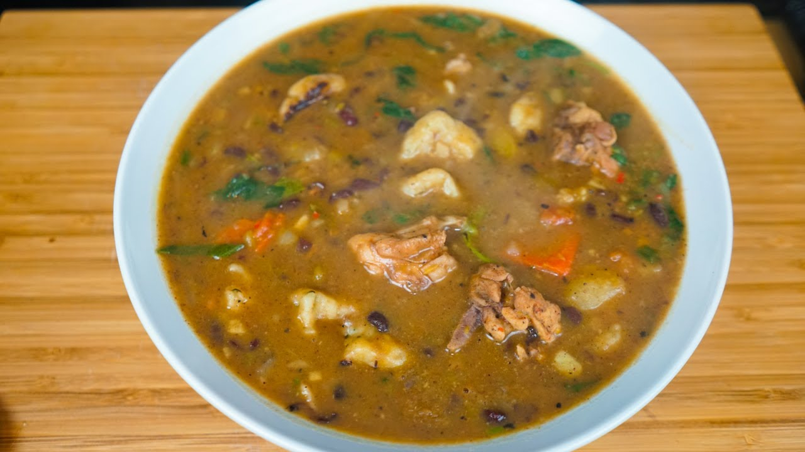

# Bouyon

*Saint Lucian one-pot stew: beef and salt-pork simmered low with dumplings, dasheen, yam, sweet potato, plantain and chopped greens. The Saturday-cooking village pot, generous enough to feed everyone who turns up.*

**Serves:** 6-8

**Prep Time:** 25 minutes

**Cook Time:** 1 hour 45 minutes

## Overview
Bouyon is the everyday Eastern Caribbean stew, found in slightly different forms across Saint Lucia, Dominica and Grenada. The principle: one big pot, brown the meat, build a herb-and-tomato base, layer in every kind of provision (dasheen, yam, sweet potato, green banana, plantain), drop in dumplings, finish with chopped greens. By the time it has simmered for an hour the meats are tender, the provisions are starchy and absorbent, the dumplings are doughy in the broth. Eaten in deep bowls with a wedge of lime, ideally with friends arriving unannounced and someone passing rum punch.

## Ingredients

### Meats and base
- 500 g beef shin or chuck, cut into 3 cm cubes
- 200 g salt pork (or smoked bacon as a substitute), cubed
- 3 tbsp vegetable oil
- 1 large onion, chopped
- 4 cloves garlic, minced
- 1 small scotch bonnet, halved (kept whole to be lifted out later)
- 1 red sweet pepper, chopped
- 2 ripe tomatoes, chopped
- 1 tbsp tomato paste
- 6 sprigs fresh thyme, leaves only
- 1 bay leaf
- 1.5 litres water or stock
- 1 tsp salt
- 1 tsp black pepper

### Provisions
- 1 small dasheen (taro), peeled and cut into 4 cm chunks
- 1 medium yam, peeled and cut into 4 cm chunks
- 1 medium sweet potato, peeled and cut into 4 cm chunks
- 1 firm green plantain, peeled and cut into 3 cm rounds
- 2 green bananas (figs), peeled and halved

### Dumplings
- 200 g plain flour
- 1/2 tsp salt
- 90 ml cold water (approx)

### Greens
- 1 large handful spinach or callaloo, chopped
- 2 spring onions, sliced

## Method

### Stage 1 - Brown the meats
1. Heat 2 tbsp oil in a large heavy pot. Brown the beef in batches, 3 minutes per side. Set aside.
2. Add the salt pork; render and brown 5 minutes; add to the beef.

### Stage 2 - Build the base
1. Add the remaining 1 tbsp oil. Soften the onion 8 minutes.
2. Add garlic, sweet pepper. Cook 4 minutes.
3. Add the chopped tomato, tomato paste, thyme and bay leaf. Cook 5 minutes.
4. Return the meats; pour in the water/stock. Add salt and pepper. Drop in the halved scotch bonnet (keep it whole - lift out at the end).

### Stage 3 - First simmer
1. Bring to a boil; reduce to low. Cover; simmer 45 minutes - the beef should be approaching tender.

### Stage 4 - Make the dumplings
1. Combine flour and salt in a bowl.
2. Gradually add cold water; mix to a stiff dough.
3. Knead briefly; rest 10 minutes.
4. Pinch off small lumps and roll into rough cylinders or small balls - rustic, not perfect.

### Stage 5 - Add provisions and dumplings
1. Add the dasheen, yam, sweet potato to the simmering pot first (they take longest).
2. Cook 15 minutes.
3. Add the plantain, green banana and dumplings.
4. Cook another 15-20 minutes until everything is tender.

### Stage 6 - Greens and finish
1. Add the spinach/callaloo and spring onion in the last 3 minutes.
2. Lift out and discard the scotch bonnet (or break a piece in for more heat).
3. Taste; adjust salt.

## Notes
- **The scotch bonnet trick:** Adding it whole and lifting it out gives the bouyon its background heat without making it fiery. Bursting it would over-spice.
- **Provisions substitution:** Use whatever's available. Dasheen, yam, sweet potato are the core; cassava and pumpkin chunks also work well.
- **Dumpling shape:** Bajan/Saint Lucian dumplings are rough - not Chinese-precise. Pinched cylinders or small flat ovals are traditional.

## Serving
- Serve in deep bowls with a wedge of lime and a small spoon of chilli pepper sauce on the side. Bread and butter alongside if it's a really cold evening.

## Storage
- Refrigerate 4 days; the flavour deepens overnight as the provisions absorb the broth.
- Freezes 2 months; the dumplings turn slightly softer on thaw.
