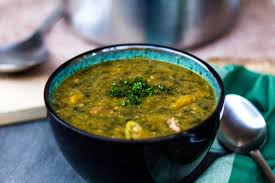

# Callaloo Soup

*Saint Lucian callaloo soup: dasheen leaves slow-simmered with okra, salt-pork or crab, coconut milk, garlic, thyme and a whisper of scotch bonnet. The thick green soup that turns up at every Sunday lunch across the Lesser Antilles.*

**Serves:** 6

**Prep Time:** 25 minutes

**Cook Time:** 1 hour

## Overview
Callaloo is one of the great Caribbean cross-island dishes - found in Trinidad, Jamaica, Saint Lucia, Dominica, Grenada, and beyond, each with its variant. The Saint Lucian version uses dasheen leaves (the dark green leaf of the taro plant; substitute spinach or chard at a pinch), softened slowly with okra, coconut milk, salt-pork or crab meat, garlic and thyme. The okra is what thickens the soup into its signature slightly mucilaginous, soup-not-stew consistency. Eaten with hard-dough bread or as the bed for steamed fish.

## Ingredients
- 500 g fresh dasheen leaves (callaloo) - substitute fresh spinach or chard (about 700 g if substituting, since they cook down more)
- 250 g salt pork or smoked bacon, cubed (or 300 g lump crab meat for the seafood version)
- 3 tbsp vegetable or coconut oil
- 1 large onion, finely chopped
- 4 cloves garlic, minced
- 1 small scotch bonnet, halved (whole for heat, not chopped)
- 200 g okra, sliced 1 cm thick
- 6 sprigs fresh thyme, leaves only
- 1 bay leaf
- 400 ml coconut milk
- 600 ml chicken or vegetable stock
- 1 tsp salt
- 1/2 tsp black pepper
- 1 lime, juiced (to finish)

## Method

### Stage 1 - Prepare the leaves
1. Wash the dasheen leaves thoroughly under cold running water (often dusty/sandy from harvest).
2. Strip the leaves from the central stalk; discard the stalks (or save for stock).
3. Stack and roll the leaves; slice into 1 cm ribbons.
4. **Important if using fresh dasheen:** boil the chopped leaves in salted water for 5 minutes before adding to the soup. This destroys the calcium oxalate crystals that make raw taro/dasheen tongue-irritating. Drain. (Skip this step for spinach or chard substitutes.)

### Stage 2 - Render the salt pork (or skip for the crab version)
1. Heat 1 tbsp oil in a wide heavy pot.
2. Add the cubed salt pork; cook over medium heat 8-10 minutes until rendered and crisp at the edges.
3. Set aside the crisped pieces. Leave the rendered fat in the pot.

### Stage 3 - Build the base
1. Add the remaining oil. Soften the onion 8 minutes.
2. Add garlic; cook 1 minute.
3. Add the okra; cook 5 minutes - the okra releases its thickening compound.
4. Add the scotch bonnet (halves, not chopped), thyme leaves and bay.

### Stage 4 - Simmer
1. Pour in the coconut milk and stock. Add salt and pepper.
2. Bring to a simmer.
3. Add the blanched dasheen leaves (or substitute greens directly if using spinach/chard).
4. Return the salt pork (or add the crab meat now if using the crab version).
5. Cover; simmer 30 minutes - the leaves break down, the soup thickens to a green-flecked consistency.

### Stage 5 - Finish
1. Lift out and discard the scotch bonnet halves (or burst one in for more heat).
2. Discard the bay leaf.
3. Off heat, stir in the lime juice.
4. Taste; adjust salt - the salt pork carries a lot, so taste before adding more.

## Notes
- **Dasheen leaf safety:** Mandatory blanch for raw dasheen. The calcium oxalate crystals are tongue-irritating raw; boiling destroys them. Spinach and chard substitutes don't need the blanch.
- **The okra's job:** Okra is the thickener. Don't skip - the soup needs the slightly slippery body that okra provides.
- **Salt pork vs crab:** Both versions are traditional. Salt pork gives a smoky-savoury richness; crab gives a sweet seafood note. Choose one - mixing both is heavy.

## Serving
Serve in deep bowls with hard-dough bread or crusty white bread. A small dish of chilli sauce alongside.

## Storage
- Refrigerate 3 days. The flavour deepens overnight.
- Freezes 2 months; thaw in the fridge.
