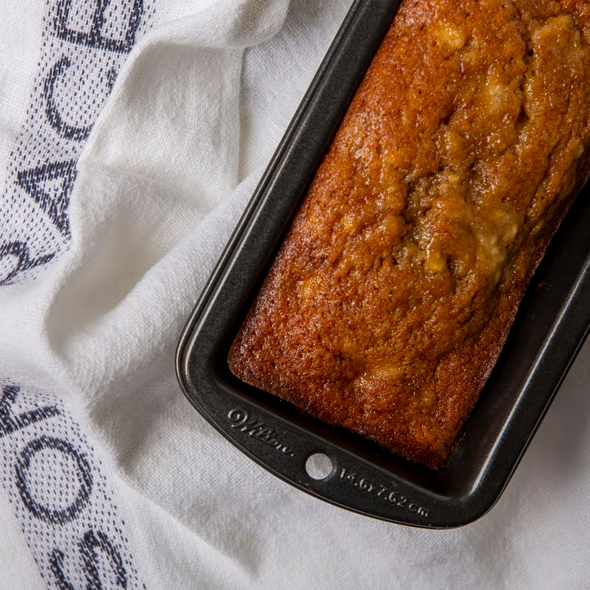

# Lucian Banana Cake

*Saint Lucian banana cake: very ripe bananas folded into a buttery brown-sugar batter with cinnamon, nutmeg and a small splash of dark rum, baked into a dense moist loaf. The afternoon tea cake of every Lucian household.*

**Serves:** 8-10 slices

**Prep Time:** 15 minutes

**Cook Time:** 1 hour

## Overview
Banana grows everywhere in Saint Lucia, and the cooks know exactly what to do with the bunch that's gone too ripe to eat as fruit. The Lucian banana cake leans heavier on spice (cinnamon, nutmeg, mixed spice) and brown sugar than the typical North American banana bread; a splash of dark rum is the Caribbean signature touch that goes into the batter to keep it moist and add depth. Eaten warm with butter or at room temperature with afternoon tea or cocoa. Lasts a week in a tin; some Lucian cooks say it improves over the second and third day as the rum and spices meld.

## Ingredients
- 4 very ripe bananas (about 450 g flesh weight; deep yellow with plenty of black spots)
- 200 g unsalted butter, softened
- 200 g dark brown sugar
- 2 large eggs
- 2 tbsp dark rum (substitute: 1 tbsp vanilla + 1 tbsp orange juice)
- 1 tsp vanilla extract
- 300 g plain flour
- 1.5 tsp baking powder
- 1/2 tsp bicarbonate of soda
- 2 tsp ground cinnamon
- 1 tsp ground nutmeg
- 1 tsp ground mixed spice
- 1/2 tsp salt
- 100 g chopped pecans or walnuts (optional)

## Method

### Stage 1 - Prep
1. Heat oven to 170 C.
2. Butter a 23 x 13 cm loaf tin; line with greaseproof paper, leaving an overhang for lifting.

### Stage 2 - Mash and cream
1. Mash the bananas thoroughly in a bowl with a fork until almost smooth (a few small lumps are fine).
2. In a separate large bowl, beat the softened butter and brown sugar together for 4-5 minutes until pale and fluffy.
3. Beat in the eggs one at a time, mixing thoroughly between each.
4. Stir in the mashed bananas, rum and vanilla.

### Stage 3 - Combine
1. In another bowl, whisk together the flour, baking powder, bicarbonate of soda, cinnamon, nutmeg, mixed spice and salt.
2. Fold the dry ingredients into the wet mixture in 3 additions, mixing just until combined.
3. Fold in the chopped nuts if using.

### Stage 4 - Bake
1. Tip the batter into the prepared tin; smooth the top.
2. Bake 55-65 minutes. A skewer inserted into the centre should come out with light moist crumbs (not wet batter).
3. The top should be deeply caramel-brown and slightly cracked.

### Stage 5 - Cool
1. Rest in the tin 10 minutes.
2. Lift out using the paper overhang; cool on a rack for at least 30 minutes before slicing.

## Notes
- **Banana ripeness:** Very ripe is essential. Underripe bananas give a starchy under-sweet cake; black-spotted ripeness gives the right depth.
- **Rum:** The dark rum (Bajan rum, Mount Gay, or any dark Caribbean) adds depth without making the cake taste alcoholic. The alcohol cooks off; the molasses notes stay.
- **Texture:** This is a dense, moist cake - not a light fluffy banana bread. Avoid overmixing; fold gently.

## Serving
Serve warm with butter, or at room temperature with afternoon tea. A scoop of vanilla ice cream and a drizzle of rum syrup makes a dessert plate.

## Storage
- In an airtight tin at room temperature: 5-7 days. The cake stays moist; the flavour deepens overnight.
- Refrigerate 2 weeks; bring to room temperature before serving.
- Freezes 3 months wrapped tightly.
