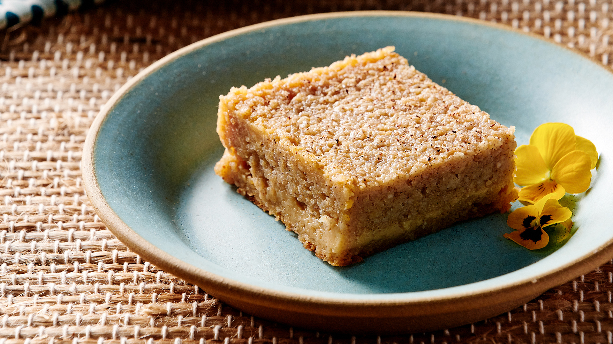

# Cassava Pone

*Saint Lucian cassava pone: grated cassava and coconut bound with brown sugar, spices and a touch of pumpkin, baked dense and dark. The everyday Lucian sweet, sliced into squares and eaten with cocoa tea.*

**Serves:** 12 squares

**Prep Time:** 20 minutes

**Cook Time:** 1 hour 15 minutes

## Overview
Cassava pone is the dense, dark, slightly chewy Caribbean cake that bridges between dessert and substantial snack. The base is grated cassava (which provides both the starch structure and a mildly sweet starchy flavour) mixed with grated coconut, brown sugar, butter, eggs, and warming spices - cinnamon, nutmeg, mixed spice. A small amount of grated pumpkin is the Saint Lucian touch that adds moisture and colour. Baked low and slow, the pone comes out brown-edged, soft in the middle, with the unmistakable West Indian comfort-cake character. Cut into squares; eaten with cocoa tea, coffee, or a glass of cold milk.

## Ingredients
- 500 g fresh grated cassava (or 400 g frozen grated cassava, thawed)
- 200 g grated fresh coconut (or 150 g desiccated, rehydrated in 100 ml hot water for 10 min, drained)
- 200 g grated pumpkin or butternut squash
- 250 g dark brown sugar
- 100 g unsalted butter, melted
- 2 large eggs
- 300 ml coconut milk
- 1 tsp vanilla extract
- 1 tbsp grated lime zest
- 2 tsp ground cinnamon
- 1 tsp ground nutmeg
- 1 tsp ground [mixed spice](../../../base-ingredients/spices/mixed-spice.md)
- 1/2 tsp salt
- 50 g raisins (optional)

## Method

### Stage 1 - Squeeze the cassava
1. Place the grated cassava in a clean tea towel.
2. Squeeze hard over a bowl to remove excess moisture.
3. Discard the liquid; keep the squeezed pulp.

### Stage 2 - Mix
1. In a wide bowl, combine the squeezed cassava, grated coconut and grated pumpkin.
2. Add the brown sugar; mix thoroughly until evenly distributed.
3. In a separate bowl, whisk the melted butter, eggs, coconut milk, vanilla, lime zest and spices.
4. Pour the wet into the dry; mix with a wooden spoon until smooth.
5. Stir in the raisins if using.

### Stage 3 - Bake
1. Heat oven to 160 C.
2. Grease a 22 x 22 cm baking tin (or similar). Line with greaseproof paper for easier lifting.
3. Pour the batter in; smooth the top.
4. Bake 1 hour 15 minutes - the top should be dark golden, the centre set but slightly soft.
5. Test with a skewer - it should come out clean (or with light moist crumbs, not wet batter).

### Stage 4 - Cool and slice
1. Cool fully in the tin (the pone firms up as it cools).
2. Lift out using the paper; cut into squares.

## Notes
- **Cassava prep:** Squeeze hard - wet batter gives a soggy pone. Frozen grated cassava is widely available at Caribbean shops and saves the work of fresh grating.
- **Pumpkin not winter squash:** Use real pumpkin if available, butternut squash as the substitute. The pumpkin adds moisture and a subtle sweetness.
- **Texture:** Pone is meant to be dense and slightly chewy - not light, not airy. If yours is cakey, you've used too much flour (there's no flour in this recipe; cassava is the starch).

## Serving
- Serve at room temperature with cocoa tea, coffee, or a glass of cold milk. The flavour improves overnight as the spices marry.

## Storage
- In an airtight tin at room temperature: 4 days.
- Refrigerate 1 week; bring to room temperature before serving.
- Freezes 2 months wrapped tightly.
