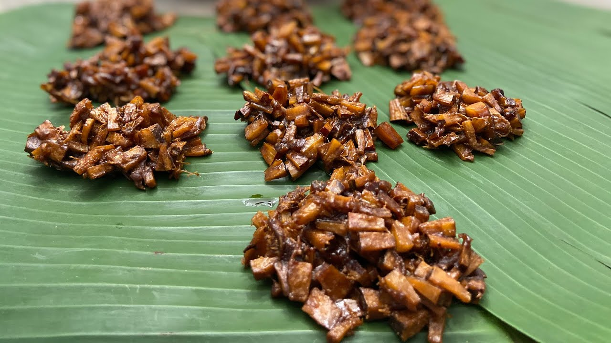

# Coconut Tablet

*Saint Lucian coconut tablet: grated coconut cooked into a thick sugar syrup and set into firm sweet pieces. The Sunday-afternoon hand-eaten sweet sold at every market across the island.*

**Serves:** Makes 18-20 small pieces

**Prep Time:** 10 minutes

**Cook Time:** 25 minutes

## Overview
Coconut tablet (called "sucre coco" in the French-Caribbean tradition) is the firm coconut sweet of the Eastern Caribbean - a confection halfway between fudge and brittle. Grated fresh coconut is cooked with brown sugar and water into a thick syrup; spices (ginger, cinnamon, nutmeg) and lime zest go in for warmth; the syrup is poured onto greaseproof paper to set into a slab that's then cut into rough rectangles. Hard outside, slightly chewy in the middle, deeply coconut-and-caramel. Sold at every market stall in Castries and the rural villages, alongside the cassava pone and the cake squares.

## Ingredients
- 400 g freshly grated coconut (or 300 g desiccated, rehydrated in 150 ml hot water for 10 min, drained)
- 400 g dark brown sugar (muscovado for the most depth)
- 100 ml water
- 1 tsp ground ginger
- 1 tsp ground cinnamon
- 1/2 tsp ground nutmeg
- 1/4 tsp salt
- Zest of 1 lime
- 1 tsp vanilla extract

## Method

### Stage 1 - Set up
1. Line a baking tray (about 25 x 30 cm) with greaseproof paper.
2. Have a wooden spoon and a spatula ready.

### Stage 2 - Cook the syrup
1. Combine sugar, water, ginger, cinnamon, nutmeg and salt in a heavy saucepan.
2. Heat over medium, stirring, until the sugar dissolves and the mixture comes to a boil.
3. Boil 5 minutes - the syrup thickens slightly.

### Stage 3 - Add the coconut
1. Tip in the grated coconut and lime zest.
2. Stir continuously over medium heat for 15-18 minutes.
3. The mixture goes through several stages: liquid and grainy → glossy and bubbling → thick and pulling away from the sides of the pan → starting to crystallise at the edges.
4. The right moment to stop: when the mixture has thickened to a thick paste that holds its shape when stirred (a wooden spoon dragged through leaves a clear track) and the colour has deepened to amber-brown.

### Stage 4 - Set
1. Off heat, stir in the vanilla.
2. Working quickly (the mixture sets fast), tip onto the prepared tray.
3. Spread to a 1.5-2 cm thick slab with a spatula.
4. Cool 5 minutes at room temperature.

### Stage 5 - Cut
1. While still slightly warm and pliable, score into rough rectangles (about 4 x 3 cm) with a sharp knife.
2. Cool completely.
3. Break or cut along the scored lines.

## Notes
- **Cook to the right point:** Underdone tablet is soft and doesn't hold its shape. Overdone is grainy and dry. The "wooden spoon leaves a track and the edges start to crystallise" stage is the right window - usually around 15-18 minutes total.
- **Lime zest:** A small amount adds a bright counterpoint to the deep brown sugar. Skip if you want a purely caramel-coconut flavour.
- **Spice level:** Saint Lucian tablet is moderately spiced. Adjust the ginger/cinnamon/nutmeg to taste.

## Serving
Serve at room temperature, broken into rough pieces, eaten with the hands. Goes with cocoa tea, coffee, or a glass of rum punch.

## Storage
- In an airtight tin at room temperature: 2 weeks. The tablet hardens slightly over time but stays good.
- Do not refrigerate (humidity makes it sticky).
- Freezing not recommended.
