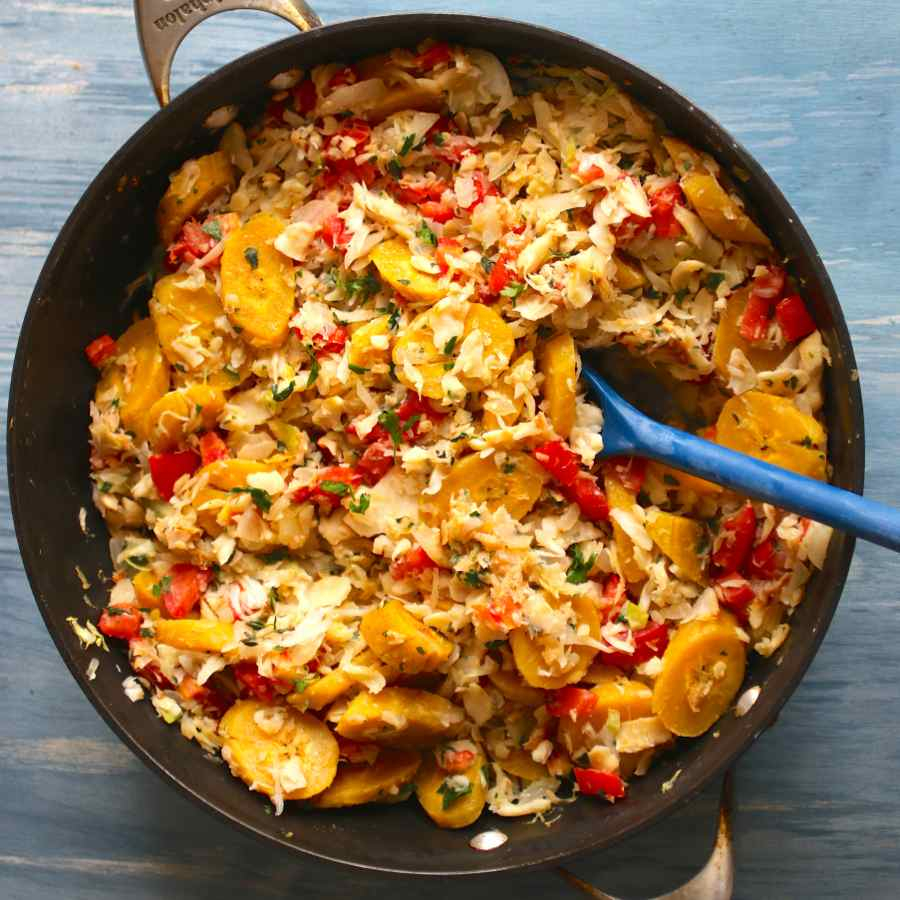

# Green Fig and Saltfish

*Saint Lucia's national dish: boiled green bananas (figue verte) tossed with sauteed salt cod, onion, thyme and a hit of scotch bonnet. The Sunday breakfast and the everyday plate eaten across the island.*

**Serves:** 4

**Prep Time:** 20 minutes (plus overnight saltfish soak)

**Cook Time:** 40 minutes

## Overview
"Fig" on Saint Lucia means green banana, not the Mediterranean fruit. Combined with salt cod (saltfish, the dried preserved fish that has anchored Caribbean cooking since the 17th century), it makes the national dish of Saint Lucia. Green bananas are boiled in their skins until tender, peeled and tossed with a base of sauteed onion, garlic, tomato, sweet pepper and reconstituted salt cod, all bound together with thyme and finished with a slice of scotch bonnet for heat. Eaten at any meal but most traditionally for Sunday breakfast - the slow start to a slow day.

## Ingredients
- 8 green bananas (figs), unripe and firm
- 400 g salt cod (saltfish; substitute heavily-salted fresh cod if unavailable)
- 4 tbsp vegetable or coconut oil
- 1 large onion, finely chopped
- 4 cloves garlic, minced
- 1 small red sweet pepper, diced
- 2 ripe tomatoes, chopped
- 1 small scotch bonnet (or any hot chilli), finely chopped (deseed if you want less heat)
- 6 sprigs fresh thyme, leaves only
- 2 spring onions, sliced
- 1 tbsp lime juice
- Black pepper

## Method

### Stage 1 - Prepare the saltfish
1. The day before: place the salt cod in a bowl; cover with cold water; refrigerate 12-24 hours, changing the water 2-3 times.
2. Drain. Place in a small pan; cover with fresh cold water; bring to a simmer; cook 10 minutes.
3. Drain again. Flake the fish into small pieces, removing any skin and bones.

### Stage 2 - Boil the green figs
1. Rinse the green bananas; cut a shallow slit lengthwise through the skin (helps with peeling later).
2. Place in a pot; cover with cold salted water.
3. Bring to a boil; cook 25-30 minutes until tender to a knife.
4. Drain; let cool just enough to handle.
5. Peel (the skin lifts off easily after boiling). Cut each banana into 2-3 cm chunks.

### Stage 3 - Build the saltfish base
1. Heat the oil in a wide pan over medium heat.
2. Soften the onion 8 minutes.
3. Add garlic, sweet pepper and scotch bonnet; cook 4 minutes.
4. Add tomatoes; cook 5 minutes until they break down into a soft base.
5. Tip in the flaked salt cod; toss to combine.
6. Add the thyme leaves; cook 2 minutes.

### Stage 4 - Combine and finish
1. Add the chunks of green fig to the pan. Toss gently with a wooden spoon to coat in the saltfish base.
2. Cook 3-4 minutes for the flavours to come together.
3. Off heat, stir in the spring onions and lime juice.
4. Taste; adjust pepper (the saltfish provides most of the salt - usually no extra is needed).

## Notes
- **Soaking the saltfish:** Non-negotiable. Without the 12-24 hour soak, the dish is inedibly salty. Change the water at least once to remove as much salt as possible.
- **Green vs ripe bananas:** Must be green - firm, starchy, no yellow at all. Ripe ones turn sweet and mushy.
- **The scotch bonnet:** Adjust to taste. Saint Lucian home cooks usually go medium - a quarter to a half of a small scotch bonnet for 4 portions.

## Serving
Serve hot for Sunday breakfast (the traditional time) with a side of fried plantain and a strong cup of cocoa tea. Lime wedges for cutting through.

## Storage
- Refrigerate 3 days; reheat gently in a pan with a splash of water.
- Freezes 1 month; the bananas turn slightly mushier on thaw but the flavour holds.
