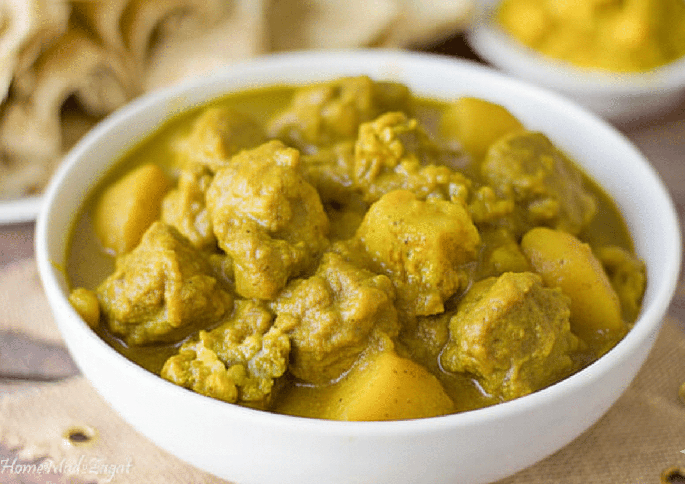

# Lucian Curry Chicken

*Saint Lucian Indo-Caribbean chicken curry: bone-in chicken stewed with West Indian curry powder, onion, garlic, ginger, thyme and a generous pour of coconut milk. The everyday Lucian weeknight curry.*

**Serves:** 4-6

**Prep Time:** 20 minutes (plus 2 hour marinade)

**Cook Time:** 50 minutes

## Overview
Saint Lucia's Indian-Caribbean inheritance is real - the 19th-century arrival of Indian indentured labourers shaped the food across the Lesser Antilles. Lucian curry chicken sits in the tradition: West Indian curry powder (heavier on cumin and coriander than Madras, lighter on chilli, often with added turmeric for colour) used to coat bone-in chicken pieces, then slow-cooked in a coconut-and-tomato sauce with thyme, garlic and a small amount of scotch bonnet. The result is rich, mild-to-medium spicy, and the chicken falls off the bone into the sauce. Eaten with rice or roti.

## Ingredients

### Chicken and marinade
- 1.2 kg chicken thighs and drumsticks (bone in, skin on)
- 2 tbsp West Indian [curry powder](../../base-ingredients/curry-powder/bir-curry-powder.md) (or substitute mild Madras curry powder)
- 1 tsp ground turmeric
- 1 tsp ground cumin
- 1 tsp salt
- 1/2 tsp black pepper
- 4 cloves garlic, minced
- 1 thumb of ginger, grated
- Juice of 1 lime
- 2 tbsp vegetable oil

### Sauce
- 2 tbsp coconut oil
- 1 large onion, finely chopped
- 4 more cloves garlic, minced
- 1 small scotch bonnet, finely chopped (or to taste)
- 2 ripe tomatoes, chopped
- 1 tbsp tomato paste
- 400 ml coconut milk
- 200 ml chicken stock or water
- 6 sprigs fresh thyme, leaves only
- 1 large potato, peeled and cubed (optional but traditional)
- 1 tsp salt
- Fresh coriander to finish

## Method

### Stage 1 - Marinate
1. In a wide bowl, mix the curry powder, turmeric, cumin, salt, pepper, garlic, ginger, lime juice and oil into a paste.
2. Add the chicken pieces; rub the paste into every surface.
3. Cover; refrigerate 2 hours minimum (overnight is better).

### Stage 2 - Brown
1. Heat the coconut oil in a heavy pot over medium-high heat.
2. Brown the chicken in batches, 3 minutes per side. The skin should colour but not burn. Set aside.

### Stage 3 - Build the sauce
1. Reduce heat to medium. Add a splash more oil if the pan is dry.
2. Soften the onion 8 minutes.
3. Add garlic and scotch bonnet; cook 1 minute.
4. Stir in tomato paste; cook 2 minutes until darkened.
5. Add tomatoes; cook 4 minutes until they break down.

### Stage 4 - Simmer
1. Return the chicken to the pot with any juices.
2. Pour in coconut milk and stock; add thyme leaves and salt.
3. Add the potato chunks if using.
4. Bring to a simmer; reduce to low; cover loosely.
5. Cook 35-40 minutes, stirring occasionally, until the chicken is tender and the sauce has thickened.

### Stage 5 - Finish
1. Taste; adjust salt and chilli.
2. Off heat, scatter fresh coriander over.

## Notes
- **West Indian vs Madras curry powder:** West Indian curry powder is milder and includes more turmeric (which gives the deeper yellow colour). Madras is hotter and more cumin-heavy. Either works; West Indian is more traditional for Lucian curry.
- **Marinade time:** Two hours minimum, overnight ideal. The curry powder needs time to flavour the meat through.
- **Scotch bonnet care:** The Lucian standard is a medium heat, not blazing. Half a small bonnet for 6 portions is typical.

## Serving
- Serve hot over steamed white rice with a roti or hard-dough bread alongside. Sliced cucumber, lime wedges and a small dish of mango chutney complete the plate.

## Storage
- Refrigerate 4 days. The curry improves overnight.
- Freezes 3 months.
