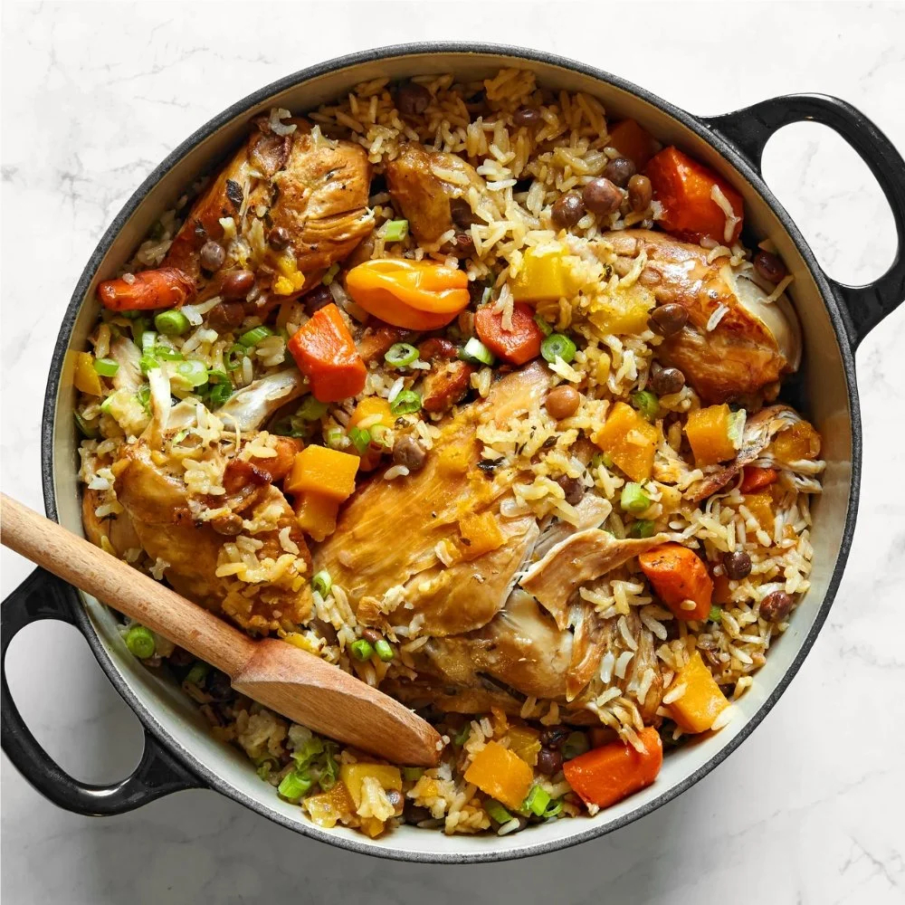

# Lucian Pelau

*Saint Lucian one-pot rice: chicken caramelised in burnt sugar (browning) before going into the pot with rice, pigeon peas, coconut milk and herbs. The Sunday lunch and the village-cricket-day cookout standard across the Eastern Caribbean.*

**Serves:** 6

**Prep Time:** 20 minutes

**Cook Time:** 1 hour 10 minutes

## Overview
Pelau is the great one-pot of the English-speaking Caribbean - Trinidad, Saint Lucia, Grenada, Tobago all claim and share it. Chicken pieces are tossed with brown sugar in hot oil until the sugar caramelises to deep amber and coats the meat (the "browning" step that defines the colour and depth of the finished dish); then rice, pigeon peas, coconut milk, thyme, scotch bonnet and stock all go into the same pot for a single 40-minute simmer. The result is fluffy caramel-coloured rice studded with chicken pieces and peas, with a slightly crusty bottom (the bun-bun, the most prized layer) that scrapes up at the end. Eaten with sliced cucumber and a wedge of lime.

## Ingredients
- 1 kg chicken thighs, cut into 2-3 cm pieces (bone in or out; bone-in adds more depth)
- 4 cloves garlic, minced
- 1 thumb of ginger, grated
- 6 sprigs fresh thyme, leaves only
- 2 spring onions, sliced
- 1 lime, juiced
- 1 tsp salt
- 1/2 tsp black pepper
- 3 tbsp vegetable or coconut oil
- 4 tbsp dark brown sugar (for the browning)
- 1 large onion, finely chopped
- 1 small scotch bonnet, finely chopped (or to taste)
- 2 tbsp tomato paste
- 400 g basmati or long-grain rice, rinsed
- 1 tin (400 g) green pigeon peas (or red kidney beans), drained
- 400 ml coconut milk
- 600 ml chicken stock
- 1 bay leaf

## Method

### Stage 1 - Marinate
1. In a wide bowl, mix garlic, ginger, thyme, spring onion, lime juice, salt and pepper.
2. Add the chicken pieces; toss to coat.
3. Cover; refrigerate at least 1 hour (or overnight).

### Stage 2 - The browning step
1. Heat the oil in a heavy wide pot (with a tight-fitting lid) over medium-high heat.
2. Sprinkle the brown sugar into the hot oil; do not stir.
3. Watch the sugar - it bubbles, then darkens. When it has turned deep amber-brown (about 90 seconds; it smells smoky and slightly bitter), immediately add the marinated chicken.
4. Stir vigorously to coat the chicken in the caramelised sugar.
5. Cook 8-10 minutes, stirring occasionally, until the chicken is dark brown on all sides.

### Stage 3 - Build the rice
1. Add the chopped onion and scotch bonnet to the pot. Stir 4 minutes to soften.
2. Add the tomato paste; cook 2 minutes.
3. Add the rinsed rice; stir 1 minute to toast in the oil.
4. Add the pigeon peas; stir.

### Stage 4 - Liquid and simmer
1. Pour in the coconut milk and stock.
2. Add the bay leaf.
3. Bring to a strong boil.
4. Stir once; reduce heat to very low; cover tightly.
5. Cook 25 minutes without lifting the lid.

### Stage 5 - Rest and serve
1. Off heat; rest covered for 10 minutes - the rice finishes steaming.
2. Lift the lid; the rice should be tender, the chicken cooked through.
3. Fluff with a fork. The slightly crusty layer at the bottom (bun-bun) is the prize - scrape and serve.
4. Discard the bay leaf.

## Notes
- **The browning step is the dish:** The deep caramel sugar is what gives pelau its name and colour. Take the sugar to the edge of burnt - just before you'd worry it's gone too far. Stopping early gives pale pelau that lacks the character.
- **Don't lift the lid during the rice cook:** Trapped steam is what cooks the rice. Lifting at 15 minutes gives undercooked grain at the top.
- **Bun-bun:** The toasted rice at the bottom of the pot is the most prized part. A small spatula gets it out.

## Serving
Serve on a wide platter family-style, with sliced cucumber, lime wedges, and a small dish of hot pepper sauce on the side. A glass of cold beer or sorrel.

## Storage
- Refrigerate 3 days. The flavours deepen overnight.
- Freezes 2 months; thaw in the fridge.
