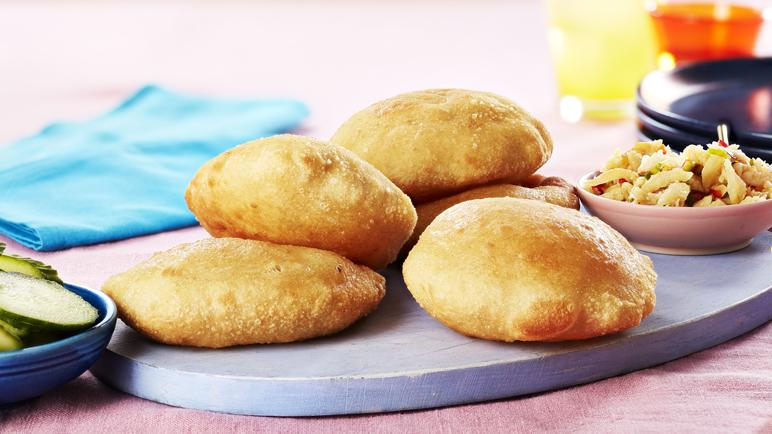

# Saint Lucian Bakes

*Saint Lucian fried bread: a simple yeasted dough rolled into small flat rounds and fried until golden and puffed. The morning bread eaten with saltfish, the lunchtime carrier for filling, and the afternoon snack with cocoa tea.*

**Serves:** Makes 8-10 bakes

**Prep Time:** 20 minutes (plus 45 min rise)

**Cook Time:** 15 minutes

## Overview
Bakes are the Eastern Caribbean's version of a yeasted fried bread, eaten across Saint Lucia, Trinidad, Tobago and the wider Lesser Antilles. The dough is plain - flour, sugar, salt, yeast, butter, milk - kneaded to soft, risen once, then rolled out into flat rounds and either deep-fried (the "fried bakes" version) or baked (the "bake" version, slightly drier and used for sandwiching). The Saint Lucian everyday is the fried version: golden, puffed slightly in the middle, soft inside, eaten warm. Split open, stuff with green-fig-and-saltfish for breakfast, or with curried chickpeas for lunch.

## Ingredients
- 400 g plain flour (plus extra for dusting)
- 1 tsp salt
- 2 tbsp caster sugar
- 7 g (1 sachet) fast-action dried yeast
- 30 g unsalted butter, melted (plus more for brushing)
- 250 ml warm milk (or warm coconut milk for a richer version)
- 500 ml vegetable oil for frying

## Method

### Stage 1 - Mix the dough
1. In a wide bowl, combine flour, salt, sugar and yeast. Whisk to distribute.
2. Add the melted butter and warm milk. Mix with a wooden spoon until a shaggy dough forms.
3. Turn onto a lightly floured surface; knead 8 minutes until smooth and elastic. The dough should be soft but not sticky.

### Stage 2 - Rise
1. Place in a lightly oiled bowl; cover with a damp tea towel.
2. Rise in a warm place 45 minutes, until almost doubled.

### Stage 3 - Shape
1. Knock back the dough; divide into 8-10 portions.
2. Roll each into a ball; flatten with a rolling pin into a round about 1 cm thick and 10-12 cm across.
3. Cover; rest 10 minutes.

### Stage 4 - Fry
1. Heat the oil to 170 C in a wide deep pan.
2. Fry the bakes 2-3 at a time (do not crowd), 1-2 minutes per side until deep golden and puffed.
3. Lift onto kitchen paper to drain briefly.

### Stage 5 - Serve
1. Eat warm, split open and stuffed, or alongside a saucy main.

## Notes
- **Coconut milk option:** Substituting warm coconut milk for the regular milk gives a richer, more Caribbean character. Costs nothing to try.
- **Oil temperature:** 170 C is the sweet spot. Too hot and the outside burns before the inside cooks; too cool and the bakes absorb oil and go heavy.
- **Eat warm:** Bakes are best within 30 minutes of frying. Cold bakes can be split, toasted briefly, and stuffed.

## Serving
- Serve warm with butter and a small dish of saltfish or curried chickpeas. Also good alongside any saucy main as a sopping bread.

## Storage
- Best the same day.
- Refrigerate 1 day; refresh briefly in a hot oven (180 C, 5 minutes).
- The shaped unfried dough can be refrigerated overnight; bring to room temperature and fry the next day.
