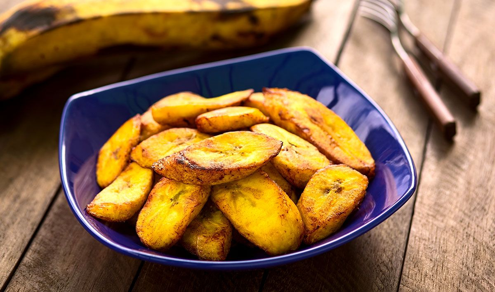

# Fried Plantain

*Saint Lucian fried plantain: ripe plantains sliced on the angle and shallow-fried in coconut oil until caramelised on both sides. The sweet starchy side that turns up beside almost every Caribbean main.*

**Serves:** 4

**Prep Time:** 5 minutes

**Cook Time:** 12 minutes

## Overview
Fried plantain is the universal Caribbean side - Saint Lucia, Trinidad, Jamaica, Cuba, Puerto Rico, the whole arc. Ripe plantains (deep yellow with black spots) are peeled, sliced diagonally into 1 cm thick ovals, and shallow-fried in hot oil. The natural sugars caramelise on contact with the hot pan, giving the slices a deep golden-brown crust while the inside stays soft and sweet. Eaten alongside any main - stew chicken, curry, callaloo, fish - the sweetness balancing the savoury, salty or spicy main.

## Ingredients
- 4 large ripe plantains (deep yellow with plenty of black spots)
- 4 tbsp coconut oil (or vegetable oil)
- Pinch of sea salt
- Optional: 1 tsp dark brown sugar (only if the plantains aren't ripe enough)

## Method

### Stage 1 - Choose and peel
1. Plantains should be ripe - deep yellow skin with black spots covering at least half the surface. Green plantains stay starchy and bitter; this dish wants the sweet ripe ones.
2. Cut off both ends.
3. Score the skin lengthwise with a sharp knife; peel back the skin in sections.

### Stage 2 - Slice
1. Slice diagonally into 1 cm thick ovals - the angled cut gives more surface area for browning.

### Stage 3 - Fry
1. Heat the oil in a wide pan over medium heat (not hot - the sugars in ripe plantain burn quickly).
2. Lay the slices in a single layer; do not crowd.
3. Fry 2-3 minutes per side until deep golden brown.
4. Flip carefully - the slices are soft and break easily.
5. Lift onto kitchen paper to drain briefly.

### Stage 4 - Serve
1. Sprinkle with a pinch of salt while still hot.
2. Pile onto a serving plate.

## Notes
- **Ripeness is everything:** Underripe plantains stay starchy and don't caramelise. Wait until the skin is mostly black-spotted - the inside should be soft to gentle pressure.
- **Medium heat, not high:** Ripe plantain has high sugar content; high heat burns it before the inside softens.
- **Salt at the end:** A pinch of salt brings out the sweetness.

## Serving
- Serve hot alongside any Caribbean main - stew chicken, curry, fish, callaloo. Particularly good with green-fig-and-saltfish at breakfast.

## Storage
- Best straight from the pan. Cold fried plantain loses its character.
- Refrigerate 2 days; reheat briefly in a hot dry pan.
