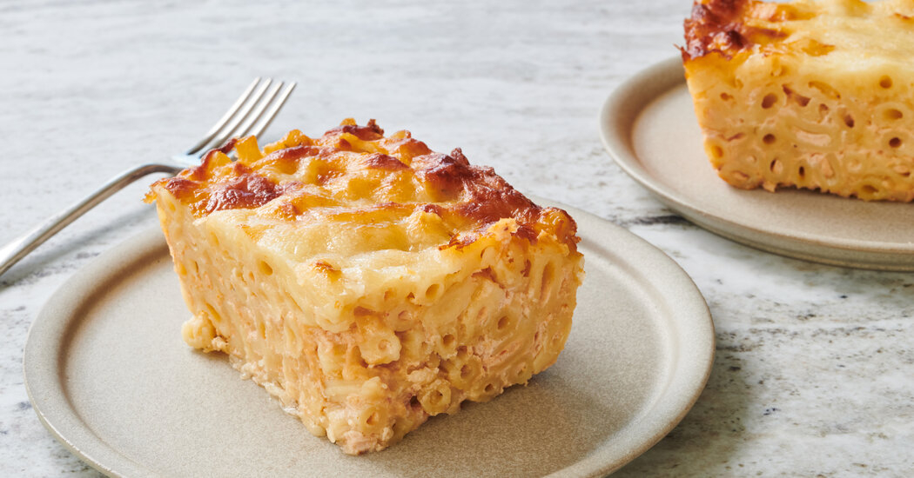

# Saint Lucian Macaroni Pie

*Saint Lucian macaroni pie: elbow macaroni bound in an egg-and-milk custard with sharp cheddar, grated onion and a top of golden crust. The Sunday-lunch side at every Lucian table, properly set and sliced like a quiche.*

**Serves:** 6 as a side

**Prep Time:** 15 minutes

**Cook Time:** 45 minutes

## Overview
Macaroni pie is the Eastern Caribbean's take on what the United States calls mac and cheese, except the Lucian version sets firm enough to slice. The elbows are boiled, drained, then bound in an egg-and-milk custard with grated cheddar, grated onion, mustard, black pepper and a hit of hot sauce, then baked in a deep dish until the top blisters golden and the inside holds its shape. It travels well in tupperware and turns up at every Lucian Sunday lunch beside stew chicken or curry, every wedding buffet, and most Saturday-night family tables. Cut into squares like a tart and eaten with a fork.

## Ingredients
- 400 g elbow macaroni
- 1 tbsp salt (for the pasta water)
- 50 g butter
- 1 small onion, finely grated
- 2 cloves garlic, finely grated
- 4 large eggs
- 500 ml whole milk
- 200 ml evaporated milk
- 1 tsp English mustard (or Dijon)
- 1 tsp salt
- 1 tsp black pepper
- 1/4 tsp grated nutmeg
- 1-2 tsp Caribbean hot sauce (or to taste)
- 350 g sharp cheddar, grated
- 50 g sharp cheddar, extra for the top
- 1 tbsp dried breadcrumbs (optional, for top)

## Method

### Stage 1 - Boil the macaroni
1. Bring a large pan of well-salted water to a rolling boil.
2. Add the macaroni; cook 1 minute less than the packet time (it finishes in the oven).
3. Drain; toss with the butter while still hot so the butter melts through.

### Stage 2 - Make the custard
1. In a wide bowl, whisk the eggs.
2. Whisk in the milk, evaporated milk, mustard, salt, pepper, nutmeg and hot sauce.
3. Stir in the grated onion and garlic.
4. Stir in the grated cheddar.

### Stage 3 - Assemble
1. Preheat the oven to 180 C / 350 F / gas 4.
2. Butter a deep baking dish (about 20 x 30 cm).
3. Tip in the buttery macaroni; pour the custard over.
4. Stir gently so the cheese and onion distribute evenly.
5. Scatter the extra cheddar over the top, then the breadcrumbs if using.

### Stage 4 - Bake
1. Bake 40-45 minutes until the top is deep golden, the edges bubble, and the centre is set when you press lightly.
2. Rest 10 minutes before cutting (the pie needs to set firm enough to slice).

### Stage 5 - Serve
1. Cut into squares; lift out with a flat spatula.
2. Serve warm beside stew chicken, curry or any saucy main.

## Notes
- **Set firm enough to slice:** The defining feature. If the custard is too loose the pie will slump; if too eggy it tastes like quiche. The ratio above is the Lucian middle ground.
- **Grated onion:** Grated rather than chopped so it melts into the custard and there are no raw bites.
- **Evaporated milk:** Adds richness and the slightly caramelised note the Lucian version is known for. Whole milk alone works but is less Caribbean.

## Variations
- **Pepper kick:** Add a finely chopped scotch bonnet to the custard for a properly Lucian heat.
- **Two-cheese:** Half cheddar, half gruyere or Red Leicester for a more complex top.
- **Bell-pepper version:** Stir 1 finely chopped red bell pepper into the custard for sweetness and colour.
- **Bechamel base:** Some Lucian cooks build a roux first and stir in the eggs at the end; gives a creamier slice.

## Serving
Serve warm in squares · stew chicken or curry alongside · a green salad to cut the richness · hot sauce on the table

## Storage
- Refrigerate 4 days covered; reheat individual squares in a 180 C oven 10 minutes
- Freezes 2 months in slices; thaw overnight before reheating
- The cold pie is also good (the texture firms further, almost like a cheesy custard tart)
