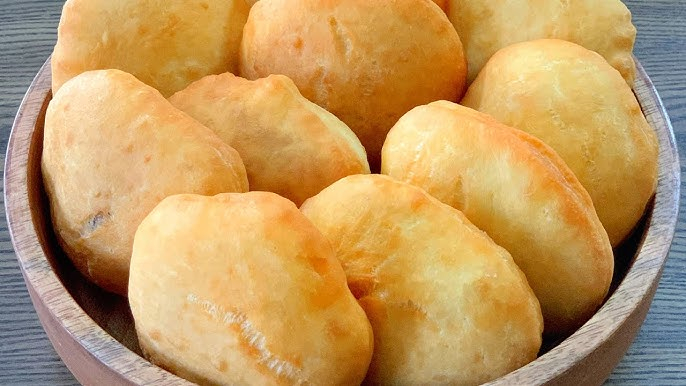

# Lucian Floats

*Lucian floats: a yeasted dough rolled thin and fried into puffed golden disks, eaten with souskaye, codfish cakes or a swipe of butter. The afternoon snack that sits beside the cocoa-tea kettle.*

**Serves:** Makes 10-12 floats

**Prep Time:** 20 minutes (plus 1 hr rise)

**Cook Time:** 20 minutes

## Overview
Floats are the snack-bread of Saint Lucia and Trinidad, eaten alongside souskaye, codfish cakes or curried chickpeas. They are a close cousin of the Lucian bake but rolled thinner and fried hotter, so they puff up like balloons in the oil and stay puffed until you split them. The dough is plain (flour, yeast, sugar, salt, butter, milk or water) and the trick is in the rolling: thin enough to puff, thick enough to hold the filling. Lucian children eat them straight off the kitchen towel with a sprinkle of sugar; adults split them around a spoonful of saltfish or a smear of guava jam. Either way, served warm.

## Ingredients
- 400 g plain flour
- 1 tsp salt
- 1 tbsp caster sugar
- 7 g (1 sachet) fast-action dried yeast
- 30 g unsalted butter, melted
- 250 ml warm water (or warm milk for a richer float)
- 500 ml vegetable oil for frying

## Method

### Stage 1 - Mix the dough
1. In a wide bowl, whisk flour, salt, sugar and yeast.
2. Add melted butter and warm water (or milk).
3. Mix with a wooden spoon to a shaggy dough, then turn onto a lightly floured surface and knead 8 minutes until smooth and elastic.

### Stage 2 - Rise
1. Place in a lightly oiled bowl; cover with a damp tea towel; rest in a warm spot 1 hour, until doubled.

### Stage 3 - Shape
1. Knock back the dough; divide into 10-12 portions, each about the size of a small lime.
2. Roll each into a ball, then flatten with a rolling pin into a thin round, about 5 mm thick and 12-14 cm across. The thinner the round, the better the puff.
3. Cover with a tea towel; rest 10 minutes.

### Stage 4 - Fry
1. Heat the oil in a wide deep pan to 180 C (a small piece of dough should bubble vigorously and rise quickly).
2. Slide one round into the oil; as it touches the hot oil, gently press the centre with the back of a slotted spoon for 5 seconds. This encourages the puff.
3. Fry 30-45 seconds until the top is golden and the round has ballooned; flip; fry 30 seconds on the second side.
4. Lift onto kitchen paper.
5. Fry the rest one or two at a time; the oil should stay at 180 C.

### Stage 5 - Eat
1. Eat warm, split open and stuffed with souskaye, codfish cakes, or a spoonful of jam.

## Notes
- **The puff:** A float that doesn't puff is just a fried flatbread. Three things make it puff: rolled thin enough, hot enough oil (180 C is the sweet spot), and a quick press in the centre as it hits the oil.
- **Rest the rolled rounds:** 10 minutes after rolling lets the gluten relax so the dough doesn't fight you when it hits the oil.
- **Drain briefly, eat fast:** Floats are best within 15 minutes of frying. They lose their puff as they cool.

## Variations
- **Coconut milk version:** Substitute warm coconut milk for the water; richer, slightly sweeter.
- **Whole-wheat half-and-half:** Replace 100 g of the plain flour with whole-wheat for a nuttier float.
- **Sweet floats:** Sprinkle the hot floats with cinnamon sugar straight out of the oil for a dessert version.
- **Stuffed before frying:** Place a teaspoon of curried chickpeas in the centre of each round, fold over and seal, fry as patties.
- **Baked floats:** Brush with melted butter and bake at 200 C for 10 minutes if you would rather not fry; they will not puff as dramatically but eat well.

## Serving
- Serve warm split around souskaye or codfish cakes · a smear of guava jam or butter · alongside cocoa tea in the afternoon · with sorrel or mauby for a child's tea

## Storage
- Eat within 30 minutes of frying for the best texture
- Refrigerate 1 day; refresh in a 180 C oven for 3 minutes to bring back some lift
- The shaped uncooked rounds can sit on the floured tray, covered, 2 hours at room temperature before frying

