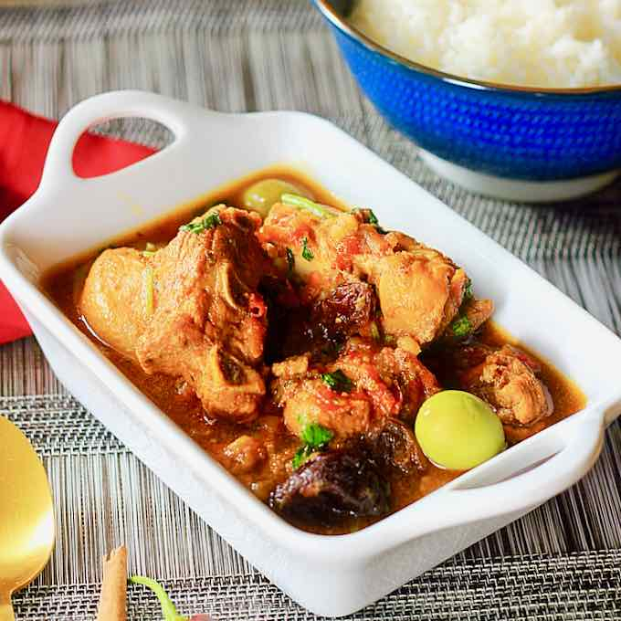

# Gallo en Chicha

*The Salvadoran feast-day dish: a rooster slow-braised in fermented sugar-cane chicha with cinnamon, cloves and dried fruit, the gravy deep, dark and faintly winey, served with rice and warm tortillas.*

**Serves:** 6

**Prep Time:** 30 minutes (plus chicha fermentation if making your own)

**Cook Time:** 2 hours 30 minutes

## Overview
Gallo en chicha is the dish brought out at Salvadoran weddings, christenings and patron-saint days. An old rooster (the toughness of an old bird is what gives the dish its depth) is braised slowly in chicha, the lightly fermented sugar-cane drink that has been drunk in Central America for centuries. The chicha cooks down to a dark glossy gravy, sweet-sour from the fermentation, perfumed with cinnamon, cloves and allspice, and studded with prunes, raisins and small chunks of pineapple. The bird falls off the bone after two hours over a low flame. The dish is served with rice or warm tortillas to mop up the sauce. Where chicha is hard to find, a mix of dark rum, panela and white wine vinegar gives an honest approximation. Use a regular chicken if you cannot source an old rooster.

## Ingredients

- 1 large rooster or capon (about 2 kg), jointed into 8 pieces (a regular chicken works)
- 2 tsp fine sea salt
- 1 tsp black pepper
- 2 tbsp lard or vegetable oil
- 2 large onions, sliced
- 6 garlic cloves, sliced
- 2 large tomatoes, chopped
- 1 green pepper, sliced
- 750 ml chicha (or substitute below)
- 200 ml chicken stock
- 1 cinnamon stick
- 4 whole cloves
- 4 allspice berries
- 2 bay leaves
- 100 g pitted prunes
- 60 g raisins
- 200 g fresh pineapple, cut into 2 cm pieces
- 1 tbsp panela or dark brown sugar (more to taste)
- 2 tbsp white wine vinegar

### Chicha substitute
- 400 ml dark rum
- 250 ml apple juice
- 100 g panela (dark brown sugar)
- 2 tbsp white wine vinegar
- Stir together, leave overnight loosely covered

## Method

### Stage 1 - Season the bird
1. Pat the rooster pieces dry. Rub all over with salt and pepper.
2. Leave at room temperature for 30 minutes while you prepare everything else.

### Stage 2 - Brown
1. Heat the lard in a heavy casserole over a medium-high heat.
2. Brown the rooster pieces in batches, 4 minutes per side, until well coloured. Lift out and set aside.

### Stage 3 - Build the base
1. Drop the heat to medium. Add the onions and cook 8 minutes until soft and pale gold.
2. Stir in the garlic, tomatoes and green pepper. Cook 6 minutes until the tomato breaks down.

### Stage 4 - Braise
1. Pour in the chicha (or the substitute mix) and the chicken stock.
2. Drop in the cinnamon stick, cloves, allspice and bay leaves.
3. Return the rooster and any juices to the pan. The liquid should come about two-thirds up the bird.
4. Bring to a gentle simmer, cover and cook over a low heat for 1 hour 30 minutes.

### Stage 5 - Add the fruit
1. Add the prunes, raisins and pineapple.
2. Stir in the panela and the vinegar.
3. Continue simmering uncovered for 40-45 minutes; the sauce reduces by a third, the bird is meltingly tender and the fruit plump.

### Stage 6 - Finish
1. Taste the gravy. Adjust salt, sugar and vinegar until the balance sings: sweet, sour, savoury, faintly winey.
2. Fish out the cinnamon stick, bay leaves and clove heads.
3. Rest off the heat for 10 minutes; the sauce thickens slightly.

## Notes
- **An old bird is best:** an old rooster has more flavour and stands up to the long simmer. A regular chicken works but cook for 1 hour total to avoid the meat shredding.
- **Real chicha:** Salvadoran chicha is fermented sugar-cane juice. Mexican chicha de jora (fermented corn) is a different drink and will not give the right result; the rum-apple-vinegar substitute is closer.
- **The fruit goes in late:** added at the start, the prunes and pineapple turn to mush. Forty minutes at the end is right.
- **Balance the sauce:** the sweetness from the fruit and panela should be cut by the vinegar. If it tastes flat, add another splash of vinegar.

## Variations
- **Gallo en chicha del oriente:** the eastern Salvadoran version adds capers and green olives in the last 10 minutes.
- **De capón:** capon instead of rooster, a more delicate bird; reduce the cooking time by 30 minutes.
- **Sin fruta:** the everyday family version drops the fruit, leaning on the chicha and spices alone.
- **Con masa:** thicken the final sauce with a tablespoon of masa harina slurried in stock; gives a more traditional country gravy.

## Serving
At the wedding table · for a saint's day lunch · with white rice and warm tortillas · with a side of curtido · with a chilled glass of chicha to drink alongside · ladled into deep plates so the gravy stays put.

## Storage
- Keeps 4 days refrigerated; the flavour deepens after a night in the fridge.
- Freezes 3 months; defrost overnight before reheating.
- Reheat at a low simmer, adding a splash of stock if the sauce has tightened too much.
- The sauce thickens dramatically when cold; loosen with stock or water on reheating.

