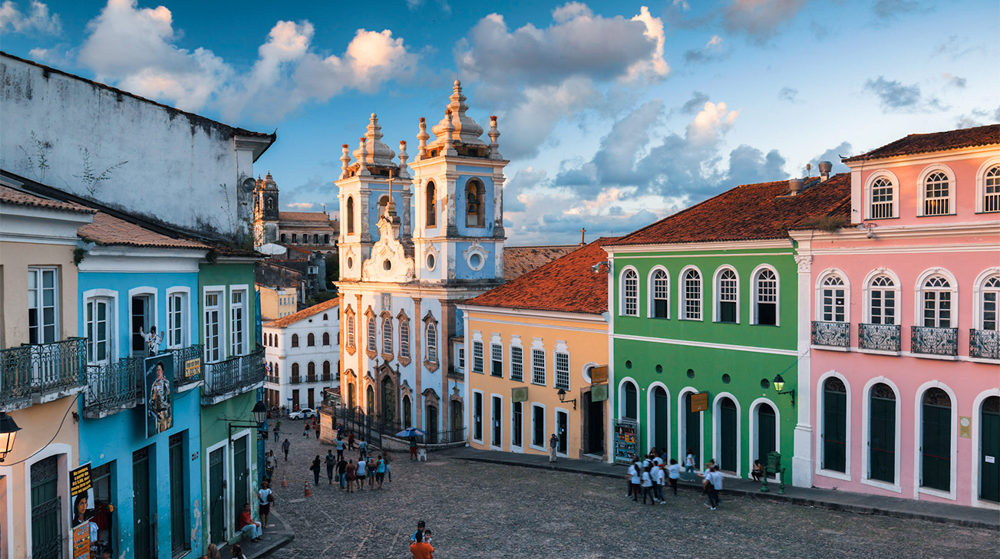

# Salvadoran Cuisine

Salvadoran food is the pupusa republic. The national-dish economy runs on pupuserías, the corner griddles where thick masa flatbreads are stuffed with beans, cheese or chicharrón and slapped onto hot comals all day long. The cuisine sits on a corn-and-bean Mesoamerican foundation: nixtamalised masa for pupusas and tortillas, frijoles rojos de seda thickened to a paste, plantain in every register from green tostones to ripe maduros. Curtido, the lightly fermented cabbage-and-carrot relish, rides shotgun on every pupusa plate, its sourness cutting the masa's richness. The chichería tradition of sugar-cane fermentation gives gallo en chicha its slow-braised funk, and Sunday morning still belongs to yuca con chicharrón, boiled cassava heaped with fried pork belly and the same curtido that anchors the rest of the table. Atol carts pour warm corn drinks at the market, refrescos naturales line the comedor counter, and morro-seed horchata, dense with sesame, cocoa and toasted cinnamon, marks the Salvadoran kitchen as distinct from its Mexican neighbour.
