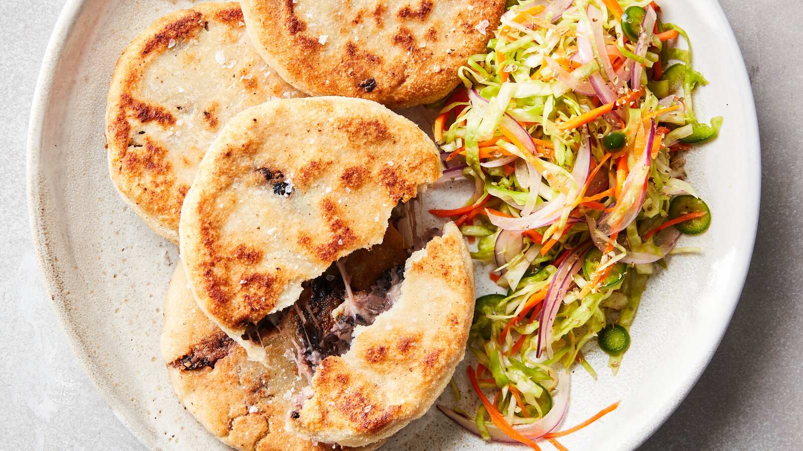

# Pupusas

*El Salvador's national dish: thick discs of nixtamalised masa stuffed with refried beans, melting cheese or chicharrón, sealed flat and griddled on a hot comal until the masa blisters and the filling weeps out at the seams.*

**Serves:** 4 (8 pupusas)

**Prep Time:** 30 minutes

**Cook Time:** 25 minutes

## Overview
A pupusa is a thick masa flatbread stuffed before it is cooked, the fillings sealed inside the dough by closing it like a small parcel and patting it flat. The three classic stuffings are revueltas (refried beans, melted quesillo and chicharrón ground to a paste), frijol con queso (beans and cheese), and queso solo (cheese alone, sometimes with loroco buds). The dough is plain nixtamalised corn flour and water with a touch of salt, soft enough to seal around the filling without cracking. The comal must be hot, dry and lightly oiled, and the pupusas go on with a slap of the palm so they spread to about twelve centimetres across and a centimetre thick. They are eaten with curtido and salsa roja, tearing pieces by hand and dragging through both at every bite.

## Ingredients

### Dough
- 500 g masa harina (Maseca instant corn flour)
- 600 ml warm water (plus a splash extra)
- 1 tsp fine sea salt
- 1 tbsp vegetable oil (helps the dough stay supple)

### Bean and cheese filling
- 300 g cooked red beans (frijoles rojos de seda), drained
- 1 tbsp lard or vegetable oil
- 1 small onion, finely chopped
- 200 g quesillo or low-moisture mozzarella, grated
- Salt to taste

### Chicharrón filling (for revueltas)
- 200 g cooked pork belly (slow-cooked until tender, fat rendered)
- 1 tomato, halved
- 1/2 small onion
- 1 small green pepper
- Pinch of dried oregano

## Method

### Stage 1 - Mix the dough
1. Tip the masa harina and salt into a wide bowl. Pour in the warm water and the oil.
2. Knead by hand for 3-4 minutes until the dough comes together as a smooth, soft mass with no dry patches. It should feel like soft Play-Doh, springing back gently when pressed.
3. If it feels stiff, add a tablespoon of warm water; if sticky, dust in a little more masa harina. Cover with a damp cloth and rest for 15 minutes.

### Stage 2 - Make the bean and cheese paste
1. Heat the lard in a small pan. Soften the onion for 4 minutes.
2. Add the beans and a splash of their cooking water; mash to a thick, spreadable paste over a low heat. Season and cool.
3. Once cooled, fold in the grated cheese so the filling holds together as a soft ball.

### Stage 3 - Make the chicharrón paste (for revueltas)
1. In a food processor or with a knife, finely chop the cooked pork, tomato, onion, pepper and oregano to a coarse paste.
2. Fry briefly in a dry pan for 2-3 minutes to bring the flavours together. Cool.
3. Combine half this paste with half the bean-and-cheese mix for revueltas filling.

### Stage 4 - Shape and stuff
1. Take a ball of dough about the size of a small lime (around 90 g).
2. Press into the palm to form a thick disc.
3. Spoon a heaped tablespoon of filling into the centre.
4. Bring the edges up and over the filling like closing a small purse, pinching the seam shut.
5. Lay the parcel on the bench seam-side down and pat gently into a disc about 12 cm across and 1 cm thick. The dough should fully enclose the filling with no leaks; if the filling peeks through, patch with a pinch of dough.

### Stage 5 - Griddle
1. Heat a dry cast-iron comal or heavy frying pan over a medium-high heat. Wipe with a film of oil using a folded paper towel.
2. Lay the pupusas on the hot surface. Cook for 3-4 minutes per side, until deep golden spots form and the masa puffs slightly.
3. Press lightly with a spatula if any large bubbles rise. Some cheese will weep out and crisp at the edges; this is the cook's snack.
4. Stack on a warm plate covered with a tea towel as you work through the batch.

## Notes
- **The masa is everything:** the dough should be soft but not sticky, and it must rest so the corn fully hydrates. Underhydrated dough cracks at the seam; over-hydrated dough sags off the spatula.
- **Seal completely:** a leaking pupusa burns onto the comal and the filling escapes. If you can see filling through the dough, patch it.
- **Comal temperature:** medium-high, not roaring. Too hot and the outside blackens before the inside cooks; too low and the masa goes leathery.
- **Loroco:** a Salvadoran edible flower bud often added to cheese pupusas. Available frozen in Latin shops; skip if unavailable.

## Variations
- **Revueltas:** the classic mix of beans, cheese and chicharrón.
- **Queso con loroco:** cheese with the green loroco buds, the most Salvadoran of all fillings.
- **Ayote:** pumpkin and cheese, a country variation.
- **Camarón:** small shrimp and cheese, the Pacific-coast version.
- **De arroz:** a rice-flour dough version from Olocuilta, where they hold a Sunday festival just for these.

## Serving
With curtido heaped on top · with salsa roja in a small bowl alongside · torn by hand at the table · for breakfast, lunch or supper · with a glass of horchata salvadoreña.

## Storage
- Eat hot off the comal; pupusas lose their character within an hour.
- Leftover pupusas keep 2 days refrigerated; reheat on a dry comal for 2 minutes per side.
- The raw dough keeps 24 hours wrapped tight; the bean filling keeps 4 days.
- Cooked pupusas freeze 1 month; reheat from frozen on a comal under a lid.

