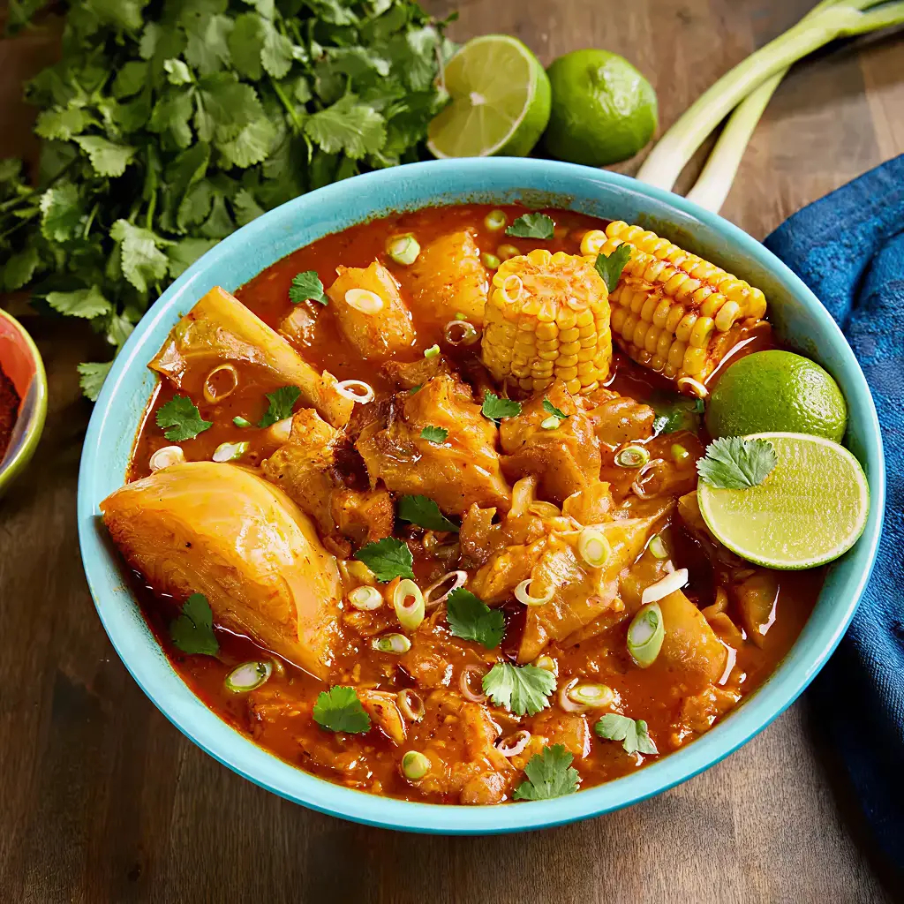

# Sopa de Pata

*The Salvadoran weekend revival soup: cow's foot and tripe simmered for hours with corn, cassava, plantain and chayote, finished with oregano and lime, ladled into deep bowls for the family lunch.*

**Serves:** 6

**Prep Time:** 30 minutes

**Cook Time:** 4 hours

## Overview
Sopa de pata is the Salvadoran weekend big-pot soup, made in a quantity that feeds a household plus the relatives who turn up. The base is cow's foot and honeycomb tripe, both blanched, scrubbed clean, then simmered for hours with onion, garlic, peppers and tomato until the broth turns silky from the released gelatine. Into the rich broth go corn on the cob, plantain, cassava, chayote and green beans, each added in its own order so they all arrive cooked at the same moment. The seasoning is restrained: salt, dried oregano, a few peppercorns, a squeeze of lime at the bowl. The soup is famous as a hangover cure and a Sunday lunch in equal measure. It is served with hot tortillas, sliced avocado, and a small bowl of chopped onion and chilli for those who want it sharper.

## Ingredients

- 800 g cow's foot, cut into pieces (your butcher will do this)
- 500 g honeycomb tripe, cleaned, cut into 4 cm squares
- 1 tbsp white vinegar (for the blanch)
- 3 litres water
- 2 large onions, halved
- 6 garlic cloves, smashed
- 2 large tomatoes, halved
- 1 green pepper, halved
- 2 tsp fine sea salt (plus more to season)
- 1 tsp black peppercorns
- 2 tsp dried oregano (Mexican oregano if you have it)
- 2 bay leaves
- 2 corn cobs, each cut into 4 chunks
- 400 g cassava (yuca), peeled, cut into batons
- 2 chayote (or 1 small green papaya), peeled, cut into wedges
- 1 green plantain, peeled, cut into thick rounds
- 200 g green beans, trimmed
- Lime wedges, sliced avocado and warm tortillas to serve

## Method

### Stage 1 - Clean the offcuts
1. Place the cow's foot and tripe in a large pan; cover with cold water and add the vinegar.
2. Bring to a boil for 5 minutes. Drain, rinse the meat under cold running water, and rinse the pan.
3. This first blanch removes any aggressive odour and the loose impurities.

### Stage 2 - Build the broth
1. Return the cow's foot and tripe to the clean pan. Add 3 litres fresh water.
2. Drop in the onions, garlic, tomatoes, green pepper, salt, peppercorns and one teaspoon of the oregano. Add the bay leaves.
3. Bring to a boil, then drop to a low simmer.
4. Skim the grey foam off the top for the first 15 minutes.
5. Cover loosely and simmer for 3 hours, until the cow's foot is wobbly-soft and the tripe yields to a fork. Top up with hot water as needed to keep everything submerged.

### Stage 3 - Strain and season
1. Lift the meat out into a bowl. Strain the broth through a sieve into a clean pan, pressing the solids gently to release flavour. Discard the spent vegetables.
2. Return the cow's foot and tripe to the strained broth.
3. Taste and adjust salt; the soup wants to be properly seasoned at this stage as the vegetables will absorb salt as they cook.

### Stage 4 - Add the vegetables in order
1. Bring back to a steady simmer. Add the cassava and corn first; cook 8 minutes.
2. Add the chayote and plantain; cook 7 minutes more.
3. Add the green beans and the remaining teaspoon of oregano; cook 5 minutes.
4. The vegetables should be tender but not falling apart.

### Stage 5 - Serve
1. Ladle a piece of cow's foot, a square or two of tripe, a piece of each vegetable, and plenty of broth into each deep bowl.
2. Squeeze a lime wedge over the top.
3. Set out warm tortillas, sliced avocado, and chopped onion with chilli for the table.

## Notes
- **The vinegar blanch is non-negotiable:** without it the broth carries a barnyard note that few people enjoy.
- **Cow's foot, not knuckle:** the foot has the right balance of skin, gelatine and tendon. Knuckle alone gives a less interesting broth.
- **Tripe quality:** honeycomb tripe (book tripe) is the right cut. Smell it before buying; properly cleaned tripe smells mild.
- **Long, gentle simmer:** boiling hard turns the broth cloudy and the meat tough. A bare bubble is correct.

## Variations
- **Sopa de mondongo:** drop the cow's foot and use double tripe.
- **With masita:** add small balls of masa dough in the last 10 minutes; they cook to soft dumplings.
- **Hangover bowl:** finish the bowl with a spoon of finely chopped raw onion and a heavy hand on the chilli.
- **Costeña style:** add a handful of coriander leaves at the table.

## Serving
Sunday lunch · with warm tortillas torn and dropped in the bowl · with sliced avocado · with a glass of agua de jamaica · as a Saturday-morning recovery soup · in deep clay bowls.

## Storage
- Keeps 4 days refrigerated; the broth sets to jelly when cold and warms back to liquid.
- The flavour improves on day two as the spices marry.
- Freezes 2 months; defrost overnight and reheat gently.
- Reheat at a low simmer; boiling toughens the tripe.

