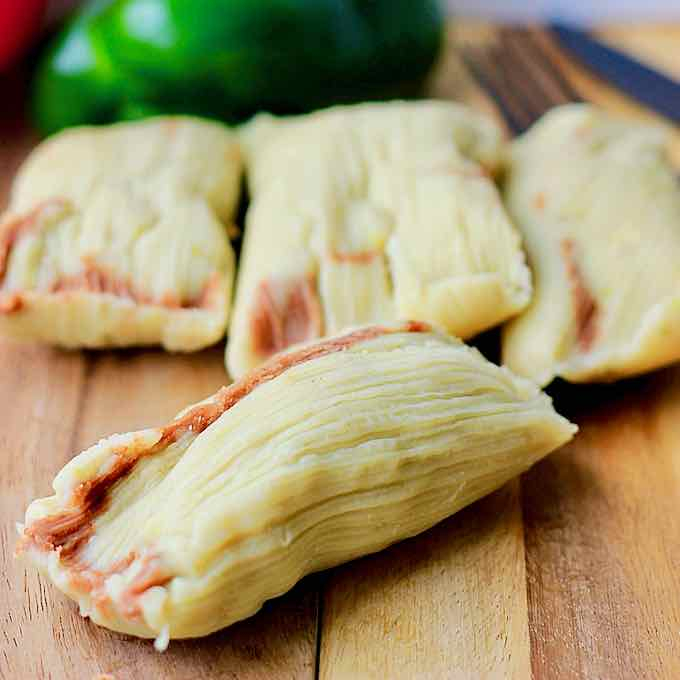

# Tamales Pisques

*Salvadoran meatless tamales: lentil-and-vegetable masa wrapped in plantain leaf and steamed until firm, the everyday breakfast tamal, eaten with strong coffee and warm tortilla.*

**Serves:** 8 tamales

**Prep Time:** 1 hour

**Cook Time:** 1 hour 30 minutes

## Overview
Tamales pisques are the workaday Salvadoran tamal, made without meat and bound with red beans or lentils mashed into the masa. They are smaller and firmer than the Christmas tamales de gallina, wrapped in plantain leaf rather than cornhusk for the deeper green tea note plantain leaf gives. The masa is built from nixtamalised corn flour mixed with cooked mashed beans (or lentils, as here), seasoned with a small amount of lard, salt, and the cooking liquid from the beans. The shape is rectangular, around the size of a postcard, sealed with a folded leaf and tied with a torn strip from the same leaf. They steam over a tight pan of boiling water for ninety minutes. Pisques travel well in a tea towel, eat well at any temperature, and are the standard packed lunch of the campo.

## Ingredients

- 250 g brown or Puy lentils
- 800 ml water
- 1 bay leaf
- 1 small onion, halved
- 2 garlic cloves, smashed
- 500 g masa harina (Maseca instant corn flour)
- 80 g lard or vegetable shortening, soft
- 1 tsp fine sea salt
- 1/2 tsp ground cumin
- 1/2 tsp dried oregano
- 400-500 ml warm water (more if needed)
- 8 large pieces of plantain leaf (about 25 cm by 25 cm), defrosted if frozen
- Kitchen string or torn leaf strips for tying

## Method

### Stage 1 - Cook the lentils
1. Rinse the lentils and tip into a pan with the 800 ml water, bay leaf, onion and garlic.
2. Bring to a boil, then simmer covered for 25-30 minutes until soft.
3. Drain, keeping the cooking liquid. Fish out the bay leaf, onion and garlic.
4. Mash half the lentils to a coarse paste; leave the other half whole.

### Stage 2 - Soften the plantain leaves
1. Wipe each piece of plantain leaf with a damp cloth to remove dust.
2. Pass each leaf briefly over a gas flame or hot dry comal for 5 seconds per side; the leaf turns glossy and pliable.
3. Stack the leaves under a tea towel.

### Stage 3 - Mix the masa
1. In a large bowl, combine the masa harina, soft lard, salt, cumin and oregano.
2. Add the mashed lentils and rub the mixture together with your fingers until it resembles damp sand.
3. Pour in the warm water (start with 400 ml) and the reserved lentil cooking liquid, mixing to a soft dough.
4. Fold in the whole lentils. The masa should be soft enough to spread but firm enough to hold a shape; like a thick paste. Add more warm water by the tablespoon if it cracks when squeezed.
5. Salt to taste.

### Stage 4 - Wrap the tamales
1. Lay a piece of plantain leaf shiny-side up on the bench, long side facing you.
2. Spoon a packed quarter-cup of masa onto the centre and spread to a rectangle about 10 cm by 14 cm.
3. Fold the long edges of the leaf over the masa to meet in the middle.
4. Fold the short edges in to seal, making a flat parcel.
5. Tie around the middle with kitchen string or a strip of leaf.

### Stage 5 - Steam
1. Set a steamer basket inside a large pan with 5 cm of water. Place a coin in the water (if it stops rattling, you have boiled dry).
2. Stack the tamales standing upright, folded side down, in the basket.
3. Cover with a layer of leftover leaf pieces, then a tea towel, then the lid.
4. Steam over a steady medium heat for 90 minutes. Top up boiling water as needed.
5. Test one: the masa should come away cleanly from the leaf and feel firm but tender.

### Stage 6 - Rest and serve
1. Lift the steamer out and let the tamales sit covered for 10 minutes; the masa firms as it cools slightly.
2. Serve in their leaves at the table; each diner unwraps their own.

## Notes
- **Lentils not red beans:** the original is made with red beans; lentils give a softer, more delicate tamal and cook faster. Both are correct.
- **Plantain leaf, not corn husk:** plantain leaf gives the tea-like aroma that defines pisques. If you cannot find it, banana leaf is the closest substitute; corn husks change the dish.
- **Masa consistency:** spreadable like thick mashed potato. Too dry and the tamal will crack; too wet and it will be claggy.
- **Tie loosely:** the masa swells as it cooks; a tight tie splits the parcel.
- **Cool a few minutes before unwrapping:** straight from the pan the masa is too soft to handle.

## Variations
- **De frijol rojo:** mash cooked red beans into the dough instead of lentils, the traditional country version.
- **Pisques de queso:** tuck a finger of cheese into the masa before wrapping.
- **Pisques de loroco:** fold loroco buds into the dough for a floral note.
- **Tamales de elote:** swap the masa for grated fresh corn and butter for the sweetcorn tamal.

## Serving
- For breakfast with coffee · in a school lunchbox, still warm in their leaves · with a spoon of curtido alongside · at the family velorio (wake) · with a glass of horchata salvadoreña.

## Storage
- Keep 3 days refrigerated in their leaves; resteam for 20 minutes from cold.
- Freeze 3 months wrapped; resteam frozen for 40 minutes.
- Do not microwave from cold (the masa goes rubbery); resteam is the only good reheat.
- The cooked tamales travel well wrapped in foil and a tea towel.

