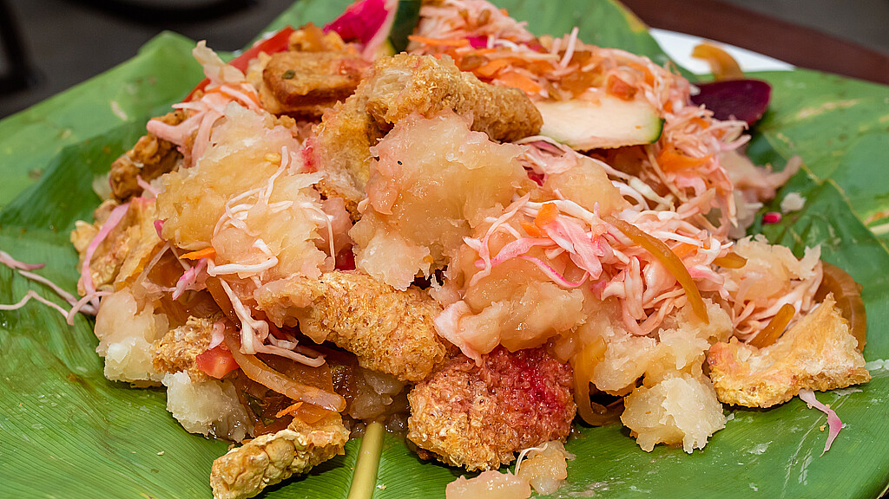

# Yuca con Chicharrón

*The Sunday-morning Salvadoran ritual: tender boiled cassava chunks heaped with crisp fried pork belly and curtido, doused with salsa roja, eaten standing at a market stall or sitting under a tarp at the comedor.*

**Serves:** 4

**Prep Time:** 20 minutes

**Cook Time:** 1 hour 15 minutes

## Overview
Yuca con chicharrón is the dish you find on every market street in El Salvador on a Sunday: boiled yuca, fried pork belly, curtido and salsa, served on a banana leaf or a polystyrene plate. The yuca is peeled, cut into thumb-thick batons and boiled in well-salted water until it splits along the central fibre and the flesh flakes apart. The chicharrón is pork belly slow-braised in its own fat until the meat is meltingly tender, then fried in the rendered lard until the skin crackles. The curtido is lightly fermented cabbage and carrot with oregano. The salsa is a cooked tomato sauce sharpened with onion and pepper. The four parts arrive in one mound: hot starch, crisp pork, sour slaw, lively sauce. There is no fork; you tear the pork and lift the yuca with your fingers.

## Ingredients

### Yuca
- 1 kg fresh cassava (yuca), or frozen yuca chunks (defrosted)
- 2 tbsp fine sea salt
- 2 bay leaves
- 1 garlic clove, smashed

### Chicharrón
- 800 g pork belly, skin on, cut into 3 cm cubes
- 250 ml water
- 1 tbsp fine sea salt
- 1 tsp ground cumin
- 1 tsp dried oregano
- 2 garlic cloves, smashed
- 1 bay leaf

### To serve
- 1 batch curtido (see side-dishes recipe)
- 1 batch salsa roja salvadoreña (see side-dishes recipe)
- Lime wedges

## Method

### Stage 1 - Prepare the yuca
1. If using fresh yuca, slice the bark and pink underlayer away with a small knife to expose the white flesh. Cut into 8 cm logs, then quarter each log lengthways.
2. Run a knife down the central woody fibre and pull it out (this is tough and inedible).
3. Drop the pieces into a pan of cold water as you go to stop discolouration.

### Stage 2 - Boil the yuca
1. Drain and transfer to a large pan. Cover with fresh cold water by 5 cm.
2. Add the salt, bay leaves and smashed garlic.
3. Bring to a boil and simmer uncovered for 25-35 minutes, until a knife slides in cleanly and the pieces have split along the centre.
4. Drain and keep warm under a tea towel.

### Stage 3 - Slow-cook the pork
1. Place the pork belly cubes in a wide heavy pan with the water, salt, cumin, oregano, garlic and bay leaf.
2. Bring to a simmer. Cover loosely and cook over a low heat for 45 minutes; the water reduces and the pork tenderises in its own steam.
3. Lift the lid, raise the heat to medium and let the water boil off completely. The fat will start to render out.

### Stage 4 - Crisp the chicharrón
1. Once the water has gone and the pork sits in its own clear fat, keep frying, turning every minute or two, for a further 10-15 minutes.
2. The skin should blister and crackle, the meat should brown deeply and the fat should be a pale gold pool.
3. Lift the pieces out with a slotted spoon onto a board lined with paper.

### Stage 5 - Plate up
1. Pile a heap of warm yuca onto each plate.
2. Crown with pieces of chicharrón.
3. Heap curtido alongside, generously.
4. Spoon salsa roja over the lot.
5. Tuck a lime wedge on the side.

## Notes
- **The yuca centre fibre:** the woody string running through the middle of each piece must be pulled out before cooking or after; either works, but it must go.
- **Don't undercook the yuca:** properly cooked yuca splits along the centre and breaks apart with a fork. Undercooked it has a chalky, almost soapy texture.
- **The pork ratio:** half meat, half skin-and-fat is right. All-meat pork belly will not give the right chicharrón.
- **Salsa hot or cold:** Salvadoran salsa roja for this dish is usually served warm but not hot. Make it ahead.

## Variations
- **Yuca frita con chicharrón:** the par-boiled yuca is then deep-fried until golden, the most-loved street version.
- **Con pescadito:** small fried whole fish (often sardine-sized) replace the chicharrón at coast comedores.
- **Con carnitas:** shredded slow-cooked pork instead of crisp chunks, gentler and looser.
- **Con queso fresco:** for a meatless plate, swap the chicharrón for crumbled fresh white cheese.

## Serving
On a banana leaf or open plate · curtido and salsa heaped on top, not on the side · with a refresco de tamarindo · for Sunday breakfast or lunch · at a market puesto · standing at a comedor counter.

## Storage
- Best assembled fresh; the yuca toughens once cooled.
- Cooked yuca keeps 2 days refrigerated; reheat in salted boiling water for 3 minutes.
- Chicharrón keeps 3 days refrigerated; recrisp in a dry pan over medium heat.
- The rendered pork fat keeps a month and is the right fat for refrying beans.
