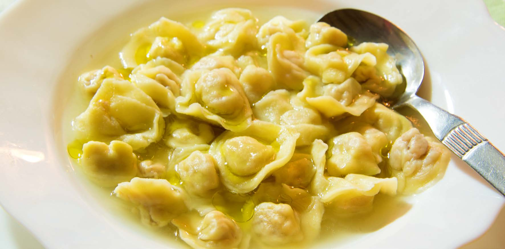

# Cappelletti in Brodo Sanmarinesi (San Marino Filled Pasta in Capon Broth)

*San Marino's New Year's Day dish: tiny hand-pinched pasta hats stuffed with parmigiano, ricotta and mortadella, floated in a long-simmered capon broth and finished with a final grating of cheese; the festive bowl that Romagnolo and San Marinese families eat at noon on January 1st.*

**Serves:** 6

**Prep Time:** 1 hour 30 minutes (plus pasta resting)

**Cook Time:** 4 hours 30 minutes (broth + cooking)

## Overview
Cappelletti in brodo is the festive winter dish of San Marino, Romagna and the borderlands of Emilia. The name means "little hats" (cappelletti = little caps); each one is hand-shaped from a 3 cm square of fresh egg pasta, stuffed with a small ball of parmigiano, ricotta and mortadella filling, folded into a triangle, then twisted around a finger so the two corners meet behind the head of the "hat". The pasta is dropped into a clear capon broth that's been simmered for hours from a whole bird with onion, carrot, celery and a sprig of parsley. The cooked cappelletti are ladled into wide bowls with the steaming broth and a final shower of grated parmigiano. The traditional San Marinese setting is the first lunch of the year, but the dish appears at Christmas Eve and weddings too.

## Ingredients

### Capon broth
- 1 whole capon or large free-range chicken (about 2 kg)
- 1 small piece beef shin or oxtail (200 g; optional, for body)
- 2 onions (peeled, halved)
- 2 carrots (peeled, cut in 5 cm chunks)
- 2 celery stalks (cut in 5 cm chunks)
- 1 leek (cleaned, halved)
- 1 small handful flat-leaf parsley stems
- 4 fresh bay leaves
- 10 whole black peppercorns
- 2 whole cloves
- 1 small piece parmigiano rind (about 10 g; optional)
- 1 tablespoon fine sea salt
- 3 litres cold water

### Cappelletti pasta dough
- 400 g 00 flour
- 4 large eggs (at room temperature)
- 1 teaspoon olive oil
- 1 small pinch fine sea salt

### Cappelletti filling
- 100 g good mortadella (very finely chopped)
- 200 g whole-milk ricotta (drained 1 hour in a fine sieve over a bowl)
- 100 g parmigiano (finely grated)
- 1 egg yolk
- 1 small grating fresh nutmeg
- 1 small pinch coarsely cracked black pepper
- 1 small pinch fine sea salt (taste before adding; mortadella is salty)

### To serve
- 100 g parmigiano (finely grated, for the table)
- A small handful flat-leaf parsley (finely chopped)
- A few drops of olive oil

## Method

### Stage 1 - Capon broth
1. Place the capon and the beef shin (if using) in a large stockpot.
2. Cover with the 3 litres of cold water.
3. Bring slowly to a gentle simmer; skim every grey scum that rises (do this for the first 15 minutes; the broth must stay clear).
4. Add the onions, carrots, celery, leek, parsley stems, bay, peppercorns, cloves, parmigiano rind and salt.
5. Simmer gently 3-4 hours; do not let it boil (cloudy broth).
6. Lift the capon out and reserve (the meat goes into other dishes; cappelletti needs only the broth).
7. Strain the broth through a fine sieve lined with muslin into a clean pot.
8. Skim any final fat from the surface.

### Stage 2 - Pasta dough
1. Sift the flour onto a clean worktop; make a well in the centre.
2. Crack the eggs into the well; add the olive oil and salt.
3. Whisk the eggs in the well with a fork, gradually drawing in flour from the inside edges, till the mass forms a rough dough.
4. Knead 10 minutes till smooth and elastic.
5. Wrap in cling film; rest 30 minutes at room temperature.

### Stage 3 - Filling
1. In a bowl, combine the finely chopped mortadella, drained ricotta, grated parmigiano, egg yolk, nutmeg and pepper.
2. Mix till smooth.
3. Taste; add a small pinch of salt only if needed (mortadella and parmigiano are both salty).

### Stage 4 - Roll the pasta
1. Divide the rested dough into 4 pieces; keep the unused pieces covered.
2. Pass each piece through a pasta roller, working from the widest setting down to the second-thinnest (you should see your hand through the sheet).
3. Lay each sheet on a lightly floured worktop.

### Stage 5 - Shape the cappelletti
1. Cut each pasta sheet into 3 cm squares with a sharp knife or pasta cutter.
2. Place a tiny ball (about ½ teaspoon, pea-sized) of filling in the centre of each square.
3. Fold the square diagonally over the filling to form a triangle; press the edges firmly to seal.
4. Now form the "hat": bring the two long-side corners of the triangle around the front of your index finger and pinch them together behind, leaving the apex of the triangle pointing up.
5. The result looks like a tiny bishop's mitre.
6. Set on a tray dusted with semolina; do not let them touch.
7. Repeat with the rest of the dough and filling; you should make 200-240 cappelletti.

### Stage 6 - Cook and serve
1. Bring the strained broth to a gentle simmer.
2. Drop the cappelletti in (in batches if there are many); cook 3-4 minutes till they float and the pasta is tender.
3. Ladle generously into wide warm bowls; 30-40 cappelletti per portion in plenty of broth.
4. Shower with grated parmigiano.
5. Scatter chopped parsley.
6. Add 2-3 drops of olive oil.
7. Serve immediately with extra cheese at the table.

## Notes
- **Capon broth is the dish:** the long slow simmer with no boil produces a deep golden broth that's the whole point. A weak stock-cube broth gives a thin dish.
- **Drain the ricotta:** otherwise the filling is wet and the cappelletti burst in the broth.
- **Roll the pasta thin but not see-through:** thinner than tagliatelle, but not as thin as ravioli; the cappelletti needs to hold its shape.
- **Wrap around your finger:** this is the cappelletti-from-tortellini differentiator; the corners join behind the index finger.
- **Cook in the broth, not water:** the pasta starches into the broth and thickens it slightly; cooking separately gives a less integrated bowl.

## Variations
- **Tortellini in brodo:** the smaller Bolognese cousin uses the same broth and a denser meat filling (mortadella + prosciutto + pork loin + parmigiano).
- **Cappelletti al ragù:** drain the cooked cappelletti from the broth and toss with Bolognese ragù instead of serving in broth.
- **Cappelletti col tartufo:** shave a few slivers of black truffle over each bowl in winter; a Sangiovese-corner luxury.
- **Vegetarian cappelletti:** swap the mortadella for 100 g sautéed spinach and an extra 50 g parmigiano in the filling.
- **Beef-bone broth version:** use beef brisket and shin instead of capon for a richer, darker bowl (Romagnolo Christmas variation).

## Serving
- At a San Marinese New Year's Day lunch (the traditional setting) · at a Christmas Eve table in the Republic · at a Romagnolo wedding banquet · on a winter Sunday in Rimini or Cesena · with a chilled glass of Albana di Romagna · followed by stracotto sanmarinese as the second course.

## Storage
- The filled raw cappelletti freeze well 1 month on a tray; bag once solid; cook from frozen by dropping into simmering broth (add 1 minute to cooking time).
- Cooked cappelletti in broth keep 1 day refrigerated; reheat gently in the broth (don't boil).
- The broth alone keeps 5 days in the fridge or 3 months in the freezer; use as base for other dishes.
- Don't store raw cappelletti at room temperature (the ricotta soft-fills the pasta and they collapse).
