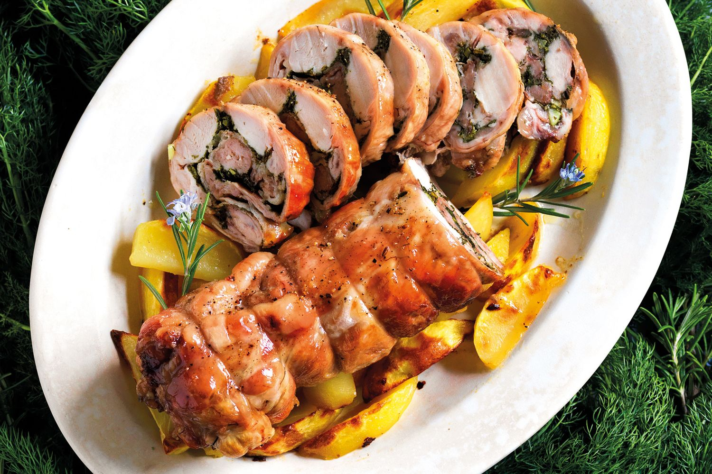

# Coniglio in Porchetta

*The San Marino farm-table classic: rabbit boned, rolled around a stuffing of wild fennel, garlic and pancetta, then slow-roasted on a bed of rosemary until the skin crackles.*

**Serves:** 4 to 6

**Prep Time:** 30 minutes

**Cook Time:** 1 hour 45 minutes

## Overview
"In porchetta" describes a treatment, not the meat: the rabbit is butterflied open, seasoned with the same aromatics that go into a roast Umbrian suckling pig (wild fennel, garlic, rosemary, plenty of black pepper), rolled around a pancetta stuffing and tied tight, then roasted slowly so the meat stays moist while the outer layer browns. It is the festival meat of the Republic, served at the Festa di San Marino on 3 September and at autumn weddings. The rabbit comes from local farms, the fennel pollen and wild rosemary from the slopes of Monte Titano. Serve in slices, with the pan juices spooned over polenta or piadina.

## Ingredients

- 1 whole rabbit, about 1.5 kg, boned and butterflied (ask the butcher)
- 150 g pancetta, in 5 mm dice
- 2 chicken livers, finely chopped (optional, for richness)
- 4 garlic cloves, very finely chopped
- 2 tbsp wild fennel fronds, chopped (or 1 tsp fennel seeds, lightly crushed, plus a handful of dill)
- 2 tbsp rosemary leaves, finely chopped
- 1 tbsp sage leaves, finely chopped
- 1 tsp fennel pollen (or extra fennel seed)
- Zest of 1 lemon
- 80 ml dry white wine
- 60 ml extra virgin olive oil
- 4 long rosemary branches for the roasting tray
- Salt and plenty of coarsely cracked black pepper
- 200 ml dry white wine for the pan
- 200 ml chicken or light stock

## Method

### Stage 1 - Make the stuffing
1. In a bowl combine the pancetta, chicken livers if using, garlic, wild fennel, rosemary, sage, fennel pollen and lemon zest. Mix in 30 ml of the olive oil, the 80 ml white wine, a good teaspoon of salt and a generous amount of black pepper.
2. Let the stuffing sit for 15 minutes for the flavours to come together.

### Stage 2 - Stuff and tie the rabbit
1. Lay the butterflied rabbit skin-side down on a board. Season the inside generously with salt and black pepper.
2. Spread the stuffing in an even layer down the middle of the meat, leaving a 2 cm border.
3. Roll the rabbit up lengthways into a tight cylinder. Tie firmly with kitchen string at 3 cm intervals so it holds its shape.
4. Rub the outside with the remaining 30 ml olive oil, a final teaspoon of salt and lots of black pepper.

### Stage 3 - Roast
1. Heat the oven to 180°C (160°C fan).
2. Lay the rosemary branches across a roasting tin and sit the rabbit on top so it does not touch the metal. Pour the 200 ml white wine and the stock into the base of the tin.
3. Roast for 1 hour 15 minutes, basting with the pan juices every 20 minutes. The skin should be deep gold and crisping.
4. Raise the heat to 220°C (200°C fan) for the final 15 minutes to colour the outside.
5. The rabbit is done when a thermometer in the thickest part reads 70 to 72°C, or the juices run clear with no pink. Total roasting time is around 1 hour 30 to 1 hour 45 minutes.

### Stage 4 - Rest and slice
1. Lift the rabbit onto a board, tent loosely with foil and rest 15 minutes.
2. Pour the pan juices into a small pan, skim off excess fat, and reduce over a high heat to a glossy spoonable sauce.
3. Snip off the strings. Slice the rabbit into 2 cm rounds, showing the spiral of stuffing.

## Notes
- **The boning.** Most butchers will bone a rabbit if asked a day ahead; you want the carcass removed but the skin and legs left attached as a flat sheet.
- **Wild fennel.** The wild fennel fronds (or fennel pollen) are the signature flavour. If you can find neither, crushed fennel seed with a handful of fresh dill is the best workaround.
- **Resting is essential.** Rabbit goes from juicy to dry in five minutes if sliced too soon; a 15 minute rest under foil sets the juices.

## Serving
Spoon the reduced pan juices over the slices. Serve with polenta sanmarinese, a wedge of piadina to mop up, and a glass of Sangiovese di San Marino.

## Storage
- Keeps 3 days refrigerated.
- Slices reheat well in a low oven covered with foil and a splash of stock.
- The leftover slices make excellent crostini the next day (see coniglio crostini).
