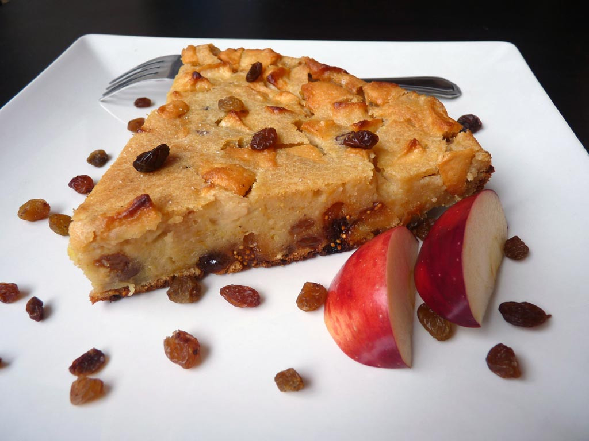

# Bustrengo (Sweet Version)

*The sweet incarnation of San Marino's polenta-and-bread cake: stale bread, polenta and milk baked with apples, raisins, figs, and honey for a rustic festival dessert.*

**Serves:** 8

**Prep Time:** 25 minutes (plus 30 minutes soaking)

**Cook Time:** 1 hour

## Overview
The sweet bustrengo and the savoury one share the same backbone: stale bread, polenta, milk, eggs. The dessert version adds apples, raisins, dried figs and honey, with rosemary still in the mix as the unexpected savoury counterpoint. It is a winter cake, baked for Christmas Eve and All Saints' Day in San Marinese kitchens, and the slices keep for days, the flavour improving as it sits. Serve at room temperature in thick wedges with a dollop of mascarpone or a small glass of vin santo.

## Ingredients

- 250 g stale country bread, torn into pieces
- 700 ml whole milk
- 150 g fine polenta (yellow cornmeal)
- 80 g 00 flour
- 3 eggs
- 80 g honey, plus extra for drizzling
- 60 g caster sugar
- 60 ml olive oil, plus extra for the tin
- 2 medium apples, peeled, cored and cut into 1 cm dice
- 100 g raisins, soaked 15 minutes in warm water and drained
- 80 g dried figs, chopped
- 60 g pine nuts
- 60 g walnuts, roughly chopped
- 1 tbsp finely chopped rosemary
- Zest of 1 orange and 1 lemon
- 1/2 tsp fine salt
- 1 tsp ground cinnamon
- A grating of nutmeg

## Method

### Stage 1 - Soak the bread
1. Tear the bread into a large bowl, pour the milk over and leave to soak for 30 minutes, breaking the bread up with a fork halfway through.

### Stage 2 - Build the batter
1. Beat the eggs, honey and caster sugar into the soaked bread.
2. Whisk in the polenta and flour in two additions; the batter should be the texture of a loose drop scone batter.
3. Stir in the olive oil, then fold in the apples, raisins, figs, pine nuts, walnuts, rosemary, citrus zests, salt, cinnamon and nutmeg.
4. Let the batter stand 10 minutes so the polenta starts to swell.

### Stage 3 - Bake
1. Heat the oven to 175°C (155°C fan). Oil a 24 cm round cake tin well, then line the base with baking paper.
2. Pour the batter in and smooth the top. Drizzle with a little extra honey.
3. Bake for 55 to 60 minutes, until the top is a deep amber, the sides have pulled away from the tin, and a skewer in the centre comes out clean.

### Stage 4 - Cool and serve
1. Cool in the tin for 20 minutes before turning out onto a rack.
2. Brush the warm top with a final spoonful of honey thinned with a teaspoon of hot water; it glazes as it dries.
3. Slice into thick wedges once cool enough to handle.

## Notes
- **The rosemary.** Counter-intuitive in a dessert, but the small amount lifts the sweetness; do not skip it.
- **Stale bread.** Day-old, dry bread soaks up the milk without going to mush; fresh bread will pulp.
- **Better the next day.** Bustrengo is at its best 24 hours after baking, when the spices have settled and the texture has firmed.

## Serving
Wedges on plates with a dollop of mascarpone or thick yoghurt, a few extra walnuts on top, and a glass of vin santo or moscato.

## Storage
- Keeps 5 days in an airtight tin at room temperature; the flavour improves.
- Freezes 2 months wrapped tightly; thaw at room temperature.
- Slices toast well on a dry pan for breakfast.
