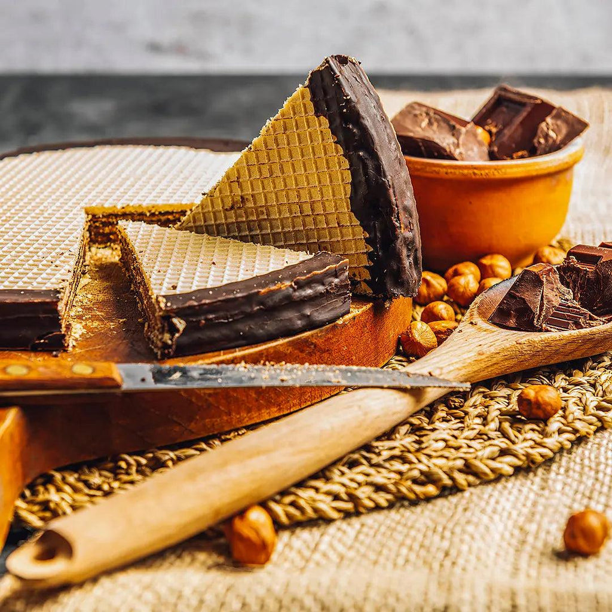

# Torta Tre Monti

*The "Three Mountains" cake: the national dessert of San Marino, alternating wafers and chocolate-hazelnut cream stacked into a cake and enrobed in dark chocolate.*

**Serves:** 12 to 16

**Prep Time:** 1 hour (plus 4 hours chilling)

**Cook Time:** 10 minutes

## Overview
The Torta Tre Monti was created in the 1940s by the La Serenissima pastry company in Borgo Maggiore and has stood as the de facto national cake of the Republic ever since. The name is the city's identity: Monte Titano has three peaks (Guaita, Cesta, Montale) and the cake stacks crisp wafer biscuits with hazelnut-chocolate cream until it stands like a small mountain itself, then is coated in dark chocolate. The texture is the point: brittle wafer against soft cream, a snap of chocolate on the outside. Slice it thin and serve with espresso.

## Ingredients

### For the chocolate-hazelnut cream
- 250 g hazelnuts, skinned
- 200 g dark chocolate (70% cocoa)
- 200 g milk chocolate
- 200 ml double cream
- 150 g unsalted butter, softened
- 80 g icing sugar
- 1 tbsp instant coffee (optional, for depth)
- A pinch of salt

### For the cake
- 1 packet (about 250 g) plain rectangular wafer biscuits (the thin three-layer kind)

### For the chocolate coating
- 250 g dark chocolate (70% cocoa)
- 50 g unsalted butter
- 50 g chopped hazelnuts, for the top

## Method

### Stage 1 - Make the hazelnut paste
1. Toast the hazelnuts in a 170°C oven for 8 to 10 minutes until fragrant; rub off any loose skins in a tea towel.
2. Tip into a food processor and blend, scraping down, for 4 to 6 minutes until the nuts release their oil and form a thick paste. Reserve 150 g for the cream; keep the rest for topping.

### Stage 2 - Make the cream
1. Chop the dark and milk chocolate together. Place in a heatproof bowl.
2. Heat the cream just to a simmer; pour over the chocolate. Wait 1 minute, then stir until smooth.
3. Stir in the hazelnut paste, the instant coffee (dissolved in 1 tsp hot water), and the salt.
4. Cool to room temperature, then beat in the soft butter and the icing sugar with a wooden spoon or a hand mixer at low speed. The cream should be soft, glossy and spreadable.

### Stage 3 - Assemble the cake
1. Trim the wafer biscuits if needed so they sit flat in even layers.
2. On a board lined with baking paper, lay down a first layer of wafer biscuits in a single rectangle.
3. Spread a generous even layer of the chocolate-hazelnut cream over the wafers (about 5 mm thick).
4. Top with another wafer layer, press down lightly, spread another layer of cream. Repeat until you have 5 or 6 wafer layers, finishing with cream on top.
5. Wrap loosely and refrigerate for at least 2 hours to firm up.

### Stage 4 - Coat in chocolate
1. Melt the coating chocolate gently with the butter in a heatproof bowl over barely simmering water. Cool until just warm, not hot.
2. Lift the chilled cake onto a wire rack over a tray. Pour the melted chocolate over the top and let it run down the sides, smoothing with a palette knife to cover everywhere.
3. Scatter the chopped hazelnuts over the top while the chocolate is still tacky.
4. Refrigerate 2 hours until the coating is fully set.

### Stage 5 - Slice
1. Lift the cake onto a board. Warm a long thin knife under hot water, dry, and slice firmly straight down into 1 cm slices, wiping the blade between cuts.

## Notes
- **Wafer biscuits.** The original cake uses simple plain rectangular three-layer wafers (no filling); these are easy to find in Italian supermarkets and many continental delis. Cream-filled wafers also work if you cannot find plain.
- **Pour the coating warm, not hot.** Hot chocolate will melt the cream layer beneath; let it cool to body temperature first.
- **Chilling discipline.** The cake needs proper chilling to slice cleanly; cutting before the chocolate sets creates a mess.

## Serving
- Thin slices with espresso, an after-dinner liqueur, or a glass of Brugneto della Serenissima.

## Storage
- Keeps 1 week refrigerated, well wrapped.
- Freezes 1 month (sliced or whole); thaw in the fridge.
- Brings to room temperature 20 minutes before serving for the best texture.

