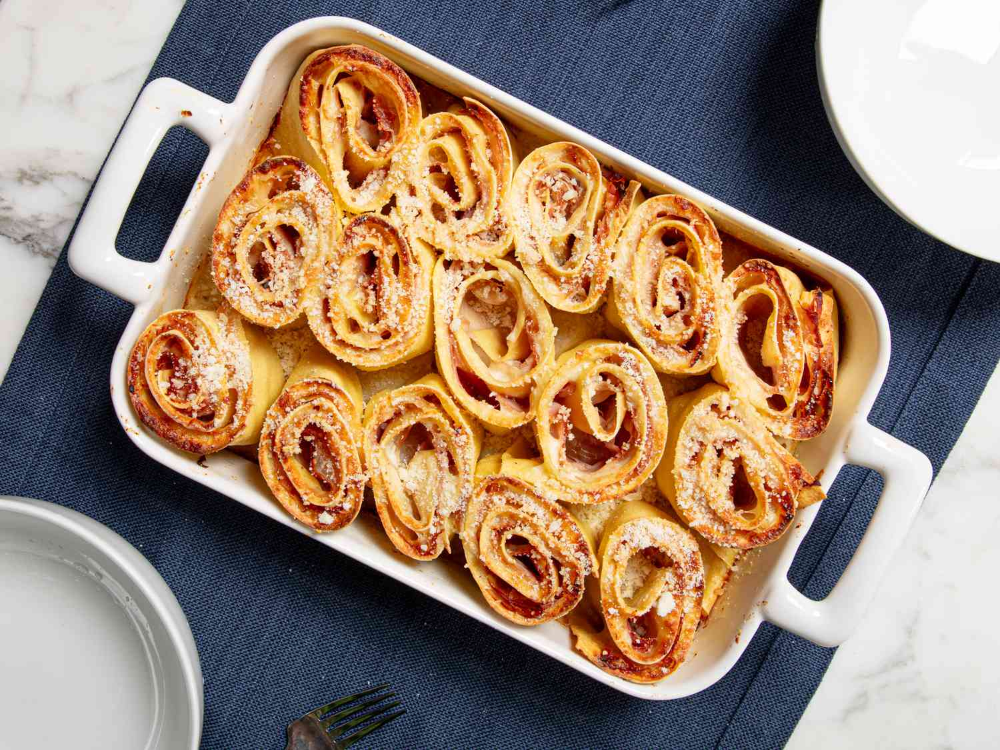

# Nidi di Rondine

*"Swallows' nests": a San Marinese rolled pasta layered with béchamel, ham and cheese, sliced into pinwheels and baked until the edges crisp and the centre bubbles.*

**Serves:** 6

**Prep Time:** 1 hour

**Cook Time:** 35 minutes

## Overview
Nidi di rondine are the showpiece pasta of San Marinese Sunday tables: a sheet of fresh egg pasta spread with béchamel, lined with prosciutto cotto and grated cheese, rolled tight like a swiss roll, sliced into rounds and baked standing up in a buttered dish. Each round looks like a small spiral nest, hence the name. They are a relative of the Romagnolo rotolo, but cut and baked rather than poached, with a crispier top. Serve as a substantial primo for a winter lunch or as the centrepiece of a holiday meal.

## Ingredients

### For the pasta
- 250 g 00 flour
- 3 large eggs

### For the béchamel
- 70 g unsalted butter
- 70 g 00 flour
- 700 ml whole milk
- A grating of nutmeg
- Salt and white pepper

### For the filling
- 200 g sliced prosciutto cotto (cooked ham)
- 200 g fontina or scamorza, coarsely grated
- 80 g aged pecorino or parmesan, finely grated
- A small handful sage leaves, chopped

### To finish
- 30 g butter for the dish and dotting on top
- 40 g grated parmesan for the top

## Method

### Stage 1 - Make the pasta
1. Mound the flour on a board, well in the middle, eggs in. Beat with a fork, draw the flour in, knead 8 minutes to a smooth firm dough. Wrap and rest 30 minutes.

### Stage 2 - Make the béchamel
1. Melt the butter in a heavy pan. Stir in the flour; cook 2 minutes without colouring.
2. Whisk in the milk a ladle at a time, keeping the sauce smooth. Bring to a gentle simmer, cook 5 minutes until thick enough to coat a spoon.
3. Season with salt, white pepper and nutmeg. Take off the heat and lay cling film on the surface to stop a skin forming.

### Stage 3 - Roll the pasta and assemble
1. Roll the rested dough into a single large rectangle, about 30 by 45 cm, just under 1 mm thick.
2. Lift the sheet onto a clean tea towel for support.
3. Spread two thirds of the béchamel over the pasta in an even layer, leaving a 2 cm border on the long edge furthest from you.
4. Cover with the prosciutto in a single layer.
5. Sprinkle the grated fontina, the pecorino and the chopped sage evenly over the ham.

### Stage 4 - Roll, slice and bake
1. Using the tea towel to help, roll the pasta into a tight cylinder, starting from the long edge nearest you. Press the seam to seal.
2. Cut the cylinder into 12 rounds about 3 to 4 cm thick.
3. Heat the oven to 190°C (170°C fan).
4. Butter a baking dish that will fit the rounds standing on a cut side with a little space between them.
5. Spread a thin layer of the remaining béchamel in the base of the dish. Stand the nests in the dish, cut side up. Spoon the rest of the béchamel between and over the nests.
6. Scatter the parmesan over the top. Dot with the remaining butter.
7. Bake for 30 to 35 minutes until the top is deep gold and the edges of the pasta crisp.

### Stage 5 - Rest and serve
1. Let the dish stand 10 minutes before serving; this firms up the layers and stops them sliding apart on the plate.
2. Lift the nests out with a wide spatula, spooning a little of the sauce around them.

## Notes
- **Tea-towel rolling.** A clean cotton tea towel makes rolling the long pasta sheet much easier and helps keep the roll tight.
- **Béchamel thickness.** It needs to coat a spoon firmly. Too thin and the layers will not hold; too thick and the inside will go pasty.
- **Standing the nests up.** Cut side up means you see the spiral, the cheese caramelises, and the béchamel can pool down the sides.

## Serving
- The main event for a Sunday lunch; a green salad after, nothing before. A bottle of Sangiovese di San Marino.

## Storage
- Keeps 2 days refrigerated. Reheat covered with foil at 170°C until heated through; uncover for the last 5 minutes to re-crisp the top.
- Freezes well baked, then thawed and reheated.

