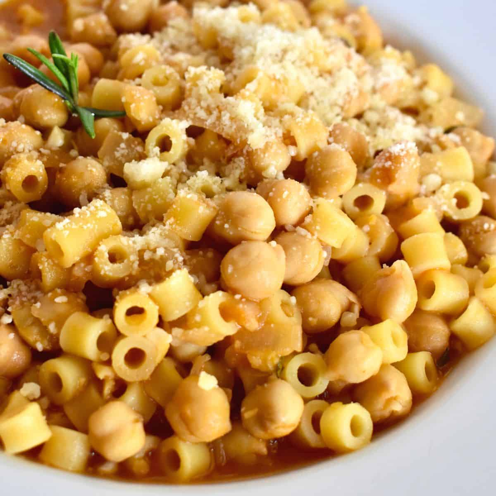

# Pasta e Ceci Sanmarinese

*The San Marino chickpea-and-pasta soup: slow-cooked chickpeas with garlic, rosemary and a glug of mountain olive oil, broken up by short pasta and finished with pecorino.*

**Serves:** 4

**Prep Time:** 15 minutes (plus overnight soaking)

**Cook Time:** 2 hours

## Overview
Pasta e ceci is shared across central Italy, but the San Marinese version leans heavier on rosemary and garlic than the Roman one, and it is finished with a grating of mountain pecorino rather than parmesan. The chickpeas are soaked overnight, then cooked very slowly with a sprig of rosemary, a peeled garlic clove and a piece of pork rind (cotenna) for body. Half the chickpeas are then mashed back into the broth to thicken it, the short pasta is cooked directly in the soup, and a final crown of fresh rosemary oil is spooned over each bowl. It is the dish that crops up on every osteria menu in Borgo Maggiore in winter.

## Ingredients

- 300 g dried chickpeas
- 1 bay leaf
- 2 sprigs rosemary (1 for cooking, 1 for the finishing oil)
- 4 garlic cloves (2 whole peeled, 2 finely sliced)
- 50 g pork rind or pancetta in one piece (optional, for body)
- 100 ml extra virgin olive oil, plus more to finish
- 1 small onion, finely chopped
- 1 small celery stalk, finely chopped
- 2 tbsp tomato paste
- 1.5 litres water or light chicken stock
- 200 g short pasta (ditalini, maltagliati or broken tagliatelle)
- Salt and black pepper
- 40 g aged pecorino, finely grated, to serve

## Method

### Stage 1 - Soak and cook the chickpeas
1. Soak the chickpeas in plenty of cold water overnight (at least 12 hours).
2. Drain and rinse. Tip into a heavy pot with the bay leaf, one rosemary sprig, two whole garlic cloves, the pork rind if using, and enough fresh cold water to cover by 5 cm.
3. Bring to a gentle simmer, skim any foam, then cook at the barest simmer for 90 minutes to 2 hours, until the chickpeas are completely tender. Salt only in the last 20 minutes.
4. Lift out and discard the bay, the rosemary stalk and the pork rind. Reserve the cooking liquid.

### Stage 2 - Build the soffritto
1. In a wide pan, warm 60 ml of the olive oil with the chopped onion, celery and sliced garlic. Cook gently for 8 minutes until soft and pale gold, not browned.
2. Stir in the tomato paste and cook for 1 minute to take the raw edge off.
3. Add the cooked chickpeas with their liquid, plus enough water or stock to bring the total liquid to about 1.5 litres. Simmer 15 minutes.

### Stage 3 - Half-mash, then cook the pasta
1. Lift out half the chickpeas and pulse them in a blender (or pass through a food mill) with a ladle of broth to a coarse cream. Return to the pan.
2. Bring back to a steady simmer. Tip in the pasta and cook until al dente, stirring often so it does not catch. The soup should be thick, almost stew-like.
3. Taste for salt and pepper.

### Stage 4 - The rosemary oil and serve
1. While the pasta cooks, warm the remaining 40 ml olive oil in a small pan with the second rosemary sprig and a sliced garlic clove. Heat for 2 minutes until fragrant; do not let the garlic colour. Take off the heat.
2. Ladle the soup into warm bowls. Drizzle a spoonful of the rosemary oil over each, top with grated pecorino and a grind of black pepper.

## Notes
- **Soaking matters.** Old chickpeas refuse to soften even after hours of cooking; if yours are more than a season old, use tinned and skip the overnight soak.
- **Pork rind for body.** A small piece of cotenna (pork rind) lends a velvety mouthfeel; vegetarians can leave it out and double the olive oil.
- **The half-mash.** Mashing half the chickpeas gives the broth its characteristic body without losing all the texture; whole chickpeas should still be visible.

## Serving
A wedge of piadina sanmarinese on the side, a glass of young Sangiovese, a small dish of olives. Lunch.

## Storage
- Keeps 3 days refrigerated; the soup thickens further on standing, so thin with a splash of hot water when reheating.
- Freezes 2 months without the pasta. Add freshly cooked pasta when reheating.

