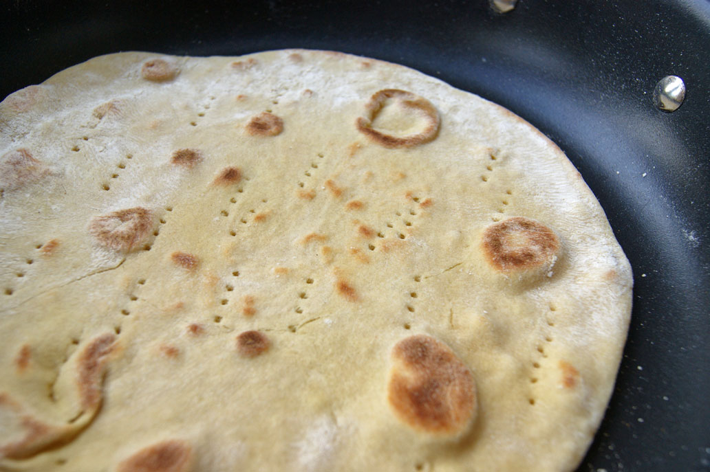

# Piadina Sanmarinese

*The San Marino flatbread: thinner and crisper than the Romagnolo piadina across the border, cooked on a hot stone until it speckles and steams.*

**Serves:** 6 piadine

**Prep Time:** 20 minutes (plus 30 minutes resting)

**Cook Time:** 15 minutes

## Overview
Every household in the Republic has a piadina recipe. The San Marinese version is the slimmer cousin of the Romagnolo one, rolled to 2 to 3 mm rather than 5 to 6, and traditionally cooked on a terracotta testo or testone (a flat stone). The dough is plain (flour, water, lard, salt), the cooking is quick, and the result is a soft pliable disc with darker speckled spots. Tear a piece off and use it for everything: wrapped around prosciutto and rocket, dipped into pasta e ceci, served alongside coniglio in porchetta. The bread is a wedge, not a course.

## Ingredients

- 500 g 00 flour, plus extra for dusting
- 50 g lard (strutto), or 50 ml olive oil
- 1 tsp fine salt
- 1/2 tsp bicarbonate of soda
- 250 to 280 ml warm water

## Method

### Stage 1 - Make the dough
1. Combine the flour, salt and bicarbonate of soda in a bowl. Rub the lard in with your fingertips until the mixture looks like coarse breadcrumbs.
2. Add 250 ml of the warm water and mix to a dough, adding the rest of the water bit by bit if needed; the dough should be firm but not stiff.
3. Tip out and knead for 5 minutes until smooth.
4. Cover with a tea towel and rest at room temperature for 30 minutes.

### Stage 2 - Shape
1. Divide the dough into 6 equal pieces, about 130 g each. Roll each into a ball.
2. Cover with a cloth and rest a further 5 minutes.
3. On a lightly floured surface, roll each ball into a thin disc of 25 to 28 cm across, about 2 to 3 mm thick.

### Stage 3 - Cook on a hot pan
1. Heat a cast-iron pan or flat griddle over medium-high heat until very hot, no oil.
2. Slap the first disc onto the pan. Cook 60 to 90 seconds; when bubbles appear and the underside has speckled brown spots, flip.
3. Cook the second side for another 60 to 90 seconds, pressing gently with a clean cloth if any large bubbles form.
4. Lift onto a clean cloth and wrap loosely to keep warm and pliable. Repeat with the rest.

## Notes
- **Lard, not butter.** Lard gives the piadina its short crumb and slight flake; olive oil is an acceptable substitute but produces a slightly softer bread.
- **Roll thin.** The San Marinese style is closer to a tortilla in thickness than to a Romagnolo piadina; 2 to 3 mm is the target.
- **Hot pan.** A medium-high cast-iron pan is the cleanest substitute for a testo; if the pan is too cool the disc dries out before it bubbles.

## Serving
Eat warm, torn into wedges, alongside any San Marinese meal. Or fold around prosciutto cotto, squacquerone cheese and rocket for piadina farcita.

## Storage
- Best eaten same day.
- Cool completely and stack in a tea towel; reheat briefly on a dry pan to soften back up.
- The cooked discs freeze well between sheets of baking paper, sealed in a bag.
