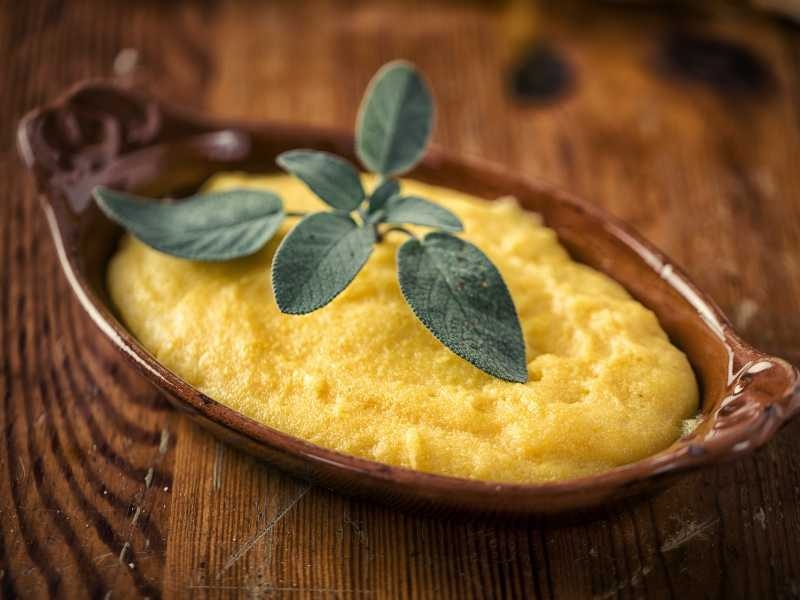

# Polenta Sanmarinese

*Slow-cooked San Marinese polenta: coarse cornmeal stirred patiently into a soft golden cream, finished with sage butter and grated pecorino.*

**Serves:** 4 to 6

**Prep Time:** 5 minutes

**Cook Time:** 45 minutes

## Overview
The San Marinese polenta sits squarely in the mountain-farm tradition: coarse yellow polenta, well-salted boiling water, a long slow stir, and a finish that leans hard on pecorino rather than the parmesan of further north. The trick is the stirring, not the recipe. Polenta thickens fast, then needs 40 minutes of regular stirring to lose its raw edge and develop the sweet creamy texture. Serve as a soft side under coniglio in porchetta, alongside a stew, or set on a board and let it cool until firm enough to slice and grill.

## Ingredients

- 1.5 litres water
- 1 1/2 tsp fine salt
- 300 g coarse yellow polenta (not instant)
- 60 g aged pecorino, finely grated
- 40 g unsalted butter
- 6 sage leaves
- Black pepper

## Method

### Stage 1 - Bring the water to the boil
1. Bring the water to a rolling boil in a wide, heavy-bottomed pan; salt generously.

### Stage 2 - Rain the polenta in
1. Tip the polenta into the boiling water in a slow steady stream, whisking constantly so no lumps form.
2. Once all the polenta is in, switch from whisk to a long wooden spoon.

### Stage 3 - Stir, low and slow
1. Reduce the heat so the polenta blups gently rather than boils hard.
2. Stir thoroughly every 3 to 4 minutes, reaching the corners and the base of the pan, for 40 to 45 minutes.
3. The polenta is ready when it pulls away from the sides of the pan as you stir, has lost its raw cornmeal smell, and tastes sweet and tender.

### Stage 4 - Finish with sage butter
1. Melt the butter in a small pan over a medium heat. Drop in the sage leaves and let them crisp for 1 minute until the butter is nut-brown and the sage is just turning. Take off the heat.
2. Beat half the pecorino through the polenta. Tip the sage butter over the top and swirl through.
3. Spoon onto warm plates or a serving board. Shower with the rest of the pecorino and a good grind of black pepper.

## Notes
- **Use proper polenta.** Coarse stone-ground polenta has the texture and sweet corn flavour the dish needs; instant polenta is faster but pasty.
- **Stir, do not abandon.** A polenta left to its own devices will catch and burn. Even minimal regular stirring keeps it on track.
- **Adjust the consistency.** If it goes too thick, beat in a splash of boiling water; too thin, cook a few minutes longer.

## Serving
Spoon under a portion of coniglio in porchetta and let the juices soak in; or eat as a bowl on its own with extra cheese.

## Storage
- Keeps 3 days refrigerated; will set very firm.
- Slice the set polenta and grill on a hot pan until crusty, dressed with olive oil and cheese.
- Reheat soft polenta with a splash of hot water and a fresh knob of butter.
