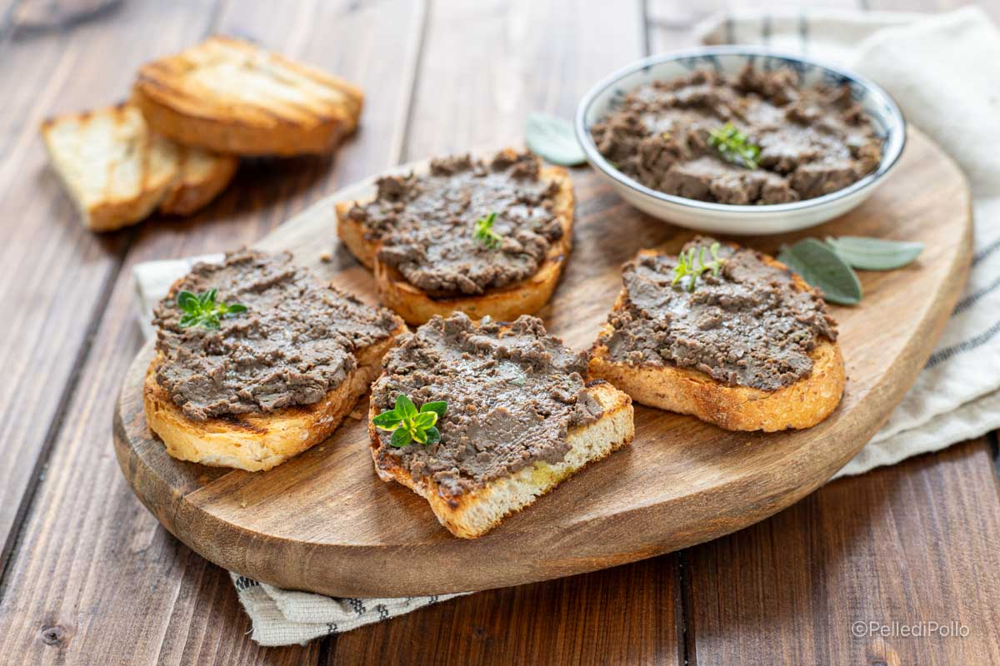

# Coniglio Crostini

*Crostini built on leftover coniglio in porchetta: thin slices of country bread, a smear of mustard, a slice of cold roasted rabbit, a slice of cornichon pickle.*

**Serves:** 4 as a snack (12 crostini)

**Prep Time:** 10 minutes

**Cook Time:** 5 minutes

## Overview
San Marinese cooks never throw out a slice of yesterday's coniglio in porchetta. Cold from the fridge, the rabbit slices are firmer than the day before, the herb-and-fennel stuffing has matured, and they make exemplary crostini. The structure is simple: a thin slice of country bread toasted just to gold, a smear of mild mustard, a slice of the cold rabbit, a slice of cornichon, a few leaves of flat parsley. The texture and the contrast (crisp bread, soft rabbit, sharp pickle) are the dish. Serve with a glass of cold prosecco at midday or with Sangiovese at the start of an evening.

## Ingredients

- 12 thin slices of country bread (sourdough or pagnotta), about 1 cm thick
- 2 tbsp extra virgin olive oil
- 1 clove garlic, halved
- 2 tbsp grain mustard (or Dijon)
- 12 cold slices coniglio in porchetta (the rounds from a leftover roast)
- 12 cornichons, sliced lengthways into thin strips
- A small handful of flat parsley leaves
- A few drops of best olive oil to finish
- Cracked black pepper

## Method

### Stage 1 - Toast the bread
1. Heat the oven to 200°C (180°C fan), or use a hot grill.
2. Brush each bread slice with olive oil on one side.
3. Toast on a tray, oiled side up, for 5 minutes until pale gold; the crostini should be crisp on the outside but still have a little chew.
4. While still warm, rub the cut side of the garlic clove once over each slice.

### Stage 2 - Assemble
1. Spread a small smear of mustard on each crostino (use it sparingly; this is a hint, not a slab).
2. Top with a slice of cold coniglio in porchetta, folded loosely if too large.
3. Lay 2 to 3 strips of cornichon across the rabbit.
4. Tuck a parsley leaf or two on top.
5. Drizzle with a few drops of best olive oil and a small grind of black pepper.

### Stage 3 - Serve
1. Arrange the crostini on a board or platter.
2. Eat at room temperature with a glass of something cold.

## Notes
- **Cold rabbit, not warm.** Cold rabbit slices sit cleanly on the crostino; reheated they go floppy.
- **Mild mustard.** A grain mustard or a softened Dijon; English mustard fights the rabbit.
- **A whisper of garlic.** Rubbing the toast with a halved garlic once is enough; more turns aggressive on a cold base.

## Serving
- At an aperitivo before a long lunch or dinner. Alongside olives, a small bowl of pickled vegetables, and a glass of cold prosecco or chilled Sangiovese.

## Storage
- Eat the crostini freshly assembled; they soften within an hour.
- The components (toasted bread cooled, sliced rabbit, sliced cornichons) keep separately for the same day; assemble at the last moment.

