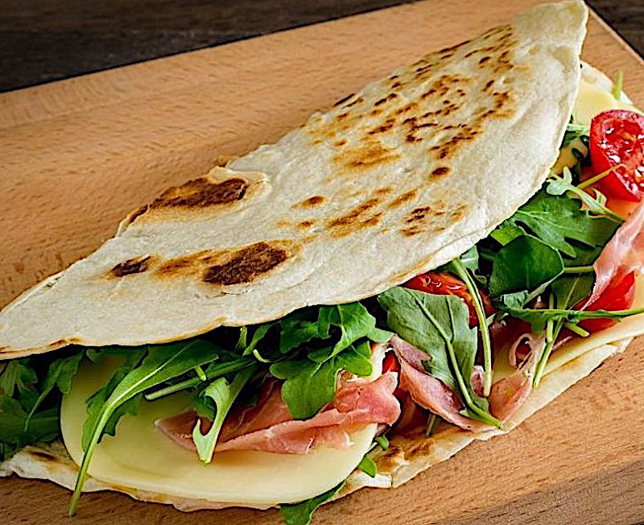

# Piadina Farcita

*The filled San Marino piadina: a fresh-cooked flatbread folded around soft squacquerone cheese, prosciutto crudo and a handful of rocket.*

**Serves:** 4

**Prep Time:** 10 minutes (with piadine already made)

**Cook Time:** 2 minutes per piadina

## Overview
Piadina farcita is San Marino's street food. Order one at a chiosco in the old town and it arrives folded in half on a square of greaseproof paper, the cheese melting into the warm flatbread, the rocket peppering the prosciutto, the whole thing eaten in five minutes standing up. The classic filling is the Romagnolo trio (squacquerone, prosciutto crudo, rocket) but the Republic adds variations: pecorino-and-fig, mortadella-and-stracchino, or grilled vegetables in summer. The bread must be warm, not cold; the cheese must be soft, not firm; the filling goes in last second.

## Ingredients

### Per piadina
- 1 freshly cooked piadina sanmarinese (see recipe)
- 60 g squacquerone cheese (or stracchino as a substitute)
- 4 thin slices prosciutto crudo (Parma or San Daniele)
- A small handful of rocket leaves (around 15 g)
- A few drops of good olive oil
- A grind of black pepper

### Optional variations
- 60 g fresh ricotta and 1 fig, sliced, plus a drizzle of honey
- 4 slices mortadella, 50 g stracchino, a few pistachios
- A few rounds of grilled courgette and a slice of aged pecorino

## Method

### Stage 1 - Warm the piadina
1. If the piadine were cooked earlier, refresh each one on a dry hot pan for 30 seconds per side; you want it warm and pliable.
2. Lift onto a plate or a square of baking paper.

### Stage 2 - Build the filling
1. Spread the squacquerone over one half of the piadina in a generous layer.
2. Drape the prosciutto over the cheese.
3. Pile the rocket over the prosciutto.
4. Drizzle with a few drops of olive oil and a small grind of pepper.

### Stage 3 - Fold and eat
1. Fold the empty half of the piadina over the filling.
2. Press gently. The cheese starts to soften against the warm bread.
3. Eat immediately, with both hands.

## Notes
- **The cheese.** Squacquerone is a fresh soft cow's-milk cheese from Emilia-Romagna that almost flows at room temperature. Stracchino is the closest substitute outside Italy; a soft fresh mozzarella will do in a pinch but loses the tangy note.
- **Warm bread, cold filling.** The heat of the bread softens the cheese and warms the prosciutto; do not put the filling in a cold piadina or it loses the magic.
- **Rocket peppery, not bitter.** Use young wild rocket if you can find it.

## Serving
On a wooden board for one, in a stack at a picnic, alongside a glass of young Sangiovese or a cold beer.

## Storage
- Eat as you make it; piadina farcita does not store, the bread softens and the rocket wilts.
- Make extra piadine to keep, then assemble fresh as needed.

