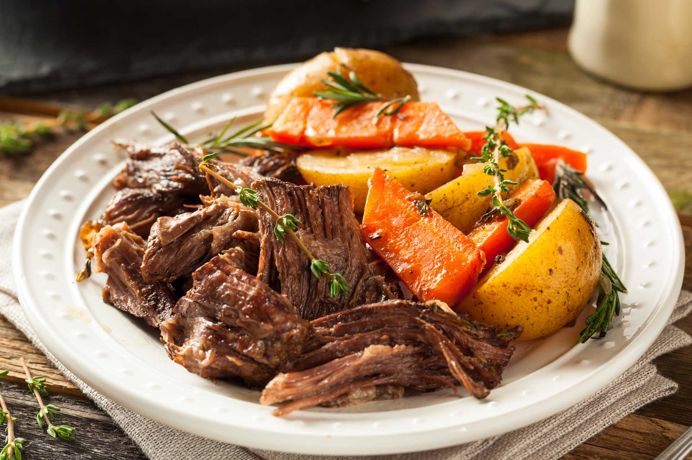

# Stracotto Sanmarinese (San Marino Sangiovese-Braised Beef)

*San Marino's Sunday-lunch braise: a whole shoulder of beef rubbed with rosemary and garlic, browned hard, then slow-cooked in a bottle of local Sangiovese with onion, carrot, celery and tomato till the meat shreds with a fork; the gravy reduced to a glossy mahogany sauce, served over creamy polenta.*

**Serves:** 6-8

**Prep Time:** 25 minutes

**Cook Time:** 4 hours

## Overview
Stracotto (literally "overcooked") is the slow-braised Sunday roast of San Marino and the surrounding Romagna hills. The dish stretches a tough cut of beef shoulder or chuck into a feast by braising it for four hours in a full bottle of Sangiovese, the local wine. A classic mirepoix of onion, carrot and celery cooks down with a small amount of tomato paste; the meat goes in whole, gets browned hard, then sits at a gentle simmer for the long afternoon. The wine reduces by half, the collagen breaks down, and the meat shreds with a fork. The gravy gets passed through a sieve to a glossy sauce, the meat sliced thick or pulled, and the whole lot goes on top of soft polenta. San Marinese tables also serve it with tagliatelle or alongside roasted potatoes. Leftovers (rare but treasured) become a ragù for the next day's pasta.

## Ingredients

### The braise
- 1500 g beef shoulder or chuck (in one piece, tied with string if necessary)
- 3 tablespoons olive oil
- 2 large onions (finely chopped)
- 2 large carrots (finely chopped)
- 3 sticks celery (finely chopped)
- 6 cloves garlic (lightly crushed)
- 2 large sprigs fresh rosemary
- 4 fresh bay leaves
- 4 sprigs fresh thyme
- 2 tablespoons tomato paste
- 750 ml Sangiovese di San Marino (or any Romagnolo Sangiovese; an honest mid-priced bottle)
- 500 ml beef stock
- 2 teaspoons fine sea salt
- 1 teaspoon coarsely cracked black pepper
- 6 whole black peppercorns
- 4 whole cloves

### Beurre manié (to finish)
- 30 g butter (softened)
- 1 tablespoon plain flour

### To serve
- 200 g coarse polenta cooked in 800 ml water with 1 teaspoon salt and 30 g butter
- A small handful chopped flat-leaf parsley
- A drizzle of San Marinese olive oil
- A wedge of pecorino sanmarinese (optional, finely grated over)

## Method

### Stage 1 - Sear the beef
1. Pat the beef dry with kitchen paper.
2. Season all over with 1 teaspoon of the salt and the cracked pepper.
3. Heat 2 tablespoons of the olive oil in a heavy lidded casserole over medium-high heat.
4. Lay the beef in; brown on all sides till deep mahogany, about 12 minutes total (this is the flavour foundation; don't rush).
5. Lift the meat onto a plate; pour off and discard any burnt fat.

### Stage 2 - Soffritto
1. Drop the heat to medium; add the remaining tablespoon of olive oil to the same pot.
2. Add the chopped onion, carrot and celery with a pinch of salt; cook 12 minutes till soft and lightly caramelised, stirring often.
3. Add the crushed garlic, rosemary, bay leaves and thyme; cook 2 minutes till fragrant.
4. Stir in the tomato paste; cook 2 minutes till it darkens to brick red.

### Stage 3 - Deglaze
1. Pour in 250 ml of the Sangiovese; scrape the bottom of the pot with a wooden spoon to release all the browned crust.
2. Simmer hard 3 minutes to drive off the raw alcohol.

### Stage 4 - Braise
1. Return the beef and any resting juices to the pot.
2. Add the remaining 500 ml of wine.
3. Add the stock; it should cover the beef by about three-quarters (top up with water if needed).
4. Add the whole peppercorns, cloves and the remaining teaspoon of salt.
5. Bring to a gentle simmer.
6. Cover with the lid and transfer to a 150°C oven (130°C fan, gas 2), or keep on the lowest hob setting.
7. Braise 3 hours, turning the meat once at the halfway mark.
8. The meat is ready when a fork slides in with no resistance and the meat shreds when pulled.

### Stage 5 - Rest and reduce
1. Lift the beef carefully onto a board; tent loosely with foil.
2. Set the pot back on a high heat; bring the braising liquid to a rolling boil.
3. Reduce 12-15 minutes till the volume halves and the sauce coats the back of a spoon.

### Stage 6 - Strain and thicken
1. Strain the reduced liquid through a fine sieve into a clean saucepan; press the vegetables firmly to extract every drop, then discard.
2. Bring the strained sauce back to a simmer.
3. Whisk the softened butter and flour together into a smooth paste (beurre manié).
4. Whisk small lumps into the simmering sauce till it thickens to a glossy gravy.
5. Check seasoning.

### Stage 7 - Polenta
1. While the sauce reduces, bring 800 ml water with 1 teaspoon salt to a boil in a wide saucepan.
2. Rain in 200 g coarse polenta in a slow stream, whisking constantly.
3. Drop the heat to low; cook 25 minutes, stirring every couple of minutes, till thick and pulling away from the sides.
4. Stir in 30 g butter; check seasoning.

### Stage 8 - Plate
1. Slice the rested beef thick (or pull it into chunks).
2. Spoon a generous mound of polenta into the centre of each warm plate.
3. Lay the beef on top.
4. Ladle the Sangiovese gravy over.
5. Scatter chopped parsley.
6. Drizzle a thread of olive oil.
7. Grate a little pecorino over if using.

## Notes
- **Beef shoulder or chuck:** these tough cuts have the connective tissue that breaks down into rich gelatinous gravy. Lean fillet is wrong here.
- **A whole bottle of real Sangiovese:** the wine is the dish. Substituting cooking wine or a cheap supermarket bottle gives thin gravy.
- **Brown hard:** the deep crust on the meat dissolves into the sauce; pale-seared meat gives pale braise.
- **150°C oven, no lower:** the gentle braise has to reach simmer at the centre of the liquid. Too low and the meat just sits warm without breaking down.
- **Strain and finish:** the strained sauce is what the San Marinese cooks call sugo lungo; the unsieved version has too much vegetable pulp.

## Variations
- **Stracotto al cioccolato:** stir 30 g grated dark chocolate into the strained sauce at the end; the Bolognese-leaning variant.
- **With prunes (alle prugne):** add 12 pitted prunes to the braise at hour 2; the autumn version, sweeter and darker.
- **Cinghiale stracotto:** swap the beef for wild boar shoulder; marinate overnight in the wine first; extend the braise to 5 hours.
- **Stracotto bianco:** swap the Sangiovese for an Albana di Romagna white; lighter, more onion-forward gravy.
- **With tagliatelle:** pull the meat into shreds, fold back into the sauce, serve over fresh egg tagliatelle as a ragù lungo.

## Serving
- At a San Marinese Sunday lunch (the traditional setting) · over polenta at a Romagnolo trattoria · with tagliatelle as a ragù the day after · alongside roast potatoes and rosemary for a Christmas table · with a bottle of the same Sangiovese used to braise it · at a wedding banquet in the Republic.

## Storage
- Refrigerates 5 days in a sealed container with its sauce; the flavour deepens.
- Reheat gently in a covered pan with a splash of stock; never microwave (the meat dries out).
- Freezes well 3 months; defrost in the fridge before reheating.
- Pulled stracotto leftovers make an excellent pasta sauce; thin with cooking water and toss with tagliatelle.
