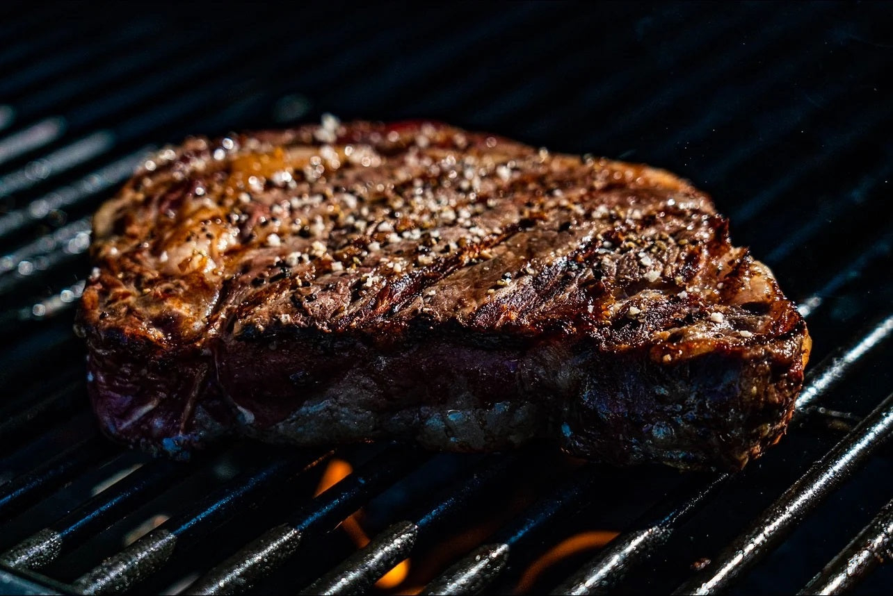

# Aberdeen Angus Steak with Whisky-Pepper Sauce

*Scotland's pride: a thick dry-aged Aberdeen Angus sirloin or ribeye seared hard in beef dripping till deeply crusted, plated with a whisky-and-cream pepper sauce.*

**Serves:** 2

**Prep Time:** 30 minutes (steak should come to room temp)

**Cook Time:** 15 minutes

## Overview
The Aberdeen Angus is Scotland's native beef breed, developed in the north-east during the 19th century and now recognised as one of the world's premier beef breeds. The dish is straightforward but reverent: a thick dry-aged sirloin or ribeye, 300 to 400 g per person, brought to room temperature, seasoned with sea salt and cracked pepper, seared hard in beef dripping till deeply crusted, then basted briefly with butter and rested before serving. The whisky-pepper cream sauce that goes with it builds in the same pan, with shallots sweated in the beef fat, a slosh of single-malt Scotch deglazed and reduced, heavy cream stirred in, cracked black peppercorns and a final knob of butter to finish. Plated with hand-cut chips, a generous handful of watercress and a wedge of grilled tomato.

## Ingredients

### Steaks
- 2 × 300-400 g Aberdeen Angus sirloin or ribeye steaks (3 cm thick; dry-aged 28+ days; brought to room temperature 30-60 minutes before cooking)
- 2 tablespoons beef dripping (or sunflower oil; not olive, it burns)
- 1 teaspoon flaked sea salt per steak (Maldon)
- ½ teaspoon coarsely cracked black pepper per steak
- 30 g butter (for the steak baste)
- 2 garlic cloves (smashed)
- A small thyme sprig

### Whisky-pepper sauce
- 1 shallot (finely diced)
- 30 ml single malt Scotch whisky (Highland or Speyside; not heavily peated for the sauce)
- 200 ml double cream
- 1 tablespoon green peppercorns in brine (drained; or 1 tablespoon coarsely cracked black peppercorns)
- 1 teaspoon Dijon mustard
- 15 g cold butter (for finish)
- Sea salt to taste

### To serve
- 500 g hand-cut chips (twice-fried; or roasted potatoes)
- A bunch of watercress
- 2 vine tomatoes (halved and grilled)
- A dram of the same single malt alongside (the traditional sipping companion)

## Method

### Stage 1 - Prep the steaks (30-60 minutes ahead)
1. Take the steaks out of the fridge.
2. Pat dry with kitchen paper (very important, wet steak doesn't crust).
3. Season generously on both sides with the flaked sea salt and cracked pepper.
4. Let sit at room temperature for 30-60 minutes (the seasoning draws moisture out, then back in with the salt; the steak comes to a temperature that sears properly).

### Stage 2 - Heat the pan
1. Place a heavy cast-iron or stainless-steel pan over high heat.
2. Heat for 3-4 minutes till smoking hot.
3. Add the beef dripping; it should shimmer and smoke slightly.

### Stage 3 - Sear the steaks
1. Place the steaks in the pan (don't overcrowd; cook one at a time if needed).
2. Sear 3 minutes on the first side without moving (a deep brown crust develops).
3. Flip; sear 3 minutes on the second side.
4. For thick steaks (3 cm), also sear the fat-side edge briefly (use tongs to hold the steak on its edge for 30 seconds).

### Stage 4 - Baste
1. In the last 60 seconds of cooking, add the butter, smashed garlic cloves, and thyme to the pan.
2. Tilt the pan so the butter pools; spoon the foaming butter over the steaks repeatedly.
3. The butter should be brown and nutty (beurre noisette), not burnt black.

### Stage 5 - Rest the steaks
1. Transfer the steaks to a warm plate.
2. Tent loosely with foil (don't seal, the crust softens if you do).
3. Rest for 5-8 minutes (essential, the juices redistribute and the steak becomes tender).
4. Pour any resting juices into the sauce later.

### Stage 6 - Make the sauce
1. Return the pan (with the rendered fat and garlic/thyme) to medium heat.
2. Add the diced shallot; sweat 2 minutes till translucent.
3. Carefully pour in the whisky (off the heat first; the alcohol can ignite). Return to the heat; let it bubble and reduce 30 seconds.
4. Add the cream; bring to a simmer.
5. Add the peppercorns and Dijon mustard.
6. Simmer 2-3 minutes till the sauce thickens to coat the back of a spoon.
7. Stir in the cold butter (off the heat) to finish; it gives the sauce a silky gloss.
8. Stir in any resting juices from the steaks.
9. Taste; adjust salt.

### Stage 7 - Plate
1. Place each rested steak on a warm plate (whole, or sliced thickly against the grain).
2. Spoon the whisky-pepper sauce generously over (or alongside).
3. Add hand-cut chips, a tangle of watercress, and a grilled tomato.
4. Serve a small dram of the same single malt alongside (the traditional pairing).

## Notes
- **Dry-aged 28+ days:** the flavour transformation is the entire point. Most supermarket steak is not aged. Buy from a proper butcher.
- **Pat dry, season generously, rest at room temp:** the holy trinity of steak cooking.
- **Beef dripping > oil:** the flavour difference is real. Save the dripping from your Sunday roast.
- **Don't move the steak in the pan:** the crust forms only if you leave it still.
- **Rest, rest, rest:** carving a steak straight out of the pan leaks the juices. Rest 5-8 minutes.
- **Sauce off the heat for the whisky:** alcohol can flambé up unexpectedly. Be ready.

## Variations
**Pepper-crust version:** press cracked black peppercorns onto the steak before cooking (steak au poivre style): more peppery.
**Béarnaise instead of whisky-pepper:** swap the sauce for a classic French béarnaise.
**Brandy-cream sauce:** swap the whisky for brandy or Armagnac, the French steakhouse version.
**Whisky-cream-mushroom sauce:** sauté 200 g sliced mushrooms in the pan after sweating the shallot; otherwise same.
**Aberdeen Angus filet mignon:** swap the sirloin/ribeye for a thick filet mignon, leaner, more tender.
**Surf and turf:** plate a langoustine or two alongside the steak, the Scottish coastal version.

## Serving
At a Scottish steakhouse (Champany Inn at Linlithgow; The Honours in Edinburgh; Hawksmoor Edinburgh) · at a Highland hotel restaurant during shooting season · at a Burns Night dinner if you're not doing haggis · at a Scottish wedding anniversary · at home for a special dinner-for-two with a bottle of claret · in any decent Aberdeenshire farm-house restaurant.

## Storage
- The cooked steak refrigerates 2 days; reheat briefly in the pan or eat cold sliced.
- The sauce refrigerates 2 days; reheat gently (don't boil; the cream splits).
- Leftover steak sliced thinly on rye with the cold sauce makes an excellent lunchtime sandwich.
- Don't freeze the cooked steak (texture suffers); freeze raw steak well-wrapped (up to 3 months).
