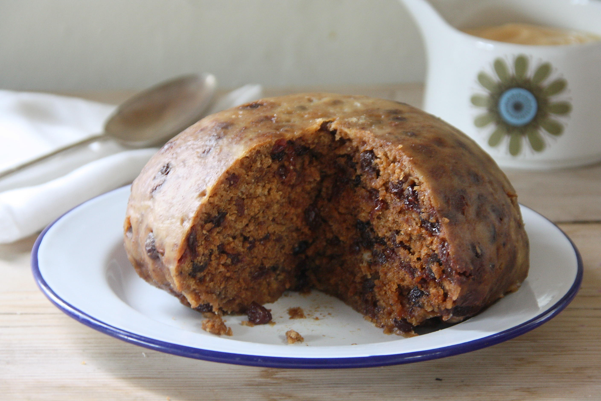

# Clootie Dumpling

*Scotland's ancient steamed pudding: a dense, dark fruit-and-spice pudding wrapped in a floured cloth ("cloot" in Scots) and simmered three hours. Often contains a sixpence for luck.*

**Serves:** 10-12

**Prep Time:** 30 minutes (plus overnight soaking of fruit)

**Cook Time:** 3 hours (steaming)

## Overview
Clootie dumpling is one of Scotland's most ancient and most distinctively Scottish puddings, named for the "cloot" (Scots for cloth) of finely-woven linen or muslin used to wrap the pudding before simmering. The base is rich and dense: flour, suet, oatmeal, brown sugar, dried mixed fruit, warm spices and just enough buttermilk to bring it to a stiff dough. Wrapped in the floured cloot, tied tightly with string and simmered in boiling water for three hours. The result emerges as a dark dumpling with a distinctive slightly chewy skin from the cloth pressing into the dough, and a soft fragrant centre. The traditional touch is a sixpence (or any small silver coin, wrapped in greaseproof paper) hidden in the dough; whoever finds it gets good fortune for the year. Eat warm with custard or cream, or sliced thick the next morning and fried in butter to a crisp golden caramel for breakfast.

## Ingredients

### Dumpling
- 250 g plain flour
- 200 g shredded suet (beef or vegetable; the traditional Scottish baking fat)
- 100 g pinhead or medium oatmeal
- 200 g soft dark brown sugar
- 1 teaspoon bicarbonate of soda
- 2 teaspoons ground cinnamon
- 1 teaspoon ground ginger
- 1 teaspoon mixed spice
- ½ teaspoon ground cloves
- 1 teaspoon fine sea salt
- 200 g raisins
- 200 g sultanas
- 100 g currants
- 60 g mixed candied peel (orange and lemon)
- 1 large carrot (grated; 100 g, the traditional moisture-and-sweetness addition)
- 1 large eating apple (grated; 100 g)
- 1 tablespoon black treacle
- 2 tablespoons golden syrup
- 1 large egg (beaten)
- 200-250 ml buttermilk (or whole milk soured with 1 tablespoon vinegar)

### For the cloot
- A 50 × 50 cm square of muslin or thin clean cotton (a clean cotton tea towel works)
- Plain flour for coating
- Butcher's string

### Optional (traditional)
- A polished sixpence (or other small silver coin) wrapped in a small piece of greaseproof paper, for the lucky finder

### To serve
- Hot homemade custard
- Pouring cream
- A scoop of vanilla ice cream
- For the next-day breakfast: butter for frying

## Method

### Stage 1 - Soak the fruit (overnight)
1. In a large bowl, combine the raisins, sultanas, currants, and candied peel.
2. Pour over 100 ml hot water OR 100 ml whisky (the boozy version).
3. Cover; soak overnight (12 hours).
4. Drain any unabsorbed liquid; reserve.

### Stage 2 - Prep the cloot
1. Soak the muslin square in boiling water for 5 minutes (sterilises and softens).
2. Wring out very thoroughly.
3. Lay flat on the counter.
4. Sprinkle a thick generous layer of plain flour over the centre of the cloth (creates the protective skin).
5. Have your string ready.

### Stage 3 - Make the dumpling
1. In the largest mixing bowl you have, combine flour, suet, oatmeal, brown sugar, bicarb, all spices, and salt.
2. Add the soaked fruit, candied peel, grated carrot, and grated apple.
3. Stir to combine.
4. In a small bowl, mix the black treacle, golden syrup, egg, and buttermilk.
5. Pour into the dry mix.
6. Stir thoroughly with a wooden spoon till you have a stiff dough.
7. If too dry, add more buttermilk a tablespoon at a time.
8. The dough should be moist but holding together (not crumbly, not wet).
9. Optional: tuck the wrapped sixpence into the dough.

### Stage 4 - Wrap in the cloot
1. Tip the dough into the centre of the floured cloth.
2. Gather the corners of the cloth above the dough.
3. Twist the gathered top several times to form a tight bundle.
4. Tie very tightly with string, leave a long enough piece to lift the dumpling.
5. The dumpling should be shaped roughly spherical, about 18 cm diameter.

### Stage 5 - Steam
1. Place an upturned plate or a wire rack in the bottom of a very large pot (the plate keeps the dumpling off the direct heat).
2. Sit the dumpling on the plate.
3. Pour boiling water around the dumpling, the water should come halfway up the sides of the dumpling (NOT cover the top).
4. Cover the pot with a tight lid.
5. Bring to a gentle simmer; reduce heat to the LOWEST possible.
6. Simmer 3 hours, topping up with boiling water as needed (never let it boil dry).

### Stage 6 - Test and remove
1. After 3 hours, lift the dumpling out by the string (use heavy oven gloves).
2. Drain over the pot for a few seconds.
3. Place on a heatproof plate.
4. Carefully untie the string and peel away the cloot, the dumpling should hold its shape.
5. Place the dumpling (without the cloot) on a clean plate and slip into a 180°C oven for 15-20 minutes to dry the skin and crisp the surface.

### Stage 7 - Serve
1. Slice thickly (1.5-2 cm slices).
2. Place on warm plates.
3. Pour hot homemade custard generously over.
4. Or serve with pouring cream and/or vanilla ice cream.
5. A small dram of whisky alongside is traditional.

### Stage 8 - Breakfast the next morning (the traditional leftover use)
1. Slice the cold dumpling into 2 cm slices.
2. Heat a generous knob of butter in a frying pan.
3. Fry the slices till crisp and golden on both sides (about 2 minutes per side).
4. Serve with a fried egg and a strong cup of tea. The Scottish breakfast of champions.

## Notes
- **The cloot must be floured generously:** the floured cloth creates the traditional Scottish dumpling skin. Don't skip.
- **Tie tightly:** a loose tie lets water in and turns the dumpling soggy.
- **Plate or rack at the bottom of the pot:** keeps the dumpling off direct heat (which would cook the bottom to a hard skin).
- **3 hours minimum:** undercooked dumpling is dense and gummy. Long slow steam is the answer.
- **The sixpence is traditional:** wrap it in greaseproof paper (so it doesn't taste of metal); warn your guests so they don't crack a tooth.

## Variations
**Whisky clootie:** soak the fruit in 100 ml single-malt Scotch overnight (the boozy version).
**Lighter clootie:** swap half the suet for grated butter, slightly lighter but less traditional.
**Vegetarian clootie:** use vegetable suet (widely available): identical result.
**With grated chocolate:** stir 50 g grated dark chocolate into the dough, modern variant.
**Pressure-cooker version:** steam in a pressure cooker for 1.5 hours instead of 3, saves time but loses the classic skin.
**Mini clooties:** make 8-10 small dumplings in individual cloths, bake-sale-friendly portions.
**Christmas pudding clootie:** add 100 g chopped glacé cherries and an extra tablespoon of mixed spice, Christmas variant.

## Serving
At Christmas Day dinner (in many Scottish homes, instead of plum pudding) · at Hogmanay supper · at Burns Night for those who want a heavier dessert than cranachan · at any Scottish birthday tea · at a Scottish christening or wedding reception · at home on a Sunday in winter with custard and a dram.

## Storage
- Refrigerates 1 week (well-wrapped).
- Freezes 3 months; defrost overnight and reheat by steaming 20 minutes.
- The "fried in butter the next morning" use is the traditional leftover treatment, slice thick, fry golden, serve with eggs.
- Cold dumpling sliced thin keeps in a sealed tin 5 days as a tea-time treat with butter.
- Slightly stale clootie dumpling is the best version for frying, drier, crisps better.
