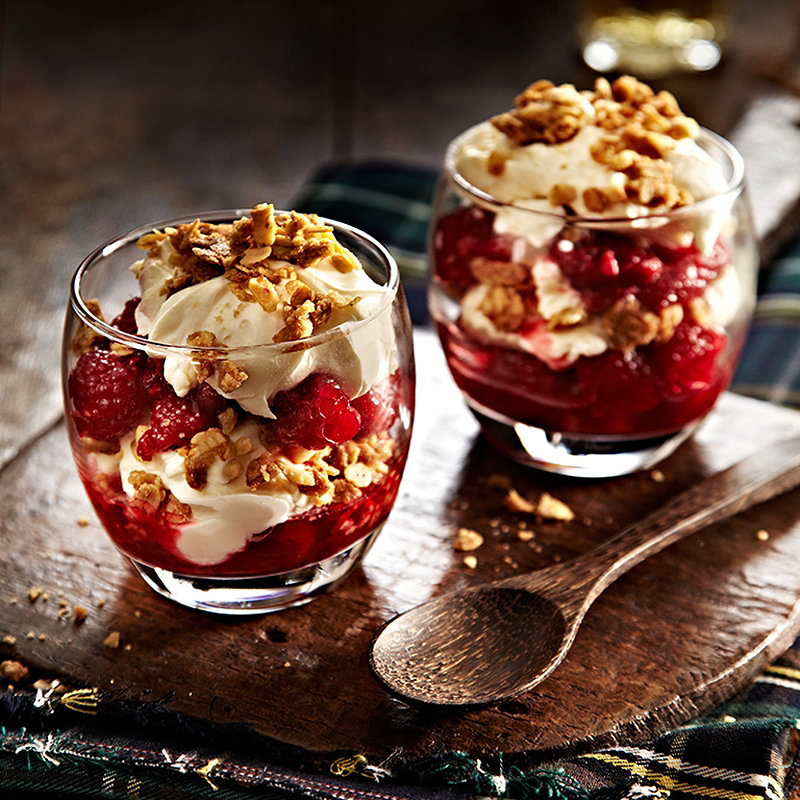

# Cranachan

*Scotland's greatest dessert: toasted pinhead oatmeal layered in a glass with whipped cream, fresh raspberries, heather honey and a slug of single-malt Scotch whisky.*

**Serves:** 6

**Prep Time:** 25 minutes (plus 1 hour optional chilling)

**Cook Time:** 5 minutes (oat toasting)

## Overview
Cranachan (from the Scottish Gaelic crannachan, related to "churn") is Scotland's most distinctive and most universally loved dessert. The roots are agricultural: a harvest-celebration dish made when the raspberries ripened in late summer and crofters had fresh cream from their cows, oatmeal from the threshing and honey from the heather. The construction is five clean layers in a tall glass: toasted pinhead oatmeal (not rolled oats, and pan-toasted till golden and nutty), lightly sweetened whipped cream, fresh raspberries, heather honey and a generous slug of single-malt Scotch. Highland or Speyside whisky works best; heavily peated Islays will dominate everything else if you let them. Assemble just before serving so the oatmeal stays crisp against the cream. The canonical Burns Night dessert finale, and a beautiful thing to set in front of guests at the end of any good meal.

## Ingredients

### For 6 generous glasses
- 60 g pinhead oatmeal (steel-cut oats; the canonical Scottish cut)
- 400 ml double cream (very cold)
- 60 g icing sugar (sifted)
- 4 tablespoons heather honey (or other good runny honey)
- 4 tablespoons single-malt Scotch whisky (Highland: Glenmorangie, Dalmore; or Speyside: Glenlivet, Macallan - not heavily peated)
- 500 g fresh raspberries (Scottish if you can get them; frozen-and-thawed in winter)
- A few extra raspberries and toasted oats for garnish
- 1 teaspoon vanilla extract (optional)
- A pinch of fine sea salt

### Optional crowdie-cream variant
- 100 g crowdie (Scottish fresh cheese; see [crowdie recipe](../side-dishes/crowdie.md)) folded into the cream

### To serve
- Tall glasses or trifle dishes (about 200 ml each)
- A small jug of extra whisky on the side (for those who want more)
- A small bowl of toasted oats and raspberries (for garnish)

## Method

### Stage 1 - Toast the oatmeal
1. Heat a dry heavy-bottomed pan over medium heat.
2. Add the pinhead oatmeal.
3. Toast, stirring constantly, for 4-5 minutes till golden-brown and intensely fragrant (smells of toasted oats and slight caramel).
4. Don't let them burn - keep moving.
5. Tip onto a cold plate to stop the cooking; cool completely.

### Stage 2 - Crush the raspberries (slightly)
1. Place 400 g of the raspberries in a bowl.
2. Crush gently with a fork - you want about half-crushed, half-whole.
3. Drizzle with 2 tablespoons of the honey.
4. Let sit 10 minutes to draw out the juice (gives a beautiful syrup).

### Stage 3 - Make the whisky-cream
1. In a clean bowl, pour the cold double cream.
2. Add the icing sugar, vanilla (if using), salt, and the remaining 2 tablespoons honey.
3. Whisk on medium speed till soft peaks form (not stiff; you want pourable).
4. Drizzle in the whisky, whisking gently to combine.
5. The cream should be thick enough to dollop but still flow softly.
6. Optional: fold in 100 g of crumbled crowdie cheese for the tangy variant.

### Stage 4 - Assemble (just before serving)
1. Have your 6 glasses ready, lined up.
2. In each glass, layer:
   - A spoonful of toasted oats at the bottom
   - A spoonful of crushed raspberries with their juice
   - A spoonful of whisky-cream
   - Another spoonful of toasted oats
   - More raspberries
   - A final big dollop of whisky-cream on top
3. Don't over-fuss; the layers should be loose and a bit messy.
4. The top layer of cream is the biggest.

### Stage 5 - Garnish
1. Top each glass with 2-3 whole fresh raspberries.
2. Sprinkle a teaspoon of toasted oats over.
3. Drizzle a tiny extra thread of honey over.
4. Optional: a delicate sprig of mint.

### Stage 6 - Serve
1. Serve immediately (the oats are crisp; they go soft within 20 minutes of assembly).
2. Provide a long spoon for digging through the layers.
3. Optional: a small jug of extra whisky for those who want to lift the cream further.
4. Pair with a small dram of the same whisky alongside.

## Notes
- **Pinhead oatmeal toasted DRY:** the canonical Scottish cut. Rolled oats won't have the same crunch. Don't toast in butter - dry pan only.
- **Fresh raspberries are essential:** the slight tartness balances the cream and honey. Frozen is acceptable in winter but Scottish-grown Tayside raspberries are the ideal.
- **Heather honey is canonical:** any runny honey works, but heather honey has the floral edge that distinguishes Scottish cranachan from generic versions.
- **Don't whip the cream stiff:** soft peaks. The cream should flow softly over the oats, not sit on top in stiff blobs.
- **Assemble JUST before serving:** the toasted oats go soft within 20-30 minutes. Don't make this 2 hours ahead.

## Variations
**Cream-crowdie variant:** fold 100 g crowdie cheese into the whipped cream - adds a tangy edge.
**Brambleberry cranachan (autumn):** swap raspberries for fresh brambles (blackberries) - the autumn variant when raspberry season ends.
**Strawberry cranachan (summer):** swap raspberries for halved strawberries - softer, sweeter; less canonical.
**Drambuie cranachan:** swap the Scotch for Drambuie (Scotch + honey + herbs liqueur) - sweeter, more aromatic.
**Atholl Brose cranachan:** add a tablespoon of Atholl Brose (oat-infused whisky-honey) to the cream - adds depth.
**Layered as a trifle:** make in a large trifle dish for the centrepiece version (assemble just before serving still).
**Mini cranachans in shot glasses:** for a canapé-style party; same ingredients, tiny portions.

## Serving
At Burns Night as the dessert finale (the canonical setting) · at Saint Andrew's Day (30 November) supper · at a Highland wedding dessert table · at a Scottish summer garden party in raspberry season (July-August) · at a Hogmanay buffet · at home as a Saturday-evening dinner-party dessert · alongside coffee and a dram after a Sunday roast.

## Storage
- Best eaten immediately after assembly (the toasted oats lose crisp within 20-30 minutes).
- The individual components can be prepared ahead:
  - Toasted oats: store in a sealed jar 1 week
  - Whisky-cream: refrigerate 1 day (it'll need a quick re-whisk before assembly)
  - Crushed raspberries with honey: refrigerate 1 day
- Once assembled, eat within 30 minutes.
- Don't freeze any component (texture suffers across the board).
