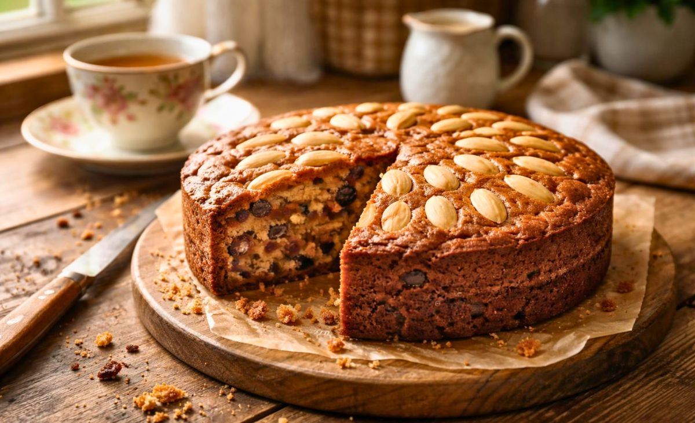

# Dundee Cake

*Scotland's famous fruit cake from the city of Dundee: a rich, light-textured cake of sultanas, currants, mixed peel and ground almonds, topped with the iconic concentric ring of whole blanched almonds.*

**Serves:** 10-12

**Prep Time:** 25 minutes (plus optional fruit soak)

**Cook Time:** 2-2.5 hours

## Overview
Dundee cake came out of the Scottish city of Dundee in the early 19th century, when the Keiller family (who invented Dundee marmalade in the 1790s and also baked commercially) started making fruit cake from the dried fruit, candied peel and oranges they traded in. The concentric ring of whole blanched almonds on top was a Keiller signature that became the cake's defining feature, copied by bakers throughout the British Isles. Lighter than English Christmas cake in three ways: a self-raising flour crumb rather than the dense plain-plus-baking-powder kind, ground almonds in the batter for richness and slight nuttiness, and the iconic almond ring on top that's so traditional bakeries can technically face legal trouble for calling a cake "Dundee" without it. A fruit cake you can happily eat outside December, with cups of tea, alongside cheese, or on a Scottish breakfast tray.

## Ingredients

### Cake
- 200 g unsalted butter (soft, room temperature)
- 200 g soft light brown sugar
- 4 large eggs (room temperature)
- 250 g self-raising flour (sifted)
- ½ teaspoon fine sea salt
- 100 g ground almonds
- 150 g sultanas
- 150 g currants
- 100 g mixed candied peel (orange and lemon)
- 60 g glacé cherries (rinsed of syrup, chopped roughly)
- Zest of 1 orange
- Zest of 1 lemon
- 2 tablespoons whisky (single malt, optional but traditional)
- 1 tablespoon orange marmalade (Dundee marmalade if you can get it; the Keiller connection)

### For the top
- 100 g whole blanched almonds (skinned; long oval shape)
- 1 tablespoon milk or beaten egg white (for sticking)

### To finish (optional)
- 2 tablespoons warmed apricot jam (for a glossy finish)
- A dust of icing sugar

## Method

### Stage 1 - Optional fruit soak (overnight)
1. Mix the sultanas, currants, candied peel, glacé cherries, orange zest, lemon zest, marmalade, and whisky in a bowl.
2. Cover; leave overnight at room temperature.
3. This step is optional but recommended, the fruit plumps and absorbs the whisky.

### Stage 2 - Prep the tin
1. Line a deep 20 cm round cake tin with two layers of parchment (bottom and sides; the sides should come 5 cm above the rim).
2. Wrap the outside of the tin with a folded layer of brown paper or newspaper tied with string (protects the cake from over-browning during the long bake).
3. Preheat oven to 160°C / 140°C fan / 325°F.

### Stage 3 - Cream the butter and sugar
1. In a large bowl, beat the butter and brown sugar with an electric mixer for 5 minutes till pale, light, and fluffy.

### Stage 4 - Add the eggs
1. Add the eggs one at a time, beating well after each addition.
2. If the mixture starts to curdle, add a tablespoon of the flour.

### Stage 5 - Fold in the dry
1. Sift the self-raising flour and salt over the batter.
2. Add the ground almonds.
3. Fold in gently with a large spoon or spatula.

### Stage 6 - Fold in the fruit
1. Add the soaked fruit mixture (with all its juice).
2. Fold in gently till evenly distributed.

### Stage 7 - Transfer to tin
1. Spoon the batter into the prepared tin.
2. Smooth the top with the back of a spoon, leaving a slight dip in the centre (the cake rises in the middle as it bakes).

### Stage 8 - The almond ring (traditional Dundee step)
1. Brush the top very lightly with the milk or egg white.
2. Place the whole blanched almonds in concentric rings, pointed-side-out, covering the entire top.
3. The traditional Dundee pattern: a centre circle of almonds, then a second ring around it, then a third ring at the edge.
4. Press each almond very lightly into the batter so they don't fall off during baking.

### Stage 9 - Bake
1. Bake at 160°C for 2 hours.
2. Check after 1 hour 45 minutes, if the top is browning too quickly, cover loosely with parchment.
3. The cake is done when a skewer inserted into the centre comes out clean (or with a few moist crumbs but no wet batter).
4. Total bake time is typically 2 hours to 2 hours 30 minutes depending on the oven.

### Stage 10 - Cool
1. Cool in the tin for 30 minutes.
2. Carefully turn out (don't disturb the almond top); peel away the parchment.
3. Cool completely on a wire rack (3-4 hours).

### Stage 11 - Optional gloss finish
1. Warm 2 tablespoons of apricot jam with 1 tablespoon water; brush the warm glaze gently over the almonds, gives a beautiful golden gloss.
2. Optional: a very light dusting of icing sugar.

### Stage 12 - Serve
1. Slice into thick wedges with a serrated knife.
2. Serve with a cup of strong Scottish breakfast tea.
3. Optional: a wedge of mature Scottish Cheddar on the side (the Scottish "cake with cheese" tradition).
4. Or with a small glass of single-malt Scotch (the deeper Scottish pairing).

## Notes
- **The almond ring is non-negotiable:** a Dundee cake without the concentric almond ring is just a fruit cake. The pattern is the visual signature.
- **Self-raising flour:** plain flour + baking powder gives the wrong texture. Self-raising is traditional.
- **Long slow bake:** 2 hours minimum at 160°C. Don't rush.
- **Protect with brown paper:** the long bake will brown the sides; the brown paper layer keeps it from over-browning.
- **Soak the fruit (if you have time):** the whisky soak transforms the cake. If you skip, just stir whisky into the dry fruit and proceed.

## Variations
**Christmas-Dundee hybrid:** add 100 g mixed spice + 100 g chopped dates to the fruit; ice the top with marzipan and white royal icing for a Christmas version (loses the almond-ring signature but gains Christmas-cake character).
**Marmalade-loaded Dundee:** add 4 extra tablespoons of Dundee marmalade to the batter, extra orange-bitter depth.
**Whisky-loaded Dundee:** double the whisky in the soak and add another tablespoon to the batter, boozier.
**Smaller Dundee cake:** make in a 15 cm tin (halve all quantities); for a smaller household.
**Dundee tea bread (loaf version):** bake in a loaf tin for 90 minutes instead, easier to slice for tea-time sandwiches.
**Gluten-free Dundee:** use gluten-free self-raising flour + add ½ teaspoon xanthan gum; otherwise identical.

## Serving
At a Scottish high tea with strong tea and butter (the traditional setting) · at a Scottish wedding cake table · at Christmas as the lighter alternative to traditional Christmas cake · at a Scottish family birthday tea · at a Highland golf clubhouse for the 19th-hole · at home with a slice and a small dram on a Sunday afternoon · on a Scottish bed-and-breakfast trolley with the morning newspaper.

## Storage
- Keeps wrapped in foil in a sealed tin for 3 weeks (matures beautifully in the first week).
- "Feeding", every 2-3 days, prick the top with a skewer and drizzle 1 teaspoon of whisky over; keeps the cake moist and intensifies the flavour.
- Freezes 6 months wrapped well; defrost overnight in the fridge.
- Best eaten 3-7 days after baking when the flavours have matured.
- Stale Dundee cake makes excellent trifle base (cube and use in place of sponge in tipsy laird).
