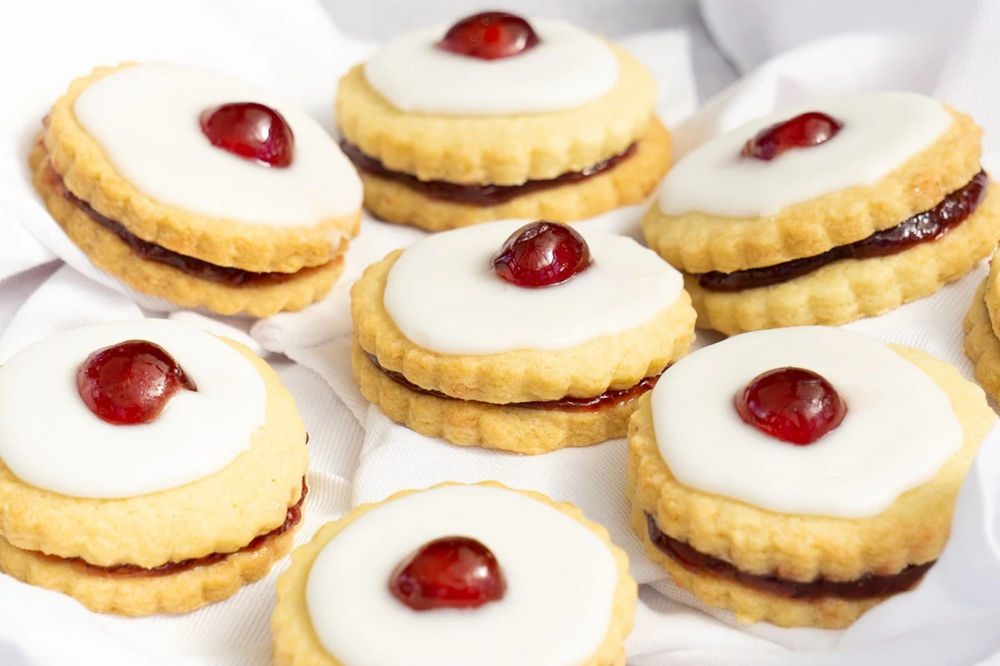

# Empire Biscuits

*Scotland's bakery-counter tea-time biscuit: two shortbread rounds sandwiched with raspberry jam, topped with white royal icing and a glacé cherry plonked in the middle.*

**Serves:** Makes 12

**Prep Time:** 30 minutes (plus 30 minutes dough chill)

**Cook Time:** 15 minutes

## Overview
Empire biscuits (originally called "Linzer biscuits" or "Belgian biscuits" until being renamed for patriotic reasons during the Great War) are one of the most distinctively Scottish bakery items in the canon. Walk into any Scottish bakery from Lerwick to Dumfries and you'll see a row of them in the front cabinet alongside Eccles cakes, fly cemeteries and butteries. The construction is simple: pale-golden shortbread rounds sandwiched with raspberry jam, topped with white royal icing while the icing is still wet, and finished with a single glacé cherry pressed into the centre. The icing sets to a hard sweet crust, the jam stays soft and red inside, the biscuit is short and buttery, the cherry sugary-bright. Sweet, soft, buttery, jammy and crunchy in every bite. The traditional Scottish primary-school treat and the one every Scottish child remembers from break-time.

## Ingredients

### Shortbread dough
- 250 g plain flour
- 75 g caster sugar
- 200 g cold butter (cubed)
- ½ teaspoon fine sea salt
- 1 teaspoon vanilla extract
- 1 large egg yolk (for binding)

### Filling
- 6-8 tablespoons good-quality seedless raspberry jam

### Royal icing
- 1 large egg white
- 300 g icing sugar (sifted)
- 1 teaspoon lemon juice (helps the icing set crisply)

### To finish
- 12 glacé cherries (red; halved if you want a more delicate look, whole for the traditional Scottish version)

## Method

### Stage 1 - Make the shortbread dough
1. In a large bowl, sift the flour and salt.
2. Add the caster sugar; stir.
3. Add the cold cubed butter; rub in with your fingertips till the mixture looks like fine breadcrumbs.
4. Add the vanilla and egg yolk; mix with a knife (then your hands briefly) till the dough just comes together.
5. Don't overwork; gentle handling keeps it short.
6. Form into a flat disc; wrap in cling film; refrigerate 30 minutes.

### Stage 2 - Roll and cut
1. Preheat oven to 170°C / 150°C fan / 325°F.
2. Line two baking trays with parchment.
3. On a lightly floured surface, roll the dough to 4 mm thick.
4. Cut out 24 rounds with a 6 cm cutter.
5. Re-roll the offcuts (lightly) and cut more rounds; aim for 24 total.
6. Place on the trays, leaving 2 cm between each.

### Stage 3 - Bake
1. Bake at 170°C for 12-15 minutes till pale-golden at the edges but still pale on top.
2. Don't overbake; you want pale, not browned.
3. Transfer to a wire rack to cool completely (about 20 minutes).

### Stage 4 - Assemble the sandwiches
1. Once fully cool, pair the rounds (24 rounds = 12 sandwiches).
2. Spread the underside of one round with about 1 teaspoon of raspberry jam.
3. Sandwich with a second round (jam side touching).
4. Press very gently to seal.
5. Set on a clean wire rack with parchment underneath (catches icing drips).

### Stage 5 - Make the royal icing
1. In a clean bowl, whisk the egg white till just frothy (about 30 seconds; not stiff).
2. Add the sifted icing sugar a third at a time, beating with each addition.
3. Add the lemon juice.
4. Beat 2 minutes till the icing is smooth, glossy, and thick enough to coat a spoon but still spreadable.
5. If too thick, add a few drops of water; if too thin, add more icing sugar.

### Stage 6 - Ice the biscuits
1. With a small palette knife or the back of a teaspoon, spread a generous teaspoon of icing on top of each sandwich.
2. The icing should cover the top completely, just dripping slightly over the edges (not running off in big puddles).
3. Work quickly, the icing sets within 10 minutes.

### Stage 7 - Add the cherry
1. While the icing is still wet, press a glacé cherry into the centre of each biscuit.
2. The cherry should sink slightly into the icing; the icing forms a small ring around it as it sets.

### Stage 8 - Set
1. Leave at room temperature for 1-2 hours for the icing to set hard.
2. The finished biscuit has a hard white icing top with a glossy cherry centre.

### Stage 9 - Serve
1. Serve with a cup of strong tea (the traditional pairing).
2. Or with a milky coffee at a Scottish bakery counter.

## Notes
- **Don't overbake the shortbread:** pale-golden, not browned. Browned shortbread is too crisp; you want melt-in-the-mouth.
- **Cool the biscuits completely before assembling:** warm biscuits will soften the icing and the jam will run.
- **Royal icing must be thick enough to set:** if too thin, it'll run off the biscuit. If too thick, it'll be lumpy. Aim for thick custard consistency.
- **Pressing the cherry while icing is wet:** if you wait, the icing sets and the cherry won't stick.
- **Use seedless raspberry jam:** seeds in your teeth aren't ideal for a delicate biscuit.

## Variations
**Belgian biscuits (the original name):** identical recipe, just called by the pre-war name. Some Scottish bakeries still use this name.
**With apricot jam:** swap raspberry for apricot, less traditional but very nice.
**With strawberry jam:** swap raspberry for strawberry, less traditional; older Scottish recipes specifically called for raspberry.
**With chocolate icing:** swap white royal icing for chocolate glaze, modern variant.
**Vegan version:** use vegan butter in the shortbread; use aquafaba (chickpea liquid) instead of egg white in the icing.
**Mini versions:** use a 3 cm cutter; makes 24 small biscuits for canapé or kids-party portions.
**Lemon-iced version:** add 1 teaspoon lemon juice + ½ teaspoon zest to the icing, lifts the sweetness.

## Serving
At a Scottish bakery counter (Greggs in Scotland; any local independent baker; Stuart's of Buckhaven) as the traditional tea-time biscuit · at a Scottish primary-school break-time · at a Scottish granny's tea trolley · at a Scottish wedding tea-bar · alongside a cup of strong Scottish breakfast tea · at home as a Saturday afternoon treat.

## Storage
- Once iced and set, keeps in a sealed tin for 1 week (the icing keeps everything fresh).
- The shortbread component (unfilled, unsanded) keeps in a tin 2 weeks.
- Don't freeze (the icing texture goes wrong on defrosting).
- The jam may make the biscuit slightly soft after 4-5 days; eat fresh for best texture.
- A made-the-day-before empire biscuit is perfect; the icing is fully set, the jam has slightly soaked into the biscuit, and the flavour is at its peak.
