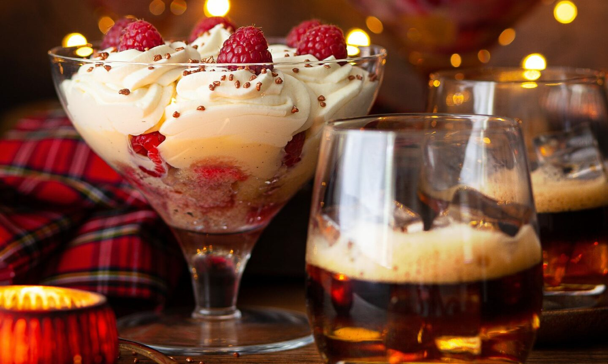

# Tipsy Laird

*Scotland's whisky trifle: sponge cake soaked in Drambuie and raspberry jam, layered with raspberries, custard and whipped cream, topped with toasted flaked almonds.*

**Serves:** 8

**Prep Time:** 30 minutes (plus 4 hours chilling)

**Cook Time:** 20 minutes (custard)

## Overview
Tipsy laird ("laird" is the Scots word for a landowner; the name implies the lord of the manor enjoying a tipsy dessert after dinner) is Scotland's national trifle and the traditional alternative to cranachan at Burns Night and Hogmanay. The construction is essentially an English sherry trifle with one critical Scottish substitution: Drambuie, the whisky-and-honey liqueur invented on the Isle of Skye in 1745, replaces the sherry, giving the dessert a distinctly Scottish character with notes of honey, herbs and single-malt depth. Built in a large glass trifle bowl in five layers: sponge cake cubed and soaked with Drambuie and raspberry jam, then raspberries, then thick homemade custard poured over and left to set, then softly whipped double cream, then a generous shower of toasted flaked almonds with a few whole raspberries on top. Built four to six hours ahead so the sponge drinks up all the Drambuie and the layers settle properly.

## Ingredients

### Sponge layer
- 250 g Madeira cake or sponge cake (homemade or bought; cut into 3 cm cubes)
- 4 tablespoons Drambuie (Scottish whisky-honey liqueur)
- 4 tablespoons single-malt Scotch (Highland or Speyside)
- 6 tablespoons raspberry jam (good-quality; thinned with 2 tablespoons hot water)

### Raspberries
- 400 g fresh raspberries (or frozen-and-thawed)
- 2 tablespoons caster sugar (if the raspberries are tart)

### Custard
- 600 ml whole milk
- 1 vanilla pod (split lengthways and seeds scraped; or 1 teaspoon vanilla extract)
- 6 large egg yolks
- 100 g caster sugar
- 30 g cornflour
- A pinch of fine sea salt

### Cream layer
- 500 ml double cream (cold)
- 30 g icing sugar
- 1 teaspoon vanilla extract
- 2 tablespoons Drambuie (optional; for an extra-tipsy cream)

### To finish
- 80 g flaked almonds (toasted in a dry pan till golden)
- A handful of extra whole raspberries
- A few crystallised mint leaves or small sprigs of fresh mint (optional)
- A dusting of icing sugar (optional)

## Method

### Stage 1 - Make the custard (do first; needs to cool)
1. In a heavy-bottomed pan, combine the milk, vanilla pod and seeds, and salt.
2. Heat gently till steaming (don't boil).
3. In a bowl, whisk the egg yolks, sugar, and cornflour together till pale and thick.
4. Slowly pour the warm milk into the yolks, whisking constantly (tempers the eggs without scrambling).
5. Return to the pan; cook over medium-low heat, stirring constantly, for 5-8 minutes till thick enough to coat the back of a spoon.
6. Strain through a fine sieve into a clean bowl (catches any lumps and the vanilla pod).
7. Cover with cling film pressed onto the surface (prevents skin).
8. Cool completely (chill in the fridge 1-2 hours till cold).

### Stage 2 - Soak the sponge
1. Place the sponge cake cubes in the bottom of a large glass trifle bowl (about 2.5 litre capacity).
2. Mix the Drambuie, single-malt Scotch, and the thinned raspberry jam in a small jug.
3. Pour the whole mixture evenly over the sponge.
4. Press gently with a spoon so the sponge absorbs the liquid.
5. Let sit 15 minutes.

### Stage 3 - Add the raspberries
1. Toss the raspberries with the caster sugar (if using).
2. Scatter evenly over the soaked sponge.
3. Press lightly so the raspberries sit among the sponge cubes.

### Stage 4 - Add the custard
1. Pour the cold custard over the raspberries and sponge.
2. Spread evenly with a spatula.
3. Refrigerate at least 4 hours (overnight is better) so the layers set.

### Stage 5 - Whip the cream and assemble the top (just before serving)
1. Whip the cold cream with icing sugar, vanilla, and Drambuie (if using) to soft peaks.
2. Pile the cream over the set custard.
3. Spread gently in a soft swirl.

### Stage 6 - Garnish
1. Scatter the toasted flaked almonds generously over the top.
2. Place a few whole raspberries decoratively over.
3. Add a few crystallised mint leaves or a small sprig of fresh mint.
4. Dust very lightly with icing sugar (optional).

### Stage 7 - Serve
1. Serve at the table; let guests see the layers through the glass bowl.
2. Use a large spoon; scoop down through all the layers.
3. Each spoonful should have sponge, raspberries, custard, and cream.
4. Pair with a small dram of Drambuie or a coffee alongside.

## Notes
- **Homemade custard is the Scottish standard:** packet custard is too thin and tastes wrong. Make it from egg yolks; it sets to a proper thick custard.
- **Generous Drambuie:** the sponge must be properly tipsy. Don't skimp - 4 tablespoons of Drambuie and 4 of Scotch is the minimum.
- **Toasted flaked almonds:** toast in a dry pan or under the grill. Untoasted almonds are bland and pale; toasted are essential.
- **Build the day before:** 4-6 hours minimum chilling. Overnight is better, the layers set and the flavours marry.
- **Glass bowl matters:** the layers are visible; the visual is part of the dish.

## Variations
- **Marsala-and-Madeira variant:** swap the Drambuie for Marsala or Madeira, closer to an English trifle but still tipsy.
- **Cranachan-tipsy laird hybrid:** stir 60 g toasted pinhead oatmeal into the cream layer, combines the country's two iconic desserts.
- **Atholl-Brose tipsy laird:** swap the Drambuie for Atholl Brose (whisky-oat-honey infusion): even more deeply Scottish.
- **Mixed-berry version:** use a mix of raspberries, blackberries, redcurrants instead of all raspberries.
- **Whisky-coffee variant:** add 2 tablespoons strong espresso to the sponge soak, gives a tiramisu edge.
- **Mini tipsy lairds (individual glasses):** assemble in 8 small individual glasses for a dinner-party presentation, same recipe, smaller portions.

## Serving
- At Burns Night supper as the dessert (the traditional setting alongside or instead of cranachan) · at Hogmanay buffet as the centrepiece · at a Highland Christmas Day pudding alternative · at a Saint Andrew's Day supper · at a Scottish family Sunday lunch for special occasions · at a Scottish wedding reception dessert table.

## Storage
- Refrigerates 2 days; the sponge becomes increasingly tipsy and softer over time.
- Don't add the cream and almonds till just before serving (the cream weeps; the almonds soften).
- The custard alone refrigerates 3 days.
- Don't freeze (the cream texture suffers; the sponge gets dense).
- A made-the-day-before tipsy laird (sponge + raspberries + custard) is perfect for serving the next day with fresh cream and almonds added before serving.
