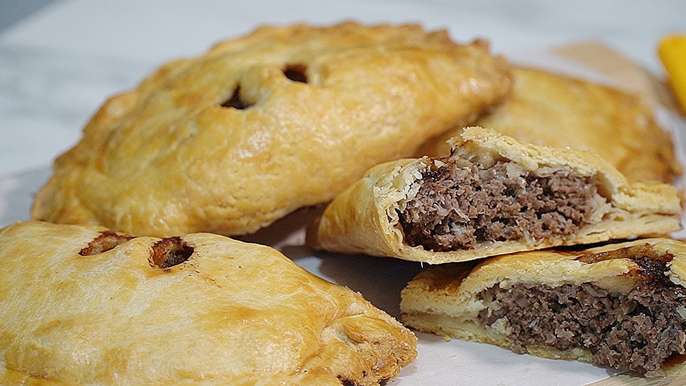

# Forfar Bridie

*Scotland's handheld meat pie from the town of Forfar in Angus: a half-moon of crisp shortcrust filled with minced beef and onion, with two small steam holes punched through the top.*

**Serves:** 6 (one bridie each)

**Prep Time:** 30 minutes (plus 30 minutes pastry rest)

**Cook Time:** 35-40 minutes

## Overview
The Forfar bridie is east-central Scotland's answer to the Cornish pasty, the lunchtime handheld of Angus, Fife and Dundee. It's distinguished from its Cornish cousin by the half-moon (not D-shape) crimp, the smaller size, the absence of potato and turnip (a Forfar bridie is meat and onion only) and the two characteristic steam holes punched through the top. The original was created by Maggie Bridie of Forfar in the 1850s, sold to farmworkers at the local cattle markets, and the recipe has been protected as a Forfar tradition ever since. A sturdy beef-suet or lard shortcrust (not butter; the bridie needs structure) wraps finely minced beef, diced onion and a generous shake of beef gravy salt or a teaspoon of Bovril, sometimes loosened with a splash of beef stock. Crimped, slashed, egg-washed and baked till deeply golden.

## Ingredients

### Beef-suet pastry
- 450 g plain flour
- 1 teaspoon fine sea salt
- 100 g beef suet (or lard, finely grated)
- 100 g cold butter (cubed)
- 1 large egg (beaten)
- 100 ml ice-cold water (approx)

### Filling
- 500 g minced beef (15-20% fat; from the shoulder/chuck, not lean)
- 1 large onion (very finely diced)
- 1 teaspoon Bovril (or 1 teaspoon beef-gravy salt)
- 1 teaspoon Worcestershire sauce
- ½ teaspoon fine sea salt
- 1 teaspoon freshly ground black pepper
- ½ teaspoon mustard powder
- 50 ml cold beef stock (or water)

### To finish
- 1 egg yolk (beaten with 1 teaspoon milk; for glaze)
- A pinch of flaked sea salt

## Method

### Stage 1 - Make the pastry
1. Sift the flour and salt into a large bowl.
2. Rub in the beef suet and cold butter with your fingertips till the mixture looks like coarse breadcrumbs.
3. Stir in the beaten egg.
4. Add ice-cold water a tablespoon at a time, mixing with a knife, till the dough JUST comes together (you may need 80-100 ml).
5. Tip onto a lightly floured surface; bring together gently into a flat disc.
6. Wrap in cling film; refrigerate 30 minutes.

### Stage 2 - Make the filling
1. In a bowl, combine the minced beef, finely diced onion, Bovril, Worcestershire sauce, salt, pepper, and mustard powder.
2. Add the cold beef stock; mix gently with a fork (don't compress; you want the filling to stay loose).
3. Divide into 6 equal portions.

### Stage 3 - Roll the pastry
1. Preheat oven to 200°C / 180°C fan / 400°F.
2. Line a baking tray with parchment.
3. Divide the pastry into 6 equal pieces.
4. On a floured surface, roll each piece into a circle about 16-18 cm diameter, 3-4 mm thick.

### Stage 4 - Fill and shape
1. Place a portion of filling on one half of each pastry circle, leaving a 2 cm border.
2. Brush the border with cold water.
3. Fold the empty half over the filling to form a half-moon.
4. Press the edges firmly together to seal.
5. Crimp the curved edge, Forfar style is a folded-over rope crimp, but a simple fork-pressed edge also works.

### Stage 5 - Steam holes and glaze
1. With a sharp knife, punch two small steam holes through the top of each bridie (the traditional Forfar mark).
2. Brush the tops generously with the egg-yolk glaze.
3. Sprinkle a tiny pinch of flaked sea salt on each.

### Stage 6 - Bake
1. Place the bridies on the lined tray, spaced apart.
2. Bake at 200°C for 15 minutes.
3. Reduce to 180°C; bake another 20-25 minutes till deeply golden and the pastry is fully crisp.
4. The internal temperature of the filling should reach 75°C (test with a probe through one of the steam holes).

### Stage 7 - Cool slightly and serve
1. Transfer to a wire rack.
2. Rest for 5 minutes (the filling is volcanic hot; this allows the juices to settle).
3. Serve warm, eaten with the hands like a pasty.
4. Accompany with HP Brown Sauce, a pint of heavy ale or a cup of strong tea.

## Notes
- **Minced beef and onion ONLY:** the Forfar bridie has no potato, no turnip, no carrot. That's a Cornish pasty, a different dish entirely. Don't be tempted.
- **Beef-suet pastry, not butter shortcrust:** the bridie needs structural integrity to be handheld. Suet pastry holds shape better.
- **Half-moon, not D-shape:** the Forfar bridie is a half-moon (curved edge to flat edge); the Cornish pasty is a D (flat top to curved bottom). Different region, different shape.
- **Two steam holes:** the traditional Forfar mark. Without them, you have a meat pie, not a bridie.
- **Eat warm, not piping hot:** the filling is very hot just out of the oven; rest 5 minutes.

## Variations
- **Mince-and-cheese bridie:** add 80 g grated mature Cheddar to the filling, modern variant, very popular in Dundee.
- **Spicy bridie:** add a teaspoon of curry powder + ½ teaspoon chilli flakes to the filling, the modern bakery version.
- **Vegetarian bridie:** swap the beef for cooked lentils + sautéed mushrooms + diced potato; brush with milk instead of egg.
- **Steak bridie:** use chunked stewing steak (slow-cooked with onion till tender) instead of mince, heartier, takes longer.
- **With black pudding:** add 100 g crumbled Stornoway black pudding to the beef filling.
- **Mini bridies (canapés):** make 24 small bridies for parties, same filling, half the bake time.

## Serving
- At Saddler's, McLaren's, or Mr Howe's bakeries in Forfar at lunchtime · at Dundee football matches · at a Scottish gastropub as a hand-pie starter · at a Highland country fair · at home as a Saturday weekend lunch with a pint of ale · in a Scottish school packed lunch.

## Storage
- Cooked bridies refrigerate 3 days; reheat in a 180°C oven for 12 minutes (don't microwave; pastry goes soft).
- Freeze raw bridies (formed, glazed, but unbaked) for 2 months; bake from frozen at 200°C for 50 minutes.
- Freeze baked bridies for 1 month; reheat from frozen at 180°C for 25 minutes.
- A cold bridie eaten the next day is fine but better warmed.
