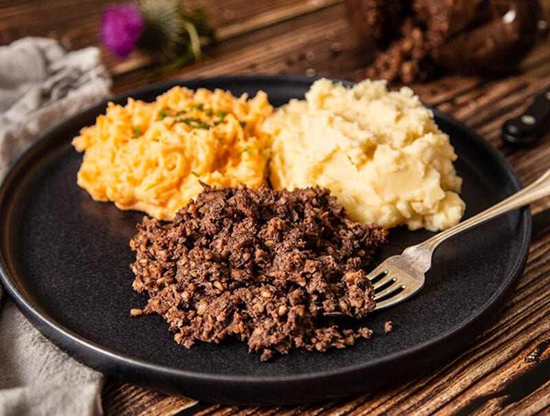

# Haggis, Neeps and Tatties

*Scotland's national dish: spiced sheep-offal-and-oatmeal pudding traditionally encased in a sheep stomach, served with mashed swede ("neeps") and mashed potato ("tatties"), and an obligatory dram of single malt poured over the haggis at table. The Burns Night centrepiece; the dish Robert Burns immortalised in "Address to a Haggis" in 1786.*

**Serves:** 6

**Prep Time:** 30 minutes (assuming you bought the haggis; making one from scratch adds 2 hours)

**Cook Time:** 1.5 hours (haggis reheat) + 30 minutes (neeps and tatties)

## Overview
Haggis, neeps and tatties is Scotland's national dish and the absolute centrepiece of Burns Night (25 January, Robert Burns's birthday), Saint Andrew's Day, Hogmanay supper, and every Scottish wedding, ceilidh and homecoming. Three components on one plate: the haggis itself (a savoury pudding of sheep heart, liver, lungs, suet, onions, oatmeal and spices, traditionally stuffed into a cleaned sheep stomach, now often a synthetic casing); mashed swede ("neeps" in Scotland, confusingly, since "neeps" is short for turnips in English) seasoned with butter, pepper and nutmeg; and mashed potato ("tatties") made creamy with butter and milk. The haggis is reheated by simmering in its casing for an hour, then cut open at table by the host who recites the eight stanzas of Burns's "Address to a Haggis" before plunging a dirk into the bag. A dram of single malt Scotch whisky is poured over each portion. This recipe assumes shop-bought haggis (Macsween of Edinburgh is canonical; vegetarian versions are widely available).

## Ingredients

### For 6 servings
- 1 large haggis (1.4-1.6 kg; serves 6) - Macsween's Traditional or a butcher's own
- 800 g swede (orange-fleshed, called rutabaga in North America)
- 50 g butter (for the neeps)
- ¼ teaspoon ground nutmeg
- 1 teaspoon flaked sea salt
- ½ teaspoon freshly ground black pepper
- 1 kg floury potatoes (Maris Piper or King Edward)
- 80 g butter (for the tatties)
- 100 ml whole milk (for the tatties)
- ½ teaspoon white pepper
- A 25 ml dram of single malt Scotch whisky per serving (Highland or Speyside)

### Equipment
- A large pot (deep enough to submerge the haggis)
- A potato masher
- A small dirk or sharp knife (for ceremonial cutting at table)
- A printed copy of Burns's "Address to a Haggis" (for the host)

## Method

### Stage 1 - Reheat the haggis
1. Place the whole haggis (still in its casing) in a large pot.
2. Cover with cold water; bring slowly to a gentle simmer.
3. DO NOT boil hard - the casing will burst.
4. Simmer gently for 1 hour for a 1.4 kg haggis (allow 45 minutes per kg). Larger haggis takes longer.
5. The haggis is ready when it's piping hot through the middle (test with a skewer; should come out hot to the touch).

### Stage 2 - Mash the neeps
1. Peel the swede and cut into 3 cm chunks.
2. Place in a saucepan; cover with cold water; add a teaspoon of salt.
3. Bring to a boil; simmer 25 minutes till the swede is very tender (a knife slides in with no resistance).
4. Drain very well.
5. Return to the pan; add the butter, nutmeg, salt, and pepper.
6. Mash thoroughly to a soft, slightly textured purée (not totally smooth - neeps should have some character).
7. Taste; adjust seasoning. Cover; keep warm.

### Stage 3 - Mash the tatties
1. Peel and cut the potatoes into 4 cm chunks.
2. Boil in salted water for 15-20 minutes till knife-tender.
3. Drain very well; return to the pan briefly over low heat to steam off any remaining moisture (1 minute).
4. Add the butter and milk; mash to a smooth creamy purée.
5. Season with salt and white pepper.

### Stage 4 - The ceremony (Burns Night)
1. Place the cooked haggis on a wooden board or silver platter.
2. The host (or a designated reader) carries it to the table to the accompaniment of bagpipes if available.
3. Read Burns's "Address to a Haggis" - the eight stanzas, slowly, with the appropriate Scots gusto.
4. At the line "His knife see rustic Labour dight," plunge a dirk or sharp knife into the haggis and split it open along its length.
5. The aromatic steam (peppery, oatmealy, lamb-y) is the moment.

### Stage 5 - Plate and pour
1. Spoon a generous mound of haggis onto each warm plate.
2. Add a quenelle of neeps next to it.
3. Add a quenelle of tatties next to that.
4. The three components stay separate on the plate; Scots eat them in distinct combinations.
5. Pour a dram (25 ml) of single malt over each haggis at the table.
6. Serve a separate small glass of whisky alongside for sipping.

## Notes
- **Don't boil hard:** the casing bursts and you lose the magic. Gentle simmer only.
- **The whisky pour-over is at the table:** not in the kitchen. The host pours theatrically over each plated portion.
- **Three components, three textures:** haggis is granular and meaty, neeps are sweet and earthy, tatties are creamy. They're meant to contrast, not mix.
- **Vegetarian haggis works perfectly:** Macsween's vegetarian version is a respected dish; oats, lentils, mushrooms and spices replace the offal.
- **The Address:** Burns's 1786 poem in eight stanzas. The host reads it; the dirk is plunged at the appropriate line. Print it out; don't try to memorise on the night.

## Variations
**Vegetarian haggis:** Macsween's vegetarian version (oats, lentils, mushrooms, vegetables, spices) - the dish loses nothing.
**Highland version:** add a tablespoon of whisky directly into the neeps mash and into the tatties.
**Modern haggis bonbons:** make small balls of cooked haggis, coat in breadcrumbs, deep-fry - a modern Burns Night canapé.
**Haggis with bashed neeps:** mash the swede less smoothly (deliberately chunky) - the rustic version.
**Whisky cream sauce:** swap the dram pour-over for a whisky-and-cream sauce drizzled over the haggis (modern restaurant version).
**Haggis stuffed chicken:** stuff a chicken breast with cooked haggis, wrap in bacon, roast - the "Highland chicken" dish.

## Serving
On Burns Night (25 January) as the centrepiece of the supper · on Saint Andrew's Day (30 November) · at Hogmanay (New Year's Eve) and the days after · at a Scottish wedding luncheon · at any Scottish family Sunday lunch in winter · in any Scottish gastropub from October to March.

## Storage
- Cooked haggis refrigerates 3 days; reheat by gentle simmering (10 minutes) or microwave (use the original casing or wrap in cling film).
- Leftover haggis is excellent crumbled into a frying pan with butter and served with a fried egg on top for breakfast (the "haggis brekkie").
- Neeps and tatties refrigerate 3 days; reheat with a splash of milk and a knob of butter.
- Don't freeze the cooked haggis (texture suffers). Uncooked haggis freezes 3 months.
