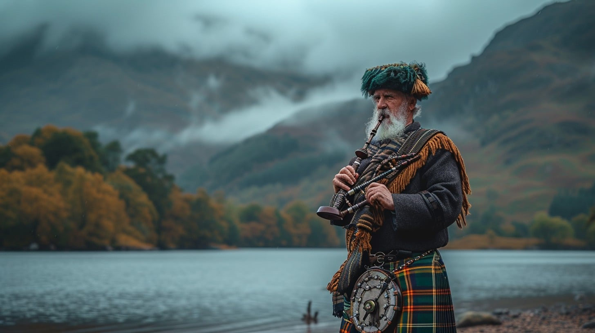

# Scottish Cuisine

Scotland's food traditions span Highland hill-farming, Lowland agriculture, North Sea fishing villages, and four centuries of distillery craft. The canonical dishes - haggis with neeps and tatties, cullen skink, cranachan, shortbread, the world-famous Scotch whisky - anchor a cuisine that's defined by oats, sheep, smoked fish, dairy and warming spices. The dishes here represent the breadth: from the Burns Night centrepiece (haggis) to the Hogmanay treasure (black bun and tablet) to the Sunday-roast accompaniment (rumbledethumps, skirlie) to the canonical Highland breakfast cheese (crowdie) and the Scottish bakery counter (empire biscuits, macaroon bars). Five drinks complete the picture: a single-malt Scotch tasting flight (the country's signature spirit, five distinct regional styles), Drambuie and Glayva (the herbal whisky liqueurs), Atholl Brose (the ancient oat-and-honey-and-whisky drink), and Irn-Bru (Scotland's bright-orange "other national drink" that outsells Coca-Cola in its home country).
