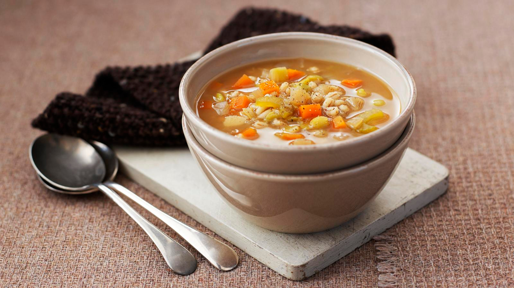

# Scotch Broth

*Scotland's everyday Sunday soup: a thick rib-sticking broth of lamb, pearl barley, root vegetables and dried peas, simmered slowly into a unified amber pottage.*

**Serves:** 6-8

**Prep Time:** 20 minutes (plus optional overnight peas soak)

**Cook Time:** 2.5 hours

## Overview
Scotch broth is Scotland's everyday home soup and the dish that defines weekday Scottish family cooking from the Borders to Caithness. The construction is hearty: a piece of lamb on the bone (neck-end or shoulder) simmers slowly in water with pearl barley, dried green peas (whole or split) and a host of diced root vegetables (carrot, swede, turnip, leek, onion, celery). After two to three hours of unhurried simmering, the lamb shreds off the bone, the broth thickens from the barley and peas, and the whole thing becomes a single amber-hued pottage somewhere between soup and stew. Eat in deep bowls with a hunk of bread and butter; the traditional lunch in Scottish primary schools, the Sunday-after-roast supper that uses up the leftovers, and the soup that's been making Scottish people warm for four hundred years.

## Ingredients

### Broth
- 800 g lamb neck on the bone OR lamb shoulder on the bone (about 6-8 chunks)
- 2.5 litres cold water
- 2 teaspoons sea salt
- 1 bay leaf
- A small thyme sprig
- 6 black peppercorns
- 100 g pearl barley
- 100 g dried green peas (whole; soaked overnight in cold water)
- 50 g yellow split peas (no soak needed)
- 1 large onion (finely diced)
- 2 large carrots (peeled, diced 1 cm)
- 300 g swede (peeled, diced 1 cm)
- 200 g turnip (peeled, diced 1 cm)
- 1 large leek (white and pale-green parts only, sliced)
- 2 sticks celery (diced)
- 4 tablespoons chopped flat-leaf parsley
- Freshly ground black pepper to taste

### To serve
- 1 thick slice of crusty bread per person
- Salted butter
- A small jug of cold milk (optional; some Scots add a splash to their broth)

## Method

### Stage 1 - Soak the peas (the night before)
1. Place the dried green peas in a bowl; cover with cold water.
2. Leave at room temperature overnight (8-12 hours).
3. Drain before using.
4. Yellow split peas don't need soaking.

### Stage 2 - Make the lamb stock (90 minutes)
1. Place the lamb pieces in a large heavy pot.
2. Cover with 2.5 litres cold water.
3. Add the salt, bay leaf, thyme, and peppercorns.
4. Bring slowly to a simmer (don't boil hard); skim off any grey scum that rises (the first 10 minutes give off the most).
5. Once clean-looking, simmer very gently with the lid ajar for 1.5 hours till the lamb is meltingly tender and falling off the bone.

### Stage 3 - Strain and de-bone
1. Remove the lamb pieces with a slotted spoon to a plate.
2. Strain the broth through a fine sieve into a clean pot (discard the bay leaf and thyme).
3. When the lamb is cool enough to handle, shred the meat off the bones with two forks. Discard the bones and any heavy fat.

### Stage 4 - Add the barley and peas
1. Bring the broth back to a simmer.
2. Add the drained green peas, the yellow split peas, and the pearl barley.
3. Simmer 30 minutes with the lid ajar.

### Stage 5 - Add the vegetables
1. Add the onion, carrots, swede, turnip, leek, and celery.
2. Simmer another 30 minutes till the vegetables are tender and the broth is thick and unified.
3. Return the shredded lamb to the broth.
4. Warm through 5 minutes.

### Stage 6 - Finish
1. Taste; adjust salt and pepper (you may need more salt; the barley absorbs a lot).
2. Stir in the chopped parsley.
3. The broth should be very thick; if too thick, add a splash of hot water.

### Stage 7 - Serve
1. Ladle into deep warmed bowls.
2. Serve with a hunk of buttered crusty bread.
3. Some Scots add a splash of cold milk to their bowl, the traditional school-dinner finish.
4. Eat with a soup spoon and the bread for dipping.

## Notes
- **Lamb on the bone:** non-negotiable for depth. Boneless lamb gives a thin broth.
- **Overnight pea soak:** if you skip, the peas stay hard and granular even after 3 hours of simmering.
- **Skim early:** the first 10 minutes of simmering produces the grey scum. Skim it; the broth stays clean.
- **Don't add the vegetables too early:** they'll cook to mush. Add them in stage 5 for the last 30 minutes.
- **The broth thickens overnight:** if you make it ahead, it'll be thick and stew-like the next day. Loosen with hot water on reheating.

## Variations
**Mutton broth:** use mutton (older sheep) instead of lamb, deeper, more old-fashioned flavour.
**With a hambone:** add a smoked hambone alongside the lamb for the first hour, gives the broth a smoky depth.
**Vegetarian Scotch broth:** skip the lamb; use a strong vegetable stock + 100 g extra split peas + 30 g dried mushrooms, the surprisingly good vegetarian version.
**With kale:** stir in a handful of chopped kale in the last 5 minutes, adds colour and a slight bitter freshness.
**Spicy version:** add a pinch of dried thyme + a teaspoon of mustard powder, modernised.
**Lentil scotch broth:** add 60 g brown lentils alongside the barley, fuller body.

## Serving
As a Sunday-evening leftover supper after a lamb roast · in a Scottish primary school dining room (the lunchtime traditional) · at a Highland farm-house lunch · in a Glasgow pub as the soup course · at home in winter with a hunk of bread and a slab of butter · at a Burns Night supper as the soup before the haggis.

## Storage
- Refrigerates 4 days; thickens significantly overnight and intensifies in flavour.
- Freezes 3 months; reheat from frozen with a splash of water.
- The broth is even better on day 2; many Scottish families deliberately make a big pot for Sunday and eat it Monday through Wednesday.
- Reheat gently; if too thick, loosen with hot water or hot stock.
