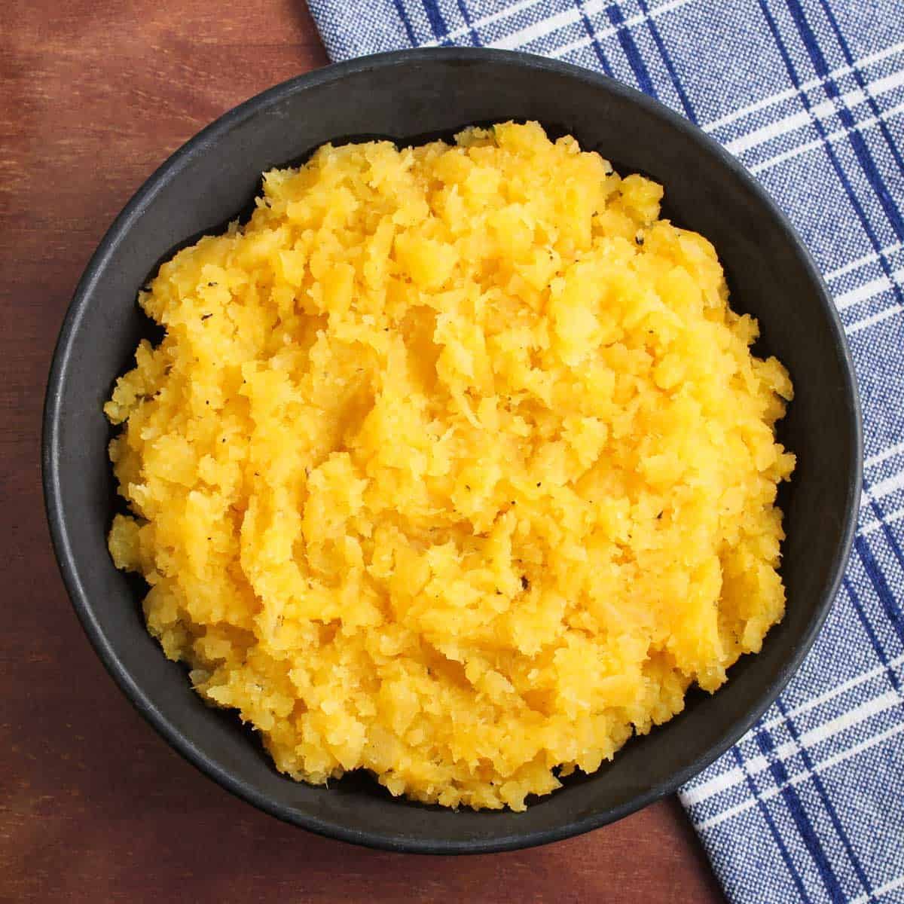

# Neeps (Mashed Swede)

*Scotland's "neeps" - orange-fleshed swede (rutabaga) boiled till tender, drained, and mashed with butter, nutmeg, salt and pepper. The "neeps" of "haggis, neeps and tatties"; the most distinctively Scottish vegetable preparation; the dish that confuses every visitor (who calls them turnips - a different vegetable entirely).*

**Serves:** 6

**Prep Time:** 10 minutes

**Cook Time:** 30 minutes

## Overview
The linguistic confusion is canonical: in Scotland, "neeps" refers to mashed SWEDE (the orange-fleshed root vegetable known as rutabaga in North America), but in England and most of the rest of the English-speaking world, "neeps" or "turnips" refers to the smaller, white-fleshed, purple-topped Brassica rapa. Scottish neeps are the larger orange-fleshed Brassica napus, and the dish is one of the country's most iconic vegetable preparations. The construction is simple: swede is peeled, cut into chunks, boiled till very tender, drained extremely thoroughly (excess water ruins neeps), and mashed with butter, a pinch of nutmeg, a generous amount of black pepper and salt. The finished neeps should be soft, slightly textured (not whipped to baby food - keep some character), and a deep golden-orange colour with flecks of pepper. They're served alongside haggis on Burns Night (the canonical haggis-neeps-tatties trio), alongside roast lamb on Sunday lunch, and alongside Scotch broth as the absorbent vegetable. Three details: peel the swede THICKLY (the outer layer is woody and bitter - peel deep), boil till COMPLETELY TENDER (a knife should slide in with no resistance), and drain VERY THOROUGHLY (return to the pan over low heat for a minute to steam off moisture before mashing).

## Ingredients

### For 6 servings
- 1.2 kg swede (the orange-fleshed root; one large or two medium swede)
- 60 g butter (plus more for serving)
- ½ teaspoon ground nutmeg
- 1 teaspoon fine sea salt (or to taste)
- 1 teaspoon freshly ground black pepper (generous)
- A pinch of caster sugar (optional; brings out the sweetness - some Scots swear by it)

### Optional add-ins (Scottish variants)
- 2 tablespoons single-malt Scotch whisky (the "Highland neeps" - stirred in at the end)
- 50 ml double cream (for an extra-rich version)
- 30 g butter melted with a pinch of mustard powder (drizzled over for serving)

## Method

### Stage 1 - Peel and chop
1. With a sharp knife (not a peeler - swede skin is too thick), peel the swede deeply - remove the brown outer skin AND the fibrous layer just beneath it. You'll lose 15-20% of the volume; that's normal.
2. Cut into 3 cm chunks (roughly uniform).
3. Rinse in a colander.

### Stage 2 - Boil
1. Place the swede chunks in a large pot.
2. Cover with cold water; add a tablespoon of salt.
3. Bring to a boil; reduce heat to a steady simmer.
4. Cook 25-30 minutes till COMPLETELY tender (test with a knife - should slide in with absolutely no resistance).
5. Don't undercook; underdone swede is hard to mash and tastes earthy.

### Stage 3 - Drain
1. Drain the swede in a colander.
2. Return to the (empty) pot over LOW heat for 1-2 minutes to steam off any remaining moisture (very important - excess water makes the mash sloppy).
3. The pot bottom may scorch slightly; that's fine - adds flavour.

### Stage 4 - Mash
1. Remove the pot from heat.
2. Add the butter; let it melt into the swede.
3. Mash thoroughly with a potato masher till you have a soft, slightly textured purée (not totally smooth - neeps benefit from a little character).
4. Don't use a food processor (turns into puréed baby food).

### Stage 5 - Season
1. Add the nutmeg, salt, and pepper.
2. Stir in the optional sugar if using.
3. Taste; adjust seasoning (you may need more salt and definitely more pepper).
4. If using whisky (Highland variant), stir in now.
5. If using cream, stir in now.

### Stage 6 - Serve
1. Spoon into a warmed serving bowl.
2. Top with an extra knob of butter (let it melt in golden puddles).
3. A few grinds of black pepper over the top.
4. Optional: a drizzle of mustard-butter for the Highland version.
5. Serve hot alongside haggis, roast lamb, or roast game.

## Notes
- **It's swede, not turnip:** the Scottish "neep" is the orange-fleshed swede (rutabaga). The small white-fleshed turnip is a different vegetable. Don't try to make neeps with turnips; the result is too watery and too peppery.
- **Peel THICKLY:** swede skin is woody; the fibrous layer just beneath is bitter. Peel deep.
- **Cook till COMPLETELY tender:** undercooked swede is hard and earthy. Boil long.
- **Drain VERY THOROUGHLY:** the post-boil steam-off in the pot is essential. Sloppy neeps are a Scottish crime.
- **Generous pepper, modest salt:** neeps want lots of black pepper; salt to taste.
- **Don't over-mash:** a slight texture is canonical. Whipped neeps are baby food.

## Variations
**Highland neeps:** stir in 2 tablespoons of single-malt Scotch at the end. Adds depth and edge.
**Honey-roasted neeps:** swap boiling for roasting - cube the swede, toss with honey, butter, salt, pepper; roast at 200°C for 40 minutes till golden and caramelised.
**Clapshot (Orkney variant):** mix equal parts mashed swede + mashed potato + butter + a tablespoon of chopped chives. The Orkney version is hugely popular at Burns Night.
**With carrot:** boil 200 g carrot with the swede; mash together - sweeter, more colourful.
**With ginger:** add a teaspoon of grated fresh ginger to the mash - modern variant.
**With orange zest:** add the zest of half an orange to the mash - bright, modern.

## Serving
Alongside haggis at Burns Night (the canonical setting) · alongside roast lamb on a Sunday · alongside Scotch broth as the absorbent veg · alongside roast venison or pheasant on a Highland hunting lunch · alongside roast goose at Christmas · with smoked sausage and onion gravy as a weeknight supper.

## Storage
- Refrigerates 4 days; reheat with a splash of milk and a knob of butter in the microwave or on the stovetop.
- Freezes 3 months (slight texture loss; loosen with butter on reheating).
- Leftover neeps blended with cream and stock makes an excellent soup.
- Day-old neeps formed into patties and pan-fried makes a side or starter (Highland neep cakes).
