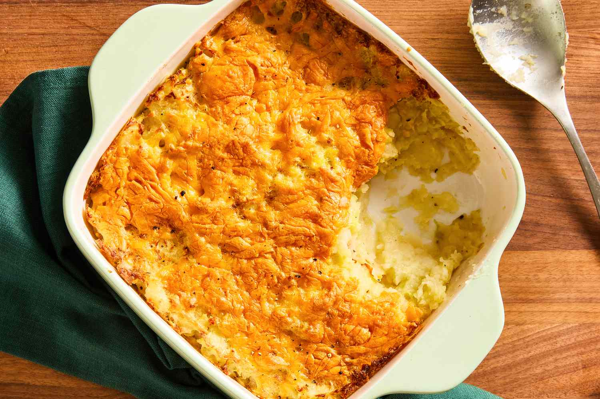

# Rumbledethumps

*Scotland's potato-cabbage bake: cooked mashed potato mixed with sweated cabbage and onion, piled into a baking dish, topped with grated mature Cheddar, and baked till golden and bubbling. The Scottish answer to colcannon or bubble-and-squeak. The Borders-Scotland Sunday-roast side; the most economical and most comforting Scottish potato dish there is.*

**Serves:** 6 (as a side)

**Prep Time:** 25 minutes

**Cook Time:** 25 minutes

## Overview
Rumbledethumps (the name is a wonderful Scots onomatopoeia, supposedly from "rumbling" the potatoes and "thumping" the cabbage together) is the Borders-Scotland traditional side that uses up boiled potatoes, sweated cabbage and onion, and a generous topping of mature Cheddar. Closely related to Irish colcannon, Northumbrian bubble and squeak and English rumbledy thump, all variations on the same potato-cabbage theme, but the Scottish version distinguishes itself by being baked rather than pan-fried, with a thick cheese topping giving a golden crust over the soft potato mass. Mashed potato folded with sweated cabbage (savoy or white) and softened onion, enriched with butter, seasoned with salt and white pepper. Piled into a baking dish, topped with grated mature Cheddar, baked till the top is deeply golden and the edges crisp. Served alongside roast lamb, roast beef, sausages, or as the traditional Sunday-roast leftover side.

## Ingredients

### For 6 servings
- 1 kg floury potatoes (Maris Piper or King Edward), peeled and quartered
- 50 g butter (for mashing; plus 30 g for cooking)
- 100 ml whole milk (warmed)
- 1 medium savoy cabbage (about 500 g, core removed, finely shredded)
- 1 large onion (finely diced)
- 1 leek (white and pale green parts only, finely sliced): optional but excellent
- 150 g mature Cheddar (grated; Scottish Mull or any aged farmhouse cheddar)
- 1 teaspoon Dijon mustard
- 1 teaspoon fine sea salt (plus more for the potato water)
- 1 teaspoon freshly ground white pepper
- A small handful of breadcrumbs (panko or fresh; optional, for extra crust)
- A small handful of fresh chives, finely chopped (for garnish)

## Method

### Stage 1 - Boil the potatoes
1. Place the peeled, quartered potatoes in a large pot.
2. Cover with cold water; add a tablespoon of salt.
3. Bring to a boil; simmer 15-20 minutes till knife-tender.
4. Drain very thoroughly; return to the pan over low heat for 1 minute to steam off moisture.

### Stage 2 - Mash the potatoes
1. Mash the hot potatoes with 50 g butter and the warm milk till smooth-ish (a slight texture is fine; don't whip).
2. Season with the salt and white pepper.
3. Set aside.

### Stage 3 - Sweat the cabbage and onion
1. Heat 30 g butter in a large heavy pan over medium heat.
2. Add the diced onion and sliced leek (if using).
3. Sweat 6-8 minutes till soft, sweet, and translucent.
4. Add the shredded cabbage.
5. Cover and cook over medium-low heat for 10 minutes, stirring occasionally, till the cabbage is soft and slightly sweetened (don't let it brown; you want soft and bright green).
6. Taste; season with salt and pepper.

### Stage 4 - Combine
1. Add the sweated cabbage-onion mixture to the mashed potato.
2. Stir in the Dijon mustard.
3. Mix gently to combine; the cabbage should be evenly distributed through the potato.
4. Taste; adjust seasoning (you may need more salt and pepper).

### Stage 5 - Assemble for baking
1. Preheat oven to 200°C / 180°C fan / 400°F.
2. Lightly butter a baking dish (about 25 × 20 cm).
3. Spoon the potato-cabbage mixture into the dish; smooth the top with the back of a spoon.
4. Scatter the grated Cheddar evenly over the top.
5. Sprinkle the breadcrumbs over (if using; gives extra crunch).

### Stage 6 - Bake
1. Bake at 200°C for 20-25 minutes till the top is deeply golden, the cheese bubbling, and the edges crisp.
2. If the top isn't browning quickly enough, switch to the grill for the last 2-3 minutes.

### Stage 7 - Serve
1. Sprinkle chopped chives over.
2. Serve hot, spooned generously onto warm plates alongside the main.

## Notes
- **Savoy cabbage:** the traditional Scottish choice. White cabbage works too. Don't use red cabbage (wrong colour) or kale (too tough).
- **Mature Cheddar:** mild cheddar disappears. Use mature, sharp, ideally Scottish.
- **Bake, don't fry:** the bake gives the cheese crust that defines rumbledethumps. Pan-frying makes it bubble-and-squeak, a different dish.
- **Use leftover potatoes:** rumbledethumps is traditionally made with leftover boiled or mashed potatoes from yesterday's lunch. Don't worry about overcooking the spuds the day before.
- **Add a pinch of nutmeg:** a Scottish granny trick, a pinch of nutmeg in the potato cabbage mix.

## Variations
**With smoked bacon:** add 100 g diced smoked bacon (cooked till crisp) to the cabbage-onion mixture, heartier version, more like a one-dish supper.
**With ham hock:** stir in 200 g shredded ham-hock meat (from a cooked ham bone): turns it into a main course.
**With kale and leek (clapshot direction):** swap half the cabbage for shredded kale; add 1 sliced leek to the onion, more nutritious modern version.
**With swede (a clapshot-rumbledethumps hybrid):** swap 300 g of the potato for mashed swede; the Orkney version that crosses with clapshot.
**Whole-meal version:** add 50 g cooked pearl barley to the mix for extra texture.
**Indian-influenced:** add a teaspoon of curry powder + ½ teaspoon turmeric to the cabbage during cooking, modern Anglo-Indian Scottish.

## Serving
Alongside a Scottish Sunday roast lamb or beef (the traditional pairing) · with grilled or pan-fried Lorne sausage and a fried egg as a brunch · with cooked smoked sausage as a weeknight family supper · alongside roast game (pheasant, venison) · at a Burns Night supper as an extra side.

## Storage
- Refrigerates 3 days; reheats brilliantly in a hot oven (180°C for 15-20 minutes) or in the microwave (with a tiny splash of milk to loosen).
- Freezes 3 months (before or after baking); defrost overnight in the fridge before reheating.
- Leftover rumbledethumps formed into patties and pan-fried makes excellent fritters (the bubble-and-squeak crossover).
- Cold rumbledethumps in a sandwich with a slice of ham is a deeply Scottish lunch.
