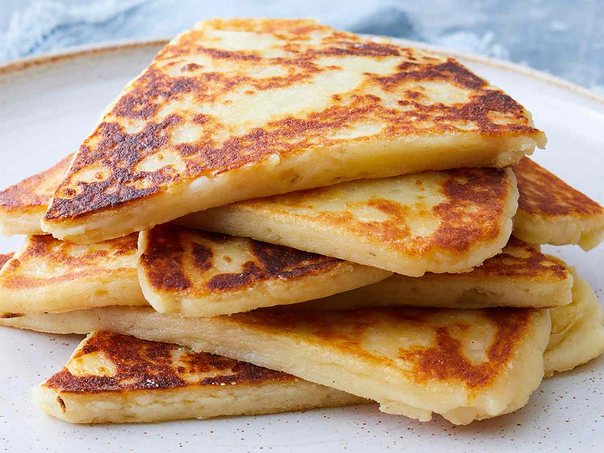

# Tattie Scones (Potato Scones)

*Scotland's griddle-cooked potato flatbread: cold mashed potato mixed with flour and butter, rolled thin, cut into triangles, and dry-toasted on a hot griddle till golden-brown. Eaten with butter and jam at tea-time, or fried with eggs and bacon as the canonical Scottish breakfast side. The Scottish answer to a crumpet, and a use for leftover Sunday mash.*

**Serves:** 4 (makes 8 triangles)

**Prep Time:** 15 minutes (assuming cold mashed potato)

**Cook Time:** 10 minutes

## Overview
Tattie scones (also called potato scones or "potato cakes" in some Scottish kitchens) are Scotland's griddle-cooked potato flatbread - a humble, frugal, infinitely useful dish that grew out of using up leftover mashed potato from Sunday lunch. The construction couldn't be simpler: cold mashed potato (yesterday's leftovers, or freshly made and chilled) is mixed with flour, melted butter and a pinch of salt; the dough is rolled thin (about 5 mm) on a floured surface, cut into rounds or triangles, and dry-toasted on a hot griddle or heavy frying pan for 3-4 minutes per side till golden-brown and lightly puffed. The finished scones are soft and slightly chewy, with a subtle potato flavour and a hint of butter-richness. They're versatile: eaten warm with butter and strawberry jam at tea-time (the canonical Scottish high-tea item), fried with bacon and eggs on a Scottish full breakfast plate, served alongside a roast as a starchy side, or split and stuffed with cheese and pickle as a portable lunch. Every Scottish bakery and supermarket sells packs of fresh tattie scones, but the home-made version is incomparably better. Three details: cold mashed potato (warm potato makes the dough sticky), dry griddle (no oil - the scones toast, not fry), and serve warm (cold tattie scones can be re-toasted, but they're best straight off the griddle).

## Ingredients

### For 8 triangular scones
- 400 g cold mashed potato (made with floury potatoes; no milk added; just butter and salt)
- 80 g plain flour (plus extra for dusting)
- 30 g butter (melted; plus extra for the griddle and for serving)
- ½ teaspoon fine sea salt
- ¼ teaspoon baking powder (optional; gives a slightly lighter result)

### To serve
- Salted butter
- Strawberry jam, raspberry jam, or marmalade (for tea-time)
- OR served alongside a Scottish full breakfast (Lorne sausage, bacon, eggs, black pudding, baked beans, mushrooms, fried tomato)

## Method

### Stage 1 - Make the mash (if not using leftover)
1. Peel and quarter 500 g floury potatoes (Maris Piper or King Edward).
2. Boil in salted water for 15-20 minutes till tender.
3. Drain very thoroughly; return to the pan over low heat for 1 minute to steam off moisture.
4. Mash thoroughly with 30 g butter; do NOT add milk (excess moisture ruins the dough).
5. Season with salt; let cool completely (chill in the fridge for 30 minutes if you're in a hurry).

### Stage 2 - Make the dough
1. In a large bowl, combine the cold mashed potato, plain flour, melted butter, salt, and baking powder (if using).
2. Mix with a wooden spoon, then your hands, till a soft pliable dough comes together.
3. The dough should be soft but not sticky; if too sticky, add a tablespoon more flour.
4. Don't overwork; the gluten will toughen the scones.

### Stage 3 - Roll out
1. Lightly flour a clean surface.
2. Tip the dough out; press into a rough disc.
3. Roll out to a 25 cm circle, about 5 mm thick.
4. Cut into 8 triangular wedges (like a pizza).

### Stage 4 - Toast on the griddle
1. Heat a heavy cast-iron griddle, frying pan, or non-stick pan over medium heat.
2. Do NOT add oil or butter to the pan (a dry griddle is the canonical Scottish method).
3. Place 3-4 triangles on the hot griddle (don't overcrowd).
4. Cook 3-4 minutes on the first side till golden-brown and lightly puffed.
5. Flip; cook 3 minutes on the second side.

### Stage 5 - Cool and serve
1. Transfer to a clean tea towel; cover loosely to keep warm and slightly soft.
2. Continue with the remaining triangles.
3. Serve warm with a knob of butter and a spoon of jam, OR as part of a Scottish full breakfast (fry briefly in bacon fat to brown the surface).

## Notes
- **Cold mash is essential:** warm mash makes the dough wet and sticky and the scones tough. Refrigerate till fully cold.
- **No milk in the mash:** moist mash ruins the dough. Mash plain with butter and salt only.
- **Dry griddle, no oil:** the scones toast, not fry. The slight char is the canonical look.
- **Don't overwork the dough:** quick mix, light roll, straight to the griddle.
- **Use immediately or re-toast:** fresh tattie scones are best straight off the griddle. Day-old ones revive nicely in a toaster or under the grill.

## Variations
**With cheese:** stir 100 g grated mature Cheddar into the dough - the cheesy variant.
**With herbs:** stir in 2 tablespoons chopped chives or finely chopped wild garlic - herbed version.
**Sweet potato tattie scones:** swap half the potato for cold mashed sweet potato - modern variant.
**Stuffed tattie scones (Forfar-style):** roll thinner, place a tablespoon of cooked black pudding or haggis in the middle, fold over, and griddle - handheld snack version.
**Tattie-scone breakfast roll:** split a fried tattie scone, butter it, layer with bacon and a fried egg - Scotland's answer to a bacon sarnie.
**Smaller round scones:** roll thinner, cut with a 6 cm cutter for canapé-sized rounds.

## Serving
On a Scottish full breakfast plate (the canonical setting - fry briefly in the bacon fat to brown) · at a Scottish high tea with butter and jam · alongside a Sunday roast as a starchy side · split and stuffed with cheese and Branston pickle for a Scottish school lunch box · at a Scottish bed-and-breakfast on the Sunday-morning trolley.

## Storage
- Eaten same day, best straight from the griddle.
- Refrigerate cooked scones up to 3 days; reheat under a hot grill or in a toaster.
- Freeze cooked scones (between sheets of greaseproof paper) up to 2 months; defrost and re-toast.
- Raw dough does NOT freeze well (the potato discolours and the texture suffers).
